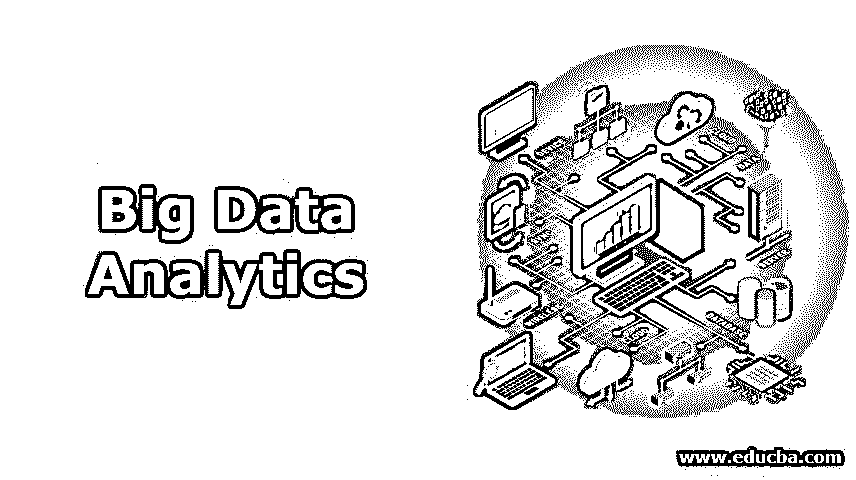

# 什么是大数据分析？

> 原文：<https://www.educba.com/what-is-big-data-analytics/>

## 大数据分析简介

分析和提取业务或数据世界中涉及的大数据信息以便做出正确结论的领域称为大数据分析。这些结论可以用来预测未来或预测业务。此外，这有助于创造一个关于过去的趋势。由于数据量巨大，在分析大数据时需要具有领域知识的统计和工程方面的熟练专业人员，并且分析需要适当的决心和技能组合。这些数据非常复杂，无法用传统的分析方法来处理。

### 我们可以将大数据定义为三个 v

*   **容量:**每秒钟生成的数据量。每天，社交媒体、电子商务企业、航空公司等组织都会收集大量数据。
*   **速度:**数据生成的速率。每个人都在使用社交媒体，每秒钟都会产生大量数据，因为人们通过社交媒体做很多事情；他们发表评论，如照片，分享视频等。
*   **多样性:**数据可以是各种形式的结构化数据，如数字数据，非结构化数据，如文本、图像、视频、金融交易等。，或者像 JSON 或 XML 这样的半结构化数据。

### 我们如何处理这些大数据？

我们可以使用这些大数据进行处理，并从中得出一些有意义的见解。有各种框架可用于处理大数据。以下列表提供了大数据开发人员和分析师广泛使用的流行框架。

<small>Hadoop、数据科学、统计学&其他</small>

*   **Apache Hadoop:** 我们可以编写 map-reduce 程序来处理数据。
*   **Spark:** 我们可以写一个 Spark 程序来处理数据；使用 spark，我们还可以处理实时数据流。
*   Apache Flink: 这个框架也用于处理数据流。

还有更多像风暴一样的，萨姆莎。

### 大数据分析

大数据分析是收集、组织和分析大量数据的过程，以揭示隐藏的模式、相关性和其他有意义的见解。它有助于组织了解数据中包含的信息，并利用这些信息提供新的机会来改善业务，从而提高运营效率、利润和客户满意度。

为了分析如此大量的数据，大数据分析应用程序使[大数据分析师](https://www.educba.com/what-is-data-analyst/)、数据科学家、预测建模师、统计学家和其他分析人员能够分析不断增长的结构化和非结构化数据。它是使用专门的软件工具和应用程序来执行的。使用这些工具，可以执行各种数据操作，如数据挖掘、文本挖掘、预测分析、预测等。;所有这些过程都是单独执行的，是高性能分析的一部分。使用大数据分析工具和软件使组织能够处理大量数据，并提供有意义的见解，从而在未来做出更好的业务决策。

### 大数据分析背后的关键技术

分析包含多种技术，可帮助您从数据中获取最有价值的信息。

#### 1.Hadoop

开源框架被广泛用于存储大量数据，并在商用硬件集群上运行各种应用程序。由于数据种类和数量的不断增加，它已经成为大数据中使用的关键技术，其分布式计算模型提供了更快的数据访问。

#### 2.数据挖掘

一旦数据存储在数据管理系统中，您就可以使用[数据挖掘技术](https://www.educba.com/data-mining-techniques/)来发现用于进一步分析和回答复杂业务问题的模式。有了数据挖掘，所有重复和嘈杂的数据可以被删除，并指出只有相关的信息，用于加快决策的步伐。

#### 3.文本挖掘

通过文本挖掘，我们可以分析来自网络的文本数据，如评论、来自社交媒体的赞以及其他基于文本的来源，如电子邮件；我们可以识别邮件是否是垃圾邮件。文本挖掘使用机器学习或自然语言处理等技术来分析大量数据并发现各种模式。

#### 4.预测分析

预测分析使用数据、统计算法和机器学习技术，根据历史数据确定未来的结果。这一切都是为了提供最好的未来结果，以便组织能够对其当前的业务决策充满信心。

### 大数据分析的优势

大数据分析在各种组织中广受欢迎。电子商务行业、社交媒体、医疗保健、银行、娱乐行业等组织。广泛使用分析来了解各种模式、收集和利用客户洞察、欺诈检测、监控金融市场活动等。

我们举个电商行业的例子:

亚马逊、Flipkart、Myntra 和许多其他在线购物网站等电子商务行业都利用了大数据。

他们通过以下几种方式收集客户数据

*   收集客户搜索的商品信息。
*   关于他们偏好的信息。
*   关于产品受欢迎程度的信息和许多其他数据。

使用这些类型的数据，组织可以得出一些模式并提供最好的客户服务，比如

*   展示正在销售的受欢迎的产品。
*   显示与客户购买的产品相关的产品。
*   提供安全的货币交易，并识别是否有任何欺诈交易。
*   预测产品需求等等。

### 结论

大数据是游戏规则的改变者。许多组织正在使用更多的分析来推动战略行动，并提供更好的客户体验。效率的微小变化或最小的节省都可能带来巨大的利润，这就是大多数组织转向大数据的原因。

### 推荐文章

这是大数据分析的指南。在这里，我们讨论了一些基本概念，如什么是大数据分析、它的优势、大数据分析背后的关键技术。您也可以阅读以下文章，了解更多信息——

1.  [大数据分析工具](https://www.educba.com/big-data-analytics-tools/)
2.  [酒店业的大数据分析](https://www.educba.com/big-data-analytics-techniques/)
3.  [大数据技术](https://www.educba.com/big-data-techniques/)
4.  [大数据架构简介](https://www.educba.com/big-data-architecture/)

