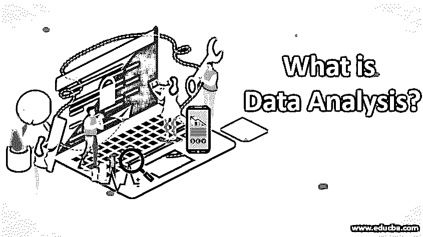
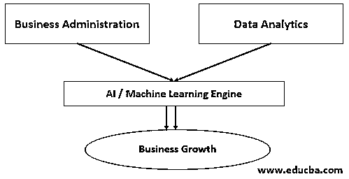
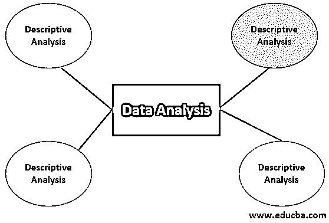

# 什么是数据分析？

> 原文：<https://www.educba.com/what-is-data-analysis/>

## 数据分析介绍

数据分析被定义为分析数据以提高生产力和业务增长的技术，包括清理、转换、检查和建模数据等过程，以执行市场分析，收集数据的隐藏洞察力，改进业务研究，并使用数据分析工具(如 Tableau、Power BI、R 和 Python、Apache Spark 等)基于可用数据生成报告。

它指的是分析数据以提高生产力和发展业务的技术。它是检查、清理、转换和建模数据的过程。

<small>Hadoop、数据科学、统计学&其他</small>

### 为什么我们需要数据分析？

我们需要数据分析，主要原因如下:

1.  收集隐藏的见解。
2.  基于可用数据生成报告。
3.  进行市场分析。
4.  经营策略的改进。

### 谁是数据分析师？

数据分析师是一个从各种来源和结构和模型中收集数据以找到生成报告的模式的人。各行各业都试图收集各种各样的数据来创建一个模型。例如，制造行业的公司记录各种参数，如制造单元的队列状态，以及它如何与其他单元(如质量保证、包装和存储单元)同步，以确保最短的停机时间。这里的想法是减少资源的闲置使用，这将在不影响成本的情况下提高生产率。就像制造业一样，其他行业如游戏行业记录用户的回报，食品配送公司可以记录特定人口结构中人们的饮食习惯。

### 所需的基本步骤

现在我们将讨论数据分析的一些基本步骤:

**步骤 1:** 这里的主要任务是分析数据。在当前的结构中，大多数传统行业甚至不知道他们已经拥有的数据，因为在早期，交互数据和交易数据之间没有明确的区别。因此，在实现机器学习或 AI 实现的情况下，最大的挑战是找到数据在哪里，以及数据如何存在。这包括对大量数据进行数据剖析，并找出数据正确性、数据完整性、空百分比等属性，以及最重要的可用数据的相关性和分类。

**步骤 2:** 然后我们需要使用任何非结构化数据存储方法来存储这些数据。这与通过已有的大数据基础架构处理非结构化数据是一样的。现代的存储基础结构不同于传统的 RDBMS。现在，大数据基础设施可以从非结构化数据中提取信息，如脸书的评论或通过电子邮件发送的消息。

**步骤 3:** 在对数据进行分类和分组后，下一步是构建模型。一旦准备好数据模型，系统将开始提取信息。

**步骤 4:** 一旦数据开始流动，就可以关联和处理各种数据，如交互数据和交易数据，以建立一种模式，这种模式不仅能够创建关于历史数据的报告，而且能够在输入到人工智能引擎时为未来定义一个清晰的战略。

### 数据分析的类型

各种类型解释如下。

#### 1.描述性分析

这种分析告诉企业什么是正确的，什么是错误的。例如，当一家餐馆了解到那些订购了一次比萨饼的用户一直在重新订购，但他们的意大利调味饭没有重新订购。这给餐馆一个暗示，他们应该改进他们的意大利调味饭的配方，并把重点放在比萨饼上，以保持业务的运转。

#### 2.诊断分析

这告诉你为什么会发生一些事情，如果你以黑莓为例，数据显示，随着 iPhone 市场开始蓬勃发展，他们的触摸屏手机没有键盘，黑莓手机的销量下降，使该公司失去了大量的市场份额。这是诊断分析的一个真实例子。

#### 3.预测分析

这种分析策略告诉企业可能会发生什么。另一个现实生活中的例子是柯达公司。他们很晚才意识到，最终胶片摄影将会灭绝，新的未来将会是数字化的，因此他们的预测分析失败了，而尼康、佳能、索尼等其他公司占领了市场。柯达进入数码相机市场太晚了，对他们来说已经结束了。

#### 4.规定性分析

这种分析是为了理解和描述未来的行动过程，以发展或维持目前的业务。通常，公司使用[机器学习技术](https://www.educba.com/machine-learning-techniques/)和算法来定义未来的商业规则。这方面的一个例子可能是，任何电信公司都明白，随着手机在计算方面变得越来越好，因此通话将不再是优先事项，重点将放在移动数据的消费上。

### 使用的流行工具

让我们看看一些广泛使用的数据分析工具，以及一些在这一领域处于市场领先地位的工具:

*   **Tableau:** 连接各种数据源后，可以创建数据可视化、仪表盘、分析报告。该工具适用于非结构化数据，因此与大数据兼容。
*   Power BI: 以前它是 MS Excel 的扩展，后来它成为一个独立的工具。它是轻量级的，经常更新。
*   如果你喜欢自定义编码和定制，那么 R 和 Python 是你的选择。r 更适合于[统计分析](https://www.educba.com/statistical-analysis/)，而 Python 内置了开箱即用的数据分析库。
*   **Apache Spark:** Apache Spark 是一个快速、轻量级和大规模的数据处理器，它执行来自大数据集群的数据，可以快速处理巨大的数据块。

### 结论

我们可以说，正确使用数据可以为任何业务提供一套新的见解，这将确保有效利用资源，更好地了解客户和市场，最终导致业务增长。

### 推荐文章

这是一本关于什么是数据分析的指南？.在这里，我们讨论所需的基本步骤、需求、不同类型的数据分析以及用于完美数据管理的工具。您也可以浏览我们推荐的文章，了解更多信息——

1.  [八大免费数据分析工具](https://www.educba.com/free-data-analysis-tools/)
2.  [数据分析 vs 数据分析](https://www.educba.com/data-analytics-vs-data-analysis/)
3.  [什么是数据集成？](https://www.educba.com/what-is-data-integration/)
4.  [数据分析的类型](https://www.educba.com/types-of-data-analysis/)

