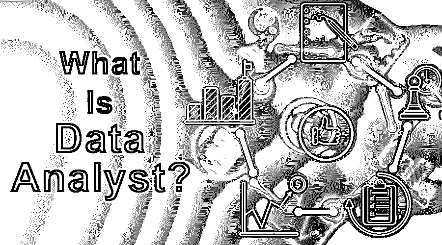
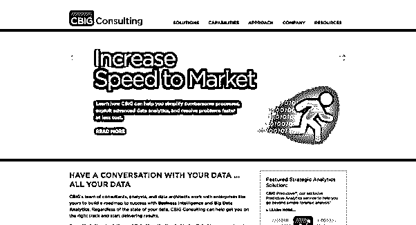

# 什么是数据分析师？

> 原文：<https://www.educba.com/what-is-data-analyst/>

## Data Analyst 简介

为了从给定的数据中推断出有用的信息而对数据进行检查、清理、转换和建模的分析师被称为数据分析师。它们有助于形成好的结论，从而根据数据做出正确的决策。他们通过做出更好的决策来帮助组织的业务。数据分析师的基本技能包括 SQL、[编程语言](https://www.educba.com/what-is-a-programming-language/)和分析技能的知识。分析过程中涉及到许多技术，数据分析师应该精通如何正确地进行分析。原始数据必须转化为有用的信息。

### 什么是数据分析师？

数据分析师[和数据科学家](https://www.educba.com/data-analyst-vs-data-scientist/)之间存在巨大差异。人们混淆了数据分析师和数据科学家的角色，因为他们听起来很相似。它浏览数据，并试图识别数据中的趋势。数据中的数字说明了什么？根据这些数据可以做出什么决定？数据分析师在处理数据时会问一些问题吗？

<small>Hadoop、数据科学、统计学&其他</small>

数据科学家是解释数据的专家，擅长编码和数学模型。大多数数据科学家都拥有数据分析方面的博士或硕士学位。他们在机器学习、编程方面拥有实践经验，能够使用预测模型和数据分析师工作为数据模型创建新流程。

### Data Analyst 如何让工作变得如此简单？

它通常会检索数据，收集数据，组织数据，分析数据，并使用数据得出某个结论。他们的工作因所处理的数据类型(库存、社交媒体、销售、财务等)而异。)或客户端项目。他们可以向公司的雇主提供有价值的数据，这些雇主希望更多地了解他们的客户和他们的需求。每个行业的公司都可以从数据分析师提供的见解中受益。

他们管理数据库，并帮助公司根据数据库做出决策。让我们考虑一个数据分析师与提供移动广告的营销公司合作的例子。在这里，他们需要建立[移动应用用户](https://www.educba.com/mobile-applications/)的档案，并在平台上提供与用户相关的广告。这将确保在分析广告支出时获得更高的回报。它也将提供一个增强的用户体验，因为通过给他们一个更个性化的广告感觉。

### 顶级公司

以下是排名靠前的公司:

#### 1.穆适马

穆适马是全球最大的数据分析公司之一。他们公司的名字来源于统计术语“(μ)”代表 Mu，“(σ)”代表 sigma，代表一个概率分布的均值和标准差。

该公司由 Dhiraj Rajaram 于 2004 年创建，他也是该公司的现任首席执行官。他们提供营销分析、需求分析、网络规划、优化、运输分析、风险分析和采购分析等服务。

#### 2.简化 360

这是一家社交商务智能公司，提供监控和分析、仪表板和报告、渠道分析、CRM 和工作流服务。他们的客户名单上有许多有声望的客户。

#### 3.CBIG 咨询公司

CBIG 为客户提供商业智能(BI)、数据仓库(DW)和大数据分析服务。他们还提供以数据为中心的计划，包括预测分析、营销分析、运营分析、云分析、数据科学等。CBIG 是最好的数据分析公司之一，无论您的数据处于何种状态，它都将帮助您步入正轨并开始交付结果。

#### 4.GoodData

GoodData 营销云计算的大数据分析软件和商业智能(BI)。它由 Roman Stanek 于 2007 年创立，名为“Good Data Corporation”。有了 GoodData，一家公司可以通过向包括客户和合作伙伴在内的所有企业成员分发有针对性的分析来增强他们的业务。

#### 5.普华永道会计师事务所

普华永道，也被称为普华永道，是世界上最大的专业服务公司。它成立于 1998 年，由普华永道和莱布兰德合并而成。普华永道借助其平台，帮助优化数据资产，做出更快更好的决策。凭借其领先的数据和分析服务，普华永道帮助创建数据框架，制定战略，优化基础设施，并帮助创建一种文化，以成为数据驱动的组织。

#### 6.德勤

德勤是一家跨国专业服务网络，也是“四大”会计组织之一。德勤通过了解决策者的角色，将信息转化为有用和可操作的见解，以最大限度地提高分析价值。

德勤提供的解决方案有:

*   高级分析
*   企业数据管理
*   ERP 分析

德勤分析方法充满了深厚的行业知识和功能经验与技术。

#### 7.毕马威会计事务所

毕马威是一家专业服务公司，是与普华永道、安永和德勤并列的四大审计公司之一。毕马威的分析、信息和建模帮助组织从海量数据中解开谜团，并向他们展示如何影响他们的数据资源以产生更好的业务产出。

毕马威在以下领域提供分析服务:

*   消费者市场
*   能源和自然资源
*   卫生保健
*   技术和电信
*   金融服务

### 数据分析师能帮你做什么？

数据分析师不仅仅是一个数字处理器。分析师审查给定的数据，并确定如何使用这些数据来解决现实生活中的问题或帮助公司发展业务。分析师与股东和不同的经理合作，了解他们的愿景，并为他们提供关于数据如何帮助他们实现愿景的见解。

分析师通过在数据的帮助下评估公司日常运营的效率来帮助公司提前计划。它们还可以产生与预测客户或多或少的需求相关的结果，数据测量可用于预算和项目管理时的会计和财务操作，以测量项目持续时间和员工效率。

### 与数据分析师合作

与他们一起工作真的很有趣，因为你可以了解数据的不同方面，并找到有意义的信息。它们帮助你理解如何将数字转换成简单的英语，即每个企业都收集与销售数字、市场研究、物流或运输成本相关的数据。

他们还需要良好的沟通技巧，能够清晰地写作和说话，轻松地交流复杂的想法；这将有助于一个人提高他的沟通技巧。数学是分析师的重要组成部分之一，因为数据分析师需要数学技能来估计数字数据并在图表上绘制数据；与分析师一起工作还会帮助一个人提高他的逻辑思维和数学技能。

### 优势

下面是提到的优点:

*   数据分析师帮助检测数据集中的错误，并在数据清理的帮助下提高数据质量，最终使机构和客户(如银行、金融公司等)受益。
*   他们致力于一个推荐系统，该系统主要被在线零售商使用，如 Flipkart、亚马逊、易贝等。分析师通过挖掘以前的数据来提供用户下一次最有可能喜欢的商品。
*   分析师还可以根据对历史数据的分析，帮助银行识别可能的欺诈客户。
*   安全机构还利用数据分析师，根据分析师收集和处理的大量信息进行监视和监控。

他们给你以下问题的答案:

1.  目前的情况如何？
2.  发生了什么事？
3.  它会对业务产生好的还是坏的影响？
4.  为什么会这样？
5.  对公司未来的成长有什么影响？
6.  可能的结果是什么？
7.  如何防止这种情况？

### 所需技能

要成为一名数据分析师，你需要对数学和统计学有一个自然的理解；以下是基本要求:

#### 1.统计数字

一个人应该对统计学有透彻的了解，从均值、中值和众数等基础知识开始，到实分析、图论和数值分析等高级主题。

#### 2.数学

与统计学一样，数学也是一个人应该有深度知识的最重要的学科。线性代数等主题用于回归，理解数据结构，为预测数据建模准备数据。

#### 3.r 和 Python

出于分析目的，Python 和 R 是广泛使用的工具，因为 Python 易于学习编程，它提供了不同的统计和数学库，如 numpy、scipy、sci-kit-learn 和 matplotlib 等。，而 R 提供高级计算能力、图形能力和高级工具。

#### 4.查询语言

一个想做数据分析师的人应该亲自操作查询语言，比如 SQL、Hive 和 PIG 等。SQL 是一种通用语言，用于事务性查询。SQL 主要在日常生活中使用，但唯一的缺点是它不支持数 Pb 的数据。

Hive 是由脸书推出的 Hadoop 查询语言，可以支持太字节和太字节的数据。PIG 用于处理结构化和非结构化数据。

### 数据可视化

拥有所有的数据是不够的，因为你还需要把它变成现实。数据分析师可以掌握不同的数据可视化工具，例如 Tableau、Oracle Visual Analyser、SAS Visual Analytics 和 Microsoft Power BI。使用这些工具，数据分析师需要制作报告并将这些发现传达给最高管理层。

### 范围

数据分析工作被 Glassdoor 评为“十年最佳工作”。分析专业人员的供需缺口很大，因为需求越来越多，而数据分析师越来越少。数据专业人员主要是统计学家、工程师、数据挖掘者和 IT 专业人员。公司总是在寻找最好的数据分析师来加强他们的研究和分析部门。数据工程在金融和资本化中起着至关重要的作用。与其他非技术性工作相比，他们将获得更多基于研究的工作。

### 谁是学习 Data Analyst 的合适受众？

数据分析是一个受欢迎且利润丰厚的职业。一个喜欢玩数据的人可以成为一名高薪的数据分析师。任何人都可以成为数据分析师，并可以从事 it 职业，因为这都是关于矩阵、微积分、积分和统计的。一个对这些主题有基本了解的人可以通过一些在线证书课程成为一名完美的数据分析师，并在获得理论知识的同时获得实践知识。

### 这项技术将如何帮助你的职业发展？

它使用大量数据来研究当前趋势并做出预测。知名大学已经开始开设专注于数据分析的课程和项目，因此对数据分析师的需求非常旺盛。

作为数据分析师的初学者可以通过经验掌握该领域。他/她可以在未来开办自己的分析公司，通过提供有用的见解和信息来帮助客户实现目标。作为数据分析师，个人的成长是巨大的，因为在当今世界，无论是社交媒体还是金融增长，一切都与数据相关。公司愿意支付任何数量的钱来获得正确的数据，以便进一步用于他们的发展。

### 结论

这是一个大数据时代，每天都有数十亿的数据产生，而只有几百个数据在处理。这是因为市场上缺乏数据分析师。他们通过提供有价值的数据在公司中发挥关键作用，最终有助于公司的发展。这是本世纪最受欢迎的工作，他们会一直待在这里。

### 推荐文章

这是什么是数据分析师的指南？在这里，我们讨论了数据分析师在实施该技术的顶级公司中的工作和优势。您也可以浏览我们推荐的其他文章，了解更多信息——

1.  [什么是大数据和 Hadoop？](https://www.educba.com/what-is-big-data-and-hadoop/)
2.  [什么是数据挖掘？](https://www.educba.com/what-is-data-mining/)
3.  [什么是数据科学](https://www.educba.com/what-is-data-science/)
4.  [什么是阿帕奇？](https://www.educba.com/what-is-apache/)

