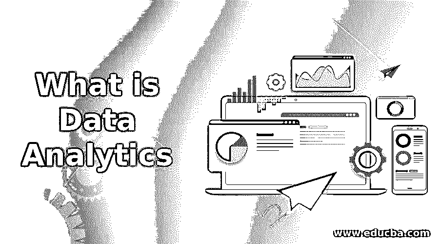

# 什么是数据分析

> 原文：<https://www.educba.com/what-is-data-analytics/>

## 数据分析简介

数据分析是对原始数据进行分析以得出相关结论的科学。数据分析是指分析数据以提高生产力和企业利润的技术。从不同来源提取和清理数据，以分析各种模式。许多数据分析技术和过程被自动化成机械过程和算法，这些过程和算法处理供人类消费的原始数据。

### 数据分析的类型

根据分析数据的目的，数据分析流程从主观上分为三种类型:

<small>Hadoop、数据科学、统计学&其他</small>

*   描述性分析
*   预测分析
*   规定性分析

上面列出的分析类型的特征如下:

#### 1.描述性分析

描述性分析侧重于总结过去的数据以得出推论。

定量描述历史数据分布的最常用方法包括:

*   **集中趋势的度量:**平均值、中位数、四分位数、众数
*   **可变性或扩散的度量:**范围、四分位数范围、百分位数

近来，收集、存储和理解大量数据堆所涉及的困难和限制通过统计推断过程得以克服。通过使用抽样方法和中心极限理论的应用，推导出关于人口数据集统计的广义推论。一家领先的新闻广播公司在选举日在投票站出口收集随机选择的选民的投票细节，以得出关于整个人口偏好的统计推断。

对群体数据集的重复采样会产生样本量足够大的样本块。通常倾向于使用聚类抽样来生成分层良好的、无偏的总体数据集代表。对采样数据块计算感兴趣的统计度量，以获得样本统计值的分布，称为采样分布。抽样分布的特征与使用中心极限理论的总体数据集的特征相关。

#### 2.预测分析

预测分析利用历史或过去数据中的模式来估计未来的结果、识别趋势、发现潜在的风险和机会，或者预测流程行为。由于预测用例在本质上是合理的，这些方法采用概率模型来衡量所有可能结果的可能性。金融公司的客户服务门户中的聊天机器人基于他/她在它的网络域中的过去活动主动地学习客户的意图或需求。通过预测的上下文，聊天机器人与客户进行交互式对话，以快速提供 apt 服务，并获得更好的客户满意度。

除了基于可用的过去数据来预测未来发生什么的外推场景之外，很少有应用程序借助可用的数据样本来猜测丢失的数据条目。给定数据样本范围内的缺失值的这种近似在技术上被称为插值。一个强大的图像编辑器应用程序支持通过在丢失的块上插入特征函数来重建由于叠加文本而丢失的纹理部分。特征函数可以解释为失真图像纹理中模式的数学符号。

影响预测模型/策略选择的重要因素有:

*   **预测精度:**传达预测值与实际值的接近程度。预测值和实际值之差的方差越低，意味着预测模型的准确性越高。
*   **预测速度:**在实时跟踪应用中，它被优先考虑
*   **模型学习率:**它取决于模型的复杂性和计算模型参数所涉及的计算。

#### 3.规定性分析

说明性分析使用作为描述性和预测性分析的一部分发现的知识来推荐情境感知的行动过程。先进的统计技术和计算密集型优化方法的实施，以了解估计预测的分布。

准确地说，在预测分析过程中估计的每个结果的影响和益处被评估，以针对给定的一组条件做出启发式和时间敏感的决策。一家股票市场咨询公司对投资者投资组合中股票的预测价格进行 SWOT(优势、劣势、机会和威胁)分析，并向其客户推荐最佳的买卖选项。

### 数据分析中的流程

数据分析过程包括如下所示的不同数据处理阶段:

#### 1.数据析取

从各种类型的多个数据源(包括网页、数据库、遗留应用程序)获取数据会产生不同格式的输入数据集。

输入数据分析流程的数据格式可以大致分为:

*   结构化数据对数据类型以及相关的字段长度或字段分隔符有明确的定义。这种类型的数据可以像存储在关系数据库(RDBMS)中的内容一样容易地被查询。
*   半结构化数据缺乏精确的布局定义，但是可以根据标准模式或其他元数据规则对数据元素进行识别、分离和分组。XML 文件使用标记来保存数据，而 Javascript 对象标记文件(JSON)以名称-值对的形式保存数据。像 MongoDB 和 couch base 这样的 NoSQL(不仅仅是 SQL)数据库也用于存储半结构化数据。
*   非结构化数据包括社交媒体对话、图像、音频剪辑等。传统的数据解析方法无法理解这些数据。非结构化数据存储在数据湖中。

结构化和半结构化数据的数据解析实现被集成到各种 ETL 工具中，如 Ab Initio、Informatica、Datastage 和 Talend 等开源工具。

#### 2.数据清理和转换

清理已解析的数据是为了确保数据的一致性以及相关数据在流程中的后续阶段的可用性。

数据分析中的主要清理操作包括:

*   数据量中异常值的检测和消除。
*   移除数据集中的重复项。
*   理解功能或用例，处理数据记录中的缺失条目。
*   数据记录(如“31-2 月”)中允许字段值的验证不能是任何日期字段中的有效值。

清理后的数据被转换成适合分析数据的格式。

数据转换包括:

*   过滤掉不需要的数据记录。
*   连接从不同来源获取的数据。
*   数据的集合或分组。
*   数据类型转换。

#### 3.KPI/洞察力推导

数据挖掘、深度学习方法用于评估关键绩效指标(KPI)或从清理和转换的数据中获得有价值的见解。基于分析的目标，使用各种模式识别技术来执行数据分析，如 k-means 聚类、SVM 分类、贝叶斯分类器等。以及机器学习模型，如马尔可夫模型、高斯混合模型(GMM)等。

概率模型在训练阶段学习最佳模型参数，在验证阶段，使用 k-fold 交叉验证测试来测试模型，以避免过度拟合和欠拟合错误。数据分析最常用的编程语言是 R 和 Python。两者都有丰富的库(SciPy、NumPy、Pandas ),这些库是开源的，可以执行复杂的数据分析。

#### 4.数据可视化

数据可视化是使用图表、绘图、仪表板和图形清晰有效地呈现未发现的模式、从数据中得出的结论的过程。

*   QlikView、Tableau 等数据报告工具。，以不同的粒度级别显示 KPI 和其他派生指标。
*   报告工具使最终用户能够使用用户友好的拖放界面创建带有透视、深入查看选项的自定义报告。
*   交互式数据可视化库，如 D3.js(数据驱动文档)、HTML5-Anycharts 等..用于提高浏览分析数据的能力。

### 推荐文章

这是什么是数据分析的指南。在这里，我们讨论了流程中不同类型的数据分析。您也可以浏览其他推荐文章，了解更多信息——

1.  [数据分析师面试问答](https://www.educba.com/data-analyst-interview-questions/)
2.  [什么是数据可视化？](https://www.educba.com/what-is-data-visualization/)
3.  [面板数据分析](https://www.educba.com/panel-data-analysis/)
4.  [大数据分析薪资](https://www.educba.com/big-data-analytics-salary/)

