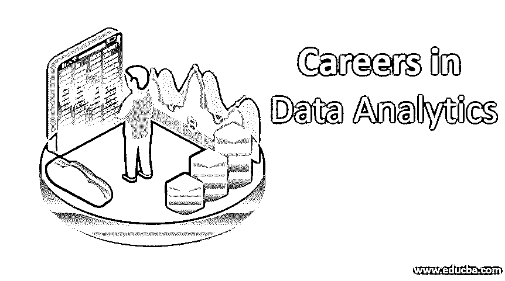
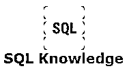

# 数据分析职业

> 原文：<https://www.educba.com/careers-in-data-analytics/>

## 数据分析职业介绍

在本主题“数据分析职业介绍”中，我们将学习[数据分析是](https://www.educba.com/what-is-data-analytics/)收集和分析数据并将其转换为有用信息的技术。分析数据有助于我们预测未来的改善，并使我们能够做出决策。存储、处理和分析数据将有助于我们根据以前的数据记录为未来的工作打下更坚实的基础。使用数据分析，交通警察可以通过收集和分析交通数据来设计道路规模扩展要求。

### 建立事业所需的教育

现在，我们将讨论建立数据分析职业生涯所需的教育，因此在成为数据分析师之前，候选人应该掌握以下技能，以便在数据分析职业领域取得成功。

<small>Hadoop、数据科学、统计学&其他</small>

#### 1.擅长

#### 

这是数据分析最基本的工具。使用内置的数据透视表可以轻松地探索、清理和分析数据。Excel 是使用最多的工具。Excel 因其计算和公式的数量而受到所有人的青睐。

#### 2。表中

#### 

[Tableau 为](https://www.educba.com/what-is-tableau/)您提供了选择正确图表的选项，以便正确地重新呈现数据，因为不可能用饼图或条形图读取所有数据。作为一名数据分析师，应该对如何表示数据有一个正确的理解，为什么 Tableau 的知识会帮助你在数据分析工作中站稳脚跟。

#### 3.SQL 知识

仅仅精通 excel 不会对你在数据分析领域建立成功的职业生涯有很大帮助，但 SQL 知识将成为你数据分析载体的附加内容。SQL 没有任何限制，但是 excel 有很多限制。由于今天的数据存在于数据仓库、数据库和大数据中，为了访问和整理这些杂乱的数据，我们应该了解任何查询语言，而 SQL 是数据分析类工作的最佳选择。SQL 只是为了进入数据分析。

#### 4.证书

#### 

以下认证将帮助您获得数据分析知识:

*   卓越工程大数据分析和优化证书(CPEE)。
*   Cloudera 认证助理(CCA)数据分析师。
*   数据科学专业成就认证。

### 职业道路

对于那些希望在数据分析领域建立职业生涯的人来说，他们的未来是光明的，并将在日常生活中发挥重要作用&商业和不断发展。数据分析职业正在改变职业世界。

以下是数据分析人员的两条主要职业道路:

#### 1.物联网

[IOT 只需](https://www.educba.com/what-is-iot/)使用网络连接将所有设备互连，并使它们进行通信，或在设备内传输数据，如计算设备、机械设备和数字设备可以使用物联网相互通信，这种通信是通过数据分析进行的分析。
所有的家庭设备可以互相连接，按顺序工作，完成工作。数据分析收集数据，并将其放在一起进行分析。使用数据分析将有助于改善设备的功能。

#### 2.人工智能

人工智能的主要用途是创造能够对自己做出反应的机器。数据分析在这里扮演着重要的角色。基于数据分析所分析的数据，设计人工智能机器。苹果的 Siri 就是 AI 最好的例子。Siri 处理输入数据，并根据问题或请求做出回应。Siri 本身会分析数据，并决定回应什么以及何时回应。

### 数据分析师的工作职位

数据分析职业生涯提供了最高级别的工作，因为数据分析师的职位从数据分析师开始，可以作为分析副总裁到达最高管理层。

以下是组织中数据分析师的常见称号和角色:

**数据分析师:**这是[在组织中的起始职位](https://www.educba.com/what-is-data-analyst/)；数据分析师可以被指定为业务分析师。他们更关心公司应该在哪个项目上投资更多的商业模式，在项目 A 还是项目 B？

**高级数据分析师:**高级数据分析师筛选出数据分析师提供的数据，并将报告发送给数据分析师主管。高级数据分析师通过不断改变现有业务的智能模式来为业务创建解决方案。高级数据分析师负责编码、设计、调试、记录和支持具有业务需求的基于服务器的应用程序。

**数据分析师主管:**数据分析师主管管理一个数据分析师团队，该团队使用统计方法提供改进业务绩效的建议领域和方法。数据分析师负责人应用分析方法协助业务增长结果&还提供市场数据用于业务比较。创建报告&提交给管理层，用于战略规划&决策。要成为分析主管，需要在同一领域拥有 7 年的经验和学士学位，因为该主管将向单位/部门主管报告，因此需要大量的创造力和演示技巧。

**数据分析副总裁:**副总裁在一家机构工作，负责分析与其机构相关的细分市场。他们为战略规划&联盟提供了机会。他们的主要工作是为他们的领域开发一个新的工作领域。他们的战略规划和分析方法总是专注于实现他们的组织目标。

### 数据分析师的薪资和职业前景

让我们看看一些职业前景和薪水

#### 工资(数据和数字)

美国一个数据分析师的平均工资是 65470 美元。根据 Glassdoor 上提交的详细信息，数据分析师的最低工资为 46，000 美元，而美国数据分析师的平均工资为 65，000 美元。因此，对于希望在数据分析领域发展职业生涯的人来说，工资增长是一个好处。许多组织在数据分析师员工身上花费了 80，000 美元到 95，000 美元不等的巨额资金。上述薪资估算基于各组织的数据分析师提交给 Glassdoor 的 13，063 份薪资。

#### 职业前景

[德勤 2016 年分析趋势](https://www2.deloitte.com/us/en/pages/deloitte-analytics/articles/analytics-trends.html?id=us:2sm:3tw:at2016:eng:da:020516:deloitteba:iot&linkId=20913691)报告称，分析型大学和数据科学项目的数量正在上升(仅在美国就有 100 个左右。);尽管如此，他们还是无法培养出足够多训练有素的人才来满足需求。根据欧洲软件，2016 年西欧 BDA 软件市场达到 122 亿美元，预计 5 年 CAGR 增长 7.9%。2015 年至 2020 年全球数据分析的收入趋势(以 10 亿美元计)IDC 欧洲公司企业软件研究总监菲利普·卡内利(Philip Carnelley)表示，2015 年西欧商业分析软件市场增长了 9.7%，达到 113 亿美元。预计到 2020 年底，中国的 CAGR 增长率将达到 5.8%。

### 推荐文章

这是一份数据分析职业指南。在这里，我们讨论了所需的教育技能，以及分析领域的职位、工资和职业道路。您也可以阅读以下文章，了解更多信息——

1.  [网页开发软件](https://www.educba.com/web-development-software/)
2.  [SharePoint 中的职业](https://www.educba.com/careers-in-sharepoint/)
3.  [数据仓库职业](https://www.educba.com/career-in-data-warehousing/)
4.  [如何穿得更好](https://www.educba.com/how-to-dress-better/)

