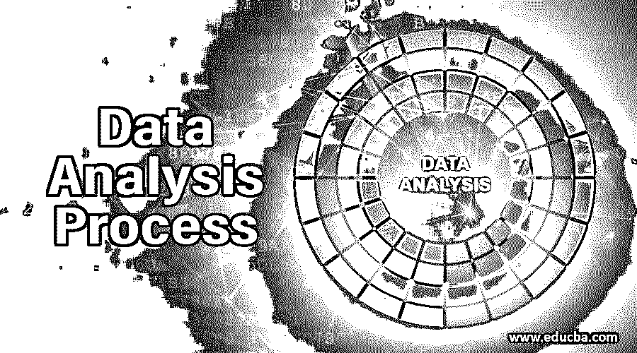

# 数据分析过程

> 原文：<https://www.educba.com/data-analysis-process/>

## 数据分析过程介绍

数据分析过程是分析数据以确定数据模式或业务决策的过程。数据分析涉及多种技术、流程和工具。数据分析对于了解现有业务绩效和预测业务改进的可能模式非常重要。数据分析过程遵循某些阶段，例如业务问题陈述、理解和获取数据、从各种来源提取数据、应用数据质量进行数据清理、通过进行探索性数据分析进行特征选择、异常值识别和移除、转换数据、通过图表和图形创建数据可视化、应用统计分析、机器学习模型。

### 数据分析过程的阶段

让我们详细定义每个阶段，以及我们如何使用技术堆栈来实现它。

<small>Hadoop、数据科学、统计学&其他</small>

#### 1.商业理解

在分析该行业的数据时，我们应该对该行业有一个清晰的概述和了解，该行业做什么，他们将做出什么样的决策，出于什么目的分析数据，所有数据分析过程都是从一个问题开始的，许多人认为可以通过使用数据集来分析数据，数据集的可用性足以分析任何类型的模式， 根据理解，没有用于分析数据的数据集，我们只需要它。问题定义数据集本身，在这种情况下，唯一的挑战是在回答一个问题时，可能会出现另一个问题，但这没关系，它实际上不只是数据分析过程的一部分。

#### 2.获取原始数据

在此步骤中，定义问题后，从不同来源(如数据仓库、日志和数据集)收集数据以回答这些问题，查询行数据以回答这些问题，但这不是行数据集，相反，我们需要称之为行数据，因为它并不完全是我们想要分析的形式。

#### 3.提取数据

这是提取数据以创建最终数据集的步骤。这将允许我们引导进一步的分析过程，这是一个干净的数据集。SQL 用于从数据库中提取数据。被查询以提取具有若干行的数据的数据库超过一百万。像 SQL 这样的数据库查询语言使分析师能够轻松地分析和转换数据。SQL 是您应该学习的第一件事，因为它使您能够处理数据集。

#### 4.转换数据

数据转换是将数据或数据集从一种状态或结构转换为另一种状态结构的过程，它是数据集成的基本状态，其中从不同来源收集的数据已被集成为特定的结构化数据，以便可以在目的地用于分析过程。该过程称为 ETL(提取转换负载)。数据转换过程是指检测和理解原始结构化或源格式的数据。这通常是在算法的帮助下实现的，算法是通过使用数据分析和剖析工具来实现的。这一步有助于您决定需要对数据进行什么处理，才能将数据转换成所需的格式。通常，R 或 Python 语言使您能够对来自数据源的大型或复杂数据执行数据转换。

#### 5.数据可视化

在构建或创建数据集之后，我们需要可视化数据来发展您的假设或见解，以探索和评估数据。Tableau/saas(数据可视化应用程序)允许我们可视化结构化和非结构化数据库中的大量数据列，并轻松地从数据集中获得见解/有意义的模式。

#### 6.静态分析

数据分析的重要方面是从模型和图表的角度总结数据及其理解。除此之外，它还解释了数据与底层现实世界的关系。静态分析还用于识别预测分析的模式或趋势，这有助于做出业务决策，也有助于确定数据集的静态重要性。

#### 7.数据模型开发

行业对部署具有预测能力的模型非常感兴趣，数据模型开发包括模型目标的定义、问题的概念及其到计算模型的转换。

R/Python 使您能够创建一个统计模型来拒绝任何无效或零假设，现代应用程序在处理数学复杂性方面发挥着重要作用。供应商正在开发软件即服务，如 table 和 SAS，通过使用为业务分析师设计的自动化预测建模工具来构建模型，使分析过程越来越容易。分析专家正在利用来自开源市场或模型构建 API 的机器学习算法来构建预测应用模型。

#### 8.建议/报告/故事

这是数据分析流程的最后一步，其中总结了分析决策，并以故事、报告、建议和 PPT 的形式呈现了分析流程的结果或后果。tableau 和 SAS 应用程序在通过报告或故事构建总结分析流程方面发挥了重要作用，该报告包括:

*   以客户/行业为中心的成果。
*   行业战略和决策树。
*   业务优先级的标识。
*   确定产品的目标受众或消费者。
*   基于可衡量结果的商业案例。

### 结论

对于大多数企业、企业、行业和政府机构来说，缺乏数据不是问题。有大量信息可用于做出明确的数据驱动和面向业务的决策。在面向分析的流程中使用了如此多的数据，我们需要从可用数据中获得更合适的知识和信息:业务需要知道这是用于制定数据驱动型决策的正确数据。企业需要从这些数据/信息/知识中得出准确的结论。企业需要信息丰富、对决策过程有用的数据。

### 推荐文章

这是数据分析过程的指南。在这里，我们讨论数据分析过程的不同阶段的基本概念，如业务理解、获取原始数据等。您也可以浏览我们推荐的文章，了解更多信息——

1.  [八大免费数据分析工具](https://www.educba.com/free-data-analysis-tools/)
2.  [数据分析技术类型介绍](https://www.educba.com/types-of-data-analysis-techniques/)
3.  [数据分析与数据分析–主要差异](https://www.educba.com/data-analytics-vs-data-analysis/)
4.  [什么是数据集成？](https://www.educba.com/what-is-data-integration/)

