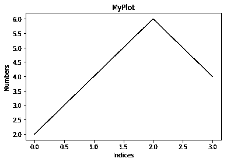
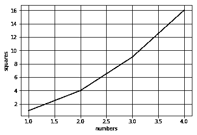
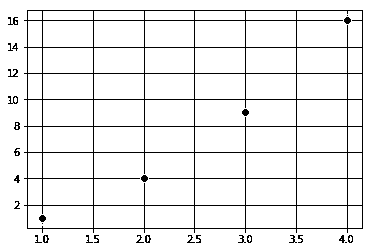
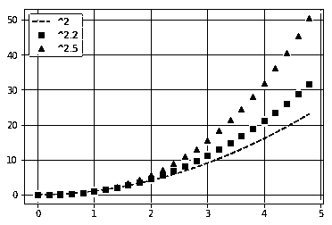
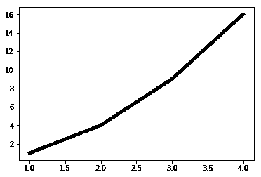
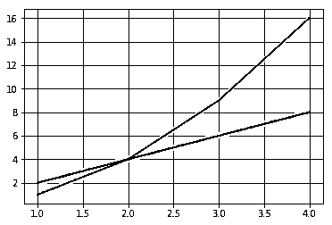

# 数据可视化工具

> 原文：<https://www.educba.com/data-visualization-tools/>


## 数据可视化工具简介

数据可视化使用 matplotlib、tableau、fusion charts、QlikView、High charts、Plotly、D3.js 等数据可视化工具帮助处理和分析复杂的信息。由于这些工具有助于以图表、图形和地图的形式获得数据和信息的图形表示，使用这些工具，数据可视化设计人员可以轻松地创建大型数据集的可视化表示，这反过来有助于通过从大型数据集获得洞察力来做出有效的决策。

### 什么是数据可视化工具？

有许多数据可视化工具，如 Tableau、QlikView、FusionCharts、HighCharts、Datawrapper、Ploty、D3.js 等。尽管在数据可视化的日常生活中有大量的数据可视化工具，但最流行的绘图工具之一是 matplot。pyplot。

<small>Hadoop、数据科学、统计学&其他</small>

**数据可视化工具 Matplotlib 使用最广泛的原因:**

*   Matplotlib 是 python 中最重要的绘图库之一。
*   整个绘图模块的灵感来自 Matlab 中可用的绘图工具。
*   主要原因是许多人来自数学、物理、天文学和统计学领域，许多工程师和研究人员都习惯于 Matlab。
*   Matlab 是一个流行的科学计算工具箱，特别是对于科学计算。因此，当人们开始为机器学习/数据科学/人工智能创建 python 专用绘图库时，他们受到 MATLAB 的启发，创建了一个名为 matplotlib 的库

**matplotlib . py plot:**matplotlib。pyplot 广泛应用于创建带区域的图形，绘制线条，我们可以很好地将图形可视化。

### 数据可视化工具的示例

下面是提到的例子:

将 matplotlib.pyplot 汇入为 plt。

**代码:**

```
plt.plot([2,4, 6, 4])
```

上面是一个列表，plt.plot 将绘制这些列表元素的 Y 轴，索引为 0，1，2，3，作为它们对应的 X 轴。

**代码:**

```
plt.ylabel("Numbers")
plt.xlabel('Indices')
```

如果我们看上面 2 行代码，它分别标记了 Y 轴和 X 轴。(即，命名两个轴。)

**代码:**

```
('MyPlot')
```

上面一行代码将给出情节的标题。标题告诉我们这个情节是怎么回事。

**代码:**

```
plt.show()
```

**输出:**




上面的图(截图 1)有一个问题，如果你注意到了，我们没有看到网格状的结构。网格有助于您更容易地从图中读取值。现在让我们看看如何得到网格。

**代码:**

```
plt.plot([1, 2, 3, 4], [1, 4, 9, 16])
```

看上面的代码行，不是给出一个数组，而是两个列表，分别是 X 轴和 Y 轴。这里你可以注意到，如果我们的 x 轴值是 2，它对应的 y 轴值是 4，也就是说，y 轴值是 x 轴值的平方。

**代码:**

```
plt.ylabel('squares')
plt.xlabel('numbers')
plt.grid() # grid on
```

你一给它，它就会给出一个嵌有网格图。

**代码:**

```
plt.show()
```

**输出:**




现在，我们用不同的示例绘制不同的图，而不是线图。

**代码:**

```
plt.plot([1, 2, 3, 4], [1, 4, 9, 16], ‘ro’)
```

每个 X，Y 对都有一个相关的参数，如颜色和形状，我们可以使用 python 关键字对参数的功能给出相应的参数。

在这种情况下，“ro”表示红色，o 表示圆形圆点。

**代码:**

```
plt.grid()
plt.show()
```

**输出:**




假设 matplot 库只对列表有效，那么我们就不能在数字处理中广泛使用它。我们可以使用 NumPy 包。此外，所有内容都在内部转换为 NumPy 数组。

**让我们稍微看一下不同的情节:**

下面是不同的情节:

**代码:**

```
import numpy as np
t = np.arange(0., 5., 0.2)
Above line creates values from 0 to 5 with an interval of 0.2.
plt.plot(t, t**2, 'b--', label='^2')#   'rs',   'g^')
plt.plot(t,t**2.2, 'rs', label='^2.2')
plt.plot(t, t**2.5, 'g^', label=‘^2.5')
```

在以上代码行中，“b––”表示蓝色破折号，“rs”表示红色正方形，'g^'表示绿色三角形。

**代码:**

```
plt.grid()
plt.legend()
```

上面一行代码添加了一个基于图例的在线标签。传说让剧情可读性极强。

**代码:**

```
plt.show()
```

**输出:**




如果我们希望线宽更大，那么一个简单的参数叫做 line width 就可以做到。

**代码:**

```
x = [1, 2, 3, 4]
y = [1, 4, 9, 16]
plt.plot(x, y, linewidth=5.0)
plt.show()
```

**输出:**




您可以在 matplotlib . py plot(https://matplotlib . org/API/py plot _ API . html)中的绘图函数文档中找到许多其他参数。

另一件有趣的事情是设置属性:

*   x1 = [1，2，3，4] y1 = [1，4，9，16]

Y1 值是 X1 值的平方。

*   x2 = [1，2，3，4] y2 = [2，4，6，8]

Y2 值是 X2 值的两倍。

*   lines = plt.plot(x1，y1，x2，y2)

通过使用上面的线，我们可以在一条直线上绘制这些值。这里会画出 X1 对 Y1，X2 对 Y2，我们把它们存储在一个叫做 lines 的变量里。此外，我们可以使用关键字参数来更改这些行的属性。

*   plt.setp(lines[0]，color='r '，linewidth=2.0)

这里 setp 被称为 set properties，lines[0]分别对应 X1，Y1，color 和 linewidth 是自变量。上面一行代码是使用关键字参数编写的(参考截图 6)。

*   plt.setp(行[1]，'颜色'，' g '，'线宽'，2.0)

上面一行代码代表了 matlab 语法。

这里线[1]分别对应于 X2，Y2。我们还有两对参数'颜色'，' g '和'线宽'，' 2.0 '。

**无论哪种方式，我们都可以画出这条线:**

*   第一种方式是我们在 python 中使用的本机方式。
*   第二种方式最好是 Matlab 背景的人使用。

**代码:**

```
plt.grid()
put.show()
```

**输出:**




### 结论

在这篇数据可视化工具的文章中，我们介绍了用 Python 可视化数据。更具体地说，我们已经看到了如何用线图绘制数据，以及如何用散点图总结变量之间的关系。

### 推荐文章

这是数据可视化工具指南。这里我们讨论数据可视化工具的介绍、不同的工具和例子。您也可以阅读以下文章，了解更多信息——

1.  [数据可视化与数据分析](https://www.educba.com/data-visualisation-vs-data-analytics/)
2.  [数据科学家 vs 数据挖掘](https://www.educba.com/data-scientist-vs-data-mining/)
3.  [大数据分析软件](https://www.educba.com/big-data-analytics-software/)
4.  [数据架构师岗位](https://www.educba.com/data-architect-jobs/)


