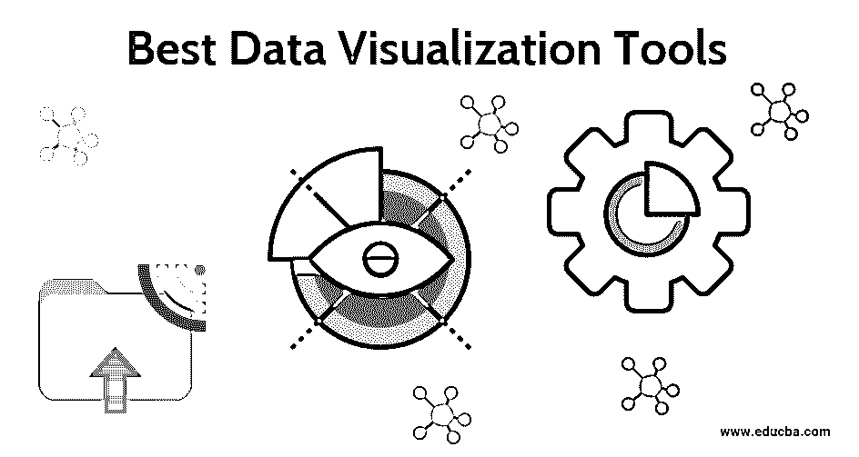

# 最佳数据可视化工具

> 原文：<https://www.educba.com/best-data-visualization-tools/>

## 最佳数据可视化工具简介

今天，我们正在处理大量的数据；有必要了解这些数据的重要性，并继续使用升级工具，以便在未来做出明智的决策。为了可视化这些数据，需要数据可视化工具。它们让用户从恰当的展示中获得洞察力。数据可视化工具旨在通过模式、仪表板、地图、图表等元素进行设计和分析。

在本文中，我们将介绍市场上一些顶级的可视化工具，目的是根据用户需求展示它们。一个非常好的 BI 工具应该能够分析和理解生成的自助分析报告。仪表板有效地显示了分析过程。

<small>Hadoop、数据科学、统计学&其他</small>

### 数据可视化工具的类型

这是目前市场上最顶尖的商业智能工具。其中，Tableau、微软 Power BI 和 Qlik 这三款工具是 Gartner 魔力象限中的领先工具。

以下是组织中最流行的免费数据可视化工具列表。

*   活人画
*   Microsoft Power BI
*   沉默
*   Zoho 报道
*   Jupyter
*   谷歌图表
*   信息图表
*   Plotly
*   qlikview
*   Klipfolio
*   维斯梅
*   适应性发现
*   沃森分析
*   多莫
*   高图表

让我们详细了解一下各个数据可视化工具的重要性:

**

** **1。Tableau:** 它们通常被认为是强大的[商业智能工具](https://www.educba.com/business-intelligence-tool/)。它允许我们处理广泛和巨大的数据集，这些数据集用于人工智能、机器学习、商业智能和许多 It 组织的客户链接等领域，因为它们在解决数据问题方面非常简单。Tableau 有助于导入所有大小的数据和管理元数据。数据来自不同平台上的不同来源。而这些数据是通过 tableau desktop 连接起来的。这些数据被发布到 tableau 服务器。tableau 阅读器帮助用户阅读和查看文件。Tableau 有大量的数据连接器，并提供了一个庞大的用户社区。

**

2。** **微软 Power BI:** Power BI 能够利用易于使用的平台创建个性化的仪表板。它支持和导入各种来源的数据，并嵌入图表、地图、表格，以实现更好的可视化。Power BI 使用 R 语言来实现更好的可视化，也可以在桌面上利用云功能。存储容量限制为 10GB 云存储。Power BI 帮助协作者在线发布数据。

**

3。Sisence:** 这是一个开源的授权商业智能软件，它使得数据非常容易作为自助服务。Sisence 使数据非常具有交互性，并连接到不同的数据源，这些数据源被放入一个存储库中，以便从仪表板上轻松访问。这种实时数据可视化提供了对特定组织的即时洞察。它们具有简单、用户友好的拖放功能，以及良好的交互式图形、图表和可视化效果。选择 Sisense 是因为它设置简单，数据导出范围大。

**

4。Zoho Reports:** 这是一款商业智能分析工具，成立于 1996 年，为两个用户提供免费服务，允许创建即席报告，并提供报告选项，如共享、邮件调度、摘要视图、具有高度安全平台的数据透视表。这个工具对于应用开发者和独立软件开发商来说非常重要。他们有直观的形象，有很好的洞察力。Zoho reports 或 analytics 是一个在线报告，具有各种功能，如混合和合并实时协作和[高安全性 SSL 连接](https://www.educba.com/what-is-ssl/)。他们的功能包括良好的财务报告，定期报告，流分析。

**

5。Jupyter:** Jupyter 是一个[开源 web 应用](https://www.educba.com/what-is-web-application/)，广泛用于共享源代码和文档，并单独执行。它们是交互式 3D 可视化，是一种方便的工具，有 GUI 工具包支持。Jupyter 功能强大、简单、可共享，可以在与大多数数据科学项目在该 IDE 中执行可视化相同的环境中工作。与其他标准工具相比，它们被认为是更高的。Jupyter 可以灵活地向用户发布 pdf、仪表盘(Plotly 的)、Html。

**

6。Google Charts:** 这是一个允许在网站上可视化数据的开源软件。它是免费的，完全用于商业和教育目的，具有丰富的画廊功能。这是一个网络服务，提供各种图表、饼图、气泡图、折线图、面积图和散点图。所有这些图表可以采用静态数据，也可以来自数据库。它们被认为是一个 JavaScript 库，有 API 包。这个 API 在 SVG 画布上嵌入了一个图形，清晰度很高。这些谷歌图表用于业务需求，财务报告，统计网站报告。他们的工作步骤是用 JavaScript 将 HTML 文件嵌入到图表中；同时，执行 AJAX 请求并设置成 SVG 最后，Html 文件将画布导入网页。

**

7。Infogram:** Infogram 是为免费的商业策略开发的，被认为是处理复杂数据的最好的信息图表工具。这个工具用一个现成的模板设计构建光滑的报告，信息图表，单页。Infogram 不需要代码；其操作结构允许用户节省大量时间。Infogram 以多种选项、格式直观地表示数据，形成一个非常可靠的平台；工作界面是动态的。他们的可视化内容抓住了观众，他们创造和发现新的事实和异常值。

**

8。Plotly:** 这是一个交互式的开源可视化工具，只需编写几行代码，具体来说，是一个 Python 图表库。Plotly 是丰富多彩的，有一个开源的脚本，很容易修改。它们的对象构成数据组件和布局组件。Plotly 产品允许高级 API 包装器来节省时间。Plotly 在技术上提供了在线图形，统计工具，易于使用的交互式 python 库。Plotly 建立在 plotly.js 之上，这是一个 JavaScript 库。所有这些图形和图表与惊人的可视化将完全互动的演示。这个 python 库利用声明式编程和完整的实现框架。

**

9。Qlik View:** 这是一个为分析应用程序创建的强大的商业智能发现平台。这是一个基于付费查询的工具，带有一个内存应用程序。构建分析应用程序不需要任何专业的开发技能。它们的优势包括灵活的图表、对转换的更好控制、实施时间非常短。qlik 视图可以从多个来源获取数据，以获得更深入的见解来应对业务挑战。qlik 视图有助于用户做出正确的决策，并且易于访问。它可以分析和分离数据关联和不需要的数据(根据用户意愿进行过滤)。这是一个数据发现产品，允许用户编辑搜索并构建自己的应用程序来满足需求。

**

10。Klipfolio:** 这个工具在仪表板平台中得到了丰富，对现实生活中的业务很有帮助。它可以针对各种规模的企业进行定制，以便使用数据引擎处理复杂的数据。它连接到多个信号源，在它们之间切换非常简单。Klipfolio 非常灵活，可以将第三方可视化嵌入到自己的仪表板中。Kilpfolio 连接到[谷歌分析](https://www.educba.com/what-is-google-analytics/)、Twitter 和数据仓库。

**

11。Visme:** 这是一个创建信息图表的工具，可以免费使用设计工具作为视觉进化的一部分。它们的特点是在为内容创作创建演示文稿时最吸引人的好处。Visme 内容可以在任何地方发布和共享，并且有 1000 个内置模板和图形。此外，Visme 还发现了微软应用程序上的数据集成。

**

12。Adaptive Discovery:**Adaptive insights 工具允许识别在交互式下钻中发现的问题。它是专门为业务中的正确决策而设计的。创建它们是为了分析公司的财务数据，以便进行绩效管理和规划流程。这些数据可视化工具是自助仪表盘的强大功能(图表、条形图易于导航，也易于监控差异)。他们有能力进行计算，并根据上下文显示出来；最重要的是，不需要任何代码。管理财务需求，简化协作和共享。

**

13。高图表:**这个工具对于网页的交互式可视化非常有帮助。它的免费版本帮助非商业用户。high charts 软件有各种各样的图表类型，甚至可以将多个图表合并成单个图表。

**

14。Watson Analytics:** IBM 发布了这些用于统计程序的分析，并计划将其用于非商业目的。通过发现新模式来可视化非结构化内容，自动预测和洞察可用数据，并使用自然语言与数据进行交流。其特点包括检测模式更快；数据展示是用预先准备好的模板完成的，只需一次点击即可访问。此外，通过客户满意度算法，我们可以收集社交媒体上的评论和反馈。

**

15。Domo:** 这款基于云的仪表盘工具让我们能够实时识别见解并分享业务故事。通信是通过通知、消息传递来完成的，以更新或改变数据集。更重要的是，他们有数据连接器和 350 流。

### 结论

在本文中，我们遇到了商业智能中不同的数据可视化工具。在选择合适的工具之前，建议探索其功能和其他可用选项。正如我们得出的结论，这种可视化工具有效地用于分析见解，并具有良好的设计工具和数据处理。

### 推荐文章

这是最佳数据可视化工具指南。在这里，我们讨论介绍并解释 15 种不同的数据可视化工具。你也可以浏览我们推荐的其他文章来了解更多信息-

1.  [什么是数据可视化](https://www.educba.com/what-is-data-visualization/)
2.  [使用 Tableau 进行数据可视化](https://www.educba.com/data-visualization-with-tableau/)
3.  [大数据分析工具](https://www.educba.com/big-data-analytics-tools/)
4.  [数据仓库工具](https://www.educba.com/data-warehouse-tools/)

