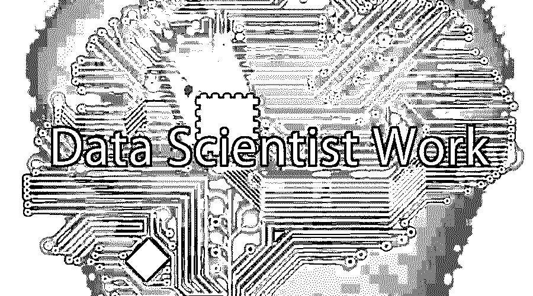

# 数据科学家的工作

> 原文：<https://www.educba.com/data-scientist-work/>

## 数据科学家工作简介

如今，数据是全球舞台上品牌和公司最重要的方面之一。数据是各个行业和类别的品牌增长的关键，因为它有助于它们在激烈的竞争中保持领先。换句话说，数据正在帮助建立公司和品牌，从而将它们带入下一个增长阶段。这就是为什么在过去几年里，董事会里充斥着大数据和数据分析等词汇。在本主题中，我们将了解数据科学家的工作。

### 数据科学家工作越来越重要

数据发展的重要性反过来提高了处理这些数据的人的重要性。这就是为什么数据科学家的职位对外来说很重要，几乎在所有地方都受到高度重视。因为数据科学家的工作相对较新，所以这个角色涉及业务数据分析和技术。因此，大多数填补这一职位的人都有这两个领域的经验，使他们成为一个知道这两个世界最好的混合体。

<small>Hadoop、数据科学、统计学&其他</small>

数据的重要性以及从数据中获取重要见解的需求导致一些组织不仅投资于一名数据科学家的工作，还投资于一个团队，共同承担相同的责任。公司投资团队而不是个人的主要原因是，数据科学家的技能组合可能会有所不同，而这些可能不是一个人所具备的。

因此，毫无疑问，数据科学家计划是公司希望填补的关键职位之一，不仅在当前，在未来也是如此。事实上，根据托马斯·达文波特和 D.J .帕蒂尔在《哈佛商业评论》上的一篇文章，这是 21 世纪最性感的工作之一。但是成为数据科学家的主要标准是什么呢？虽然许多人可能认为软件开发、数据管理、统计学、机器学习和数据可视化等各种领域的复杂知识很重要，但这个过程中涉及的内容要多得多。

### 工作职责

数据科学家的一些主要工作职责包括:

1.  管理任何特定行业的研究，然后提出相关的问题
2.  从大量数据中推断出重要的见解。数据可以来自外部或内部来源。
3.  一方面准备数据，使其可用于说明性和预测性建模，另一方面安装熟练的分析程序和其他数据分析方法。
4.  清理和删除数据，从而删除不相关和不重要的信息
5.  从多个角度检查数据，以便找出隐藏的弱点、趋势和公司未来的机会
6.  为一些最具挑战性的品牌问题设计数据驱动的解决方案
7.  设计能够解决挑战和简化工作问题的当代算法。
8.  通过数据可视化和数据，这些科学家必须连接团队的其余部分，特别是 IT 部门和管理层关于数据分析趋势的实施
9.  认可对公司当前战略和程序的实际改变

虽然公司总是需要数据科学家，但根据公司的类型，他们有不同的工作职责。而一些公司认为他们的数据科学家主要是作为数据分析师；有时他们的职责与数据工程师的职责相结合，其他人相信雇佣精通数据分析技术的顶尖分析专家。随着数据科学家获得更多的经验，并在职业阶梯上晋升，他们的工作职责往往会发生变化。例如，中级组织中的数据科学家可能会花时间清理和管理数据，而大型高级组织中的数据科学家可能会花时间为公司的大数据项目创建结构，并帮助他们创建满足目标受众需求的新产品和服务。

### 数据科学家工作的方方面面

数据科学家工作分析师处理大量数据，有时成为数据科学家程序也是这份工作的同义词。数据科学家必须像分析师一样工作，从 MySQL 数据库中提取数据，成为 Excel 数据透视表的专家，并以折线图和条形图的形式生成基本的数据可视化。有时，数据分析师还必须接听公司的谷歌分析报告。雇用数据分析师的公司可能不是一个大品牌，但对于那些想要了解更多数据科学的人来说，他们是一个完美的起点。一旦数据分析师能够定期处理管理数据的职责，他们就可以向更大更好的组织前进。因此，数据分析师是任何想要最终成为数据科学家的人的第一步！

 

<address>Image source: pixabay.com</address>

如前所述，如今公司充斥着大量数据，他们需要定期分析这些数据。这就是为什么需要数据基础设施来理解数据，而这正是数据分析师可以帮助公司的地方。大多数时候，数据科学家和数据工程师的工作列表几乎是一样的。由于几乎所有类型的组织都需要数据工程师，所以在这个部门找工作相对简单。这就是为什么从事软件工程的数据科学家可能会在这样的公司中表现出色，因为他们需要专业人员一方面为他们的数据提供见解，另一方面帮助提供有用的数据，如对生产代码的贡献。作为初级数据科学家，在各种公司实习的机会非常适合那些希望以全面和战略性的方式了解该领域的人。

对于一个有正式的数学、统计学或物理学背景的人来说，在这个领域的学习几乎是无限的。这些人可以专注于生产更好的数据驱动型产品，这些产品可以以战略性的方式满足消费者的需求。专注于消费者需求的公司拥有大量数据，他们总是需要能够通过有意义和有效的营销活动帮助他们锁定目标受众的个人。

如今，许多组织都在为他们的数据职位雇佣多名员工。在这家公司，数据科学家计划将是大型团队的一部分，该团队基本上专注于从数据中生成重要趋势，尽管他们不必是数据公司。在这种情况下，数据科学家将需要执行分析、接触生产代码和可视化数据等技能。因此，有可能这些公司正在寻找一般数据分析师的职位，或者他们想要拥有机器学习或数据可视化等特定技能的人。

所有这些都非常清楚和明显地表明，数据科学家计划是一个非常宽泛的术语，理解工作描述将是开发所需技能集的第一步。首先，重要的是要理解数据科学家程序必须在一个领域具有特定的专业知识，并且必须知道如何处理该领域的问题。其次，他们必须能够从整组数据中辨别出不需要的数据，因为这将有助于他们得出结论性的结果和发现。

因此，如果成为一名数据科学家是你职业规划中的一部分，这里有一些你需要培养的品质。

1.  #### Understand basic tools

对数据科学的基本工具有一个基本的了解是非常重要的。想要成为数据科学家的个人必须对统计促进语言(如 R 或 Python)和数据库查询语言(如 SQL)有所了解。

2.  #### Basic statistical knowledge

每个想成为数据科学家的人都必须对统计学有一个整体的了解。它需要对统计测试、分布、最大似然估计等有一个内在的理解。除了与各种类型的公司，尤其是数据驱动型公司合作之外，统计对于处理各种类型的数据是不可或缺的。这些公司需要能够帮助他们做出决策和评估实验的数据科学家，因此掌握基本的统计学知识是极其重要的。

3.  #### Knowledge of machine learning is very important

如果你想在一家拥有海量数据的大公司工作，学习像 k 近邻、随机森林等机器学习方法是很重要的。虽然机器学习技术确实可以使用 R 或 Python 库来实现，但机器学习可以帮助公司发现数据管理的一个新方面。

4.  #### Basic knowledge of linear algebra and multivariable calculus can be of great help

许多员工希望他们的数据科学家工作能够提供他们通过统计结果或机器学习了解到的数据。这就是为什么多变量微积分或线性代数问题的基本知识可以帮助你看起来非常适合这份工作。当数据科学家能够实现他们自己的实现工具时，这表明他们能够以成功的方式从大量数据中得出结果。总而言之，理解这些概念对那些拥有由数据定义的产品的公司特别有帮助，对其算法的微小改进可以对公司的整体增长产生巨大的好处。

5.  #### Learn how to solve data management problems

当数据量很大时，很容易出现错误。这就是为什么知道如何处理数据中的任何缺陷是很重要的。数据缺陷的例子可能包括缺少值或不一致的字符串格式和日期格式。数据整理在小公司中极其重要，在小公司中，数据分析师被雇佣来整理大量数据。

6.  #### It is important to know how to visualize data and communicate effectively

让数据科学家的工作与众不同的最重要的技能之一是通过强烈的数据可视化和交流意识。对于成长中的公司来说尤其如此，因为他们首次做出数据驱动的决策。这就是为什么数据科学家计划能够可视化数据非常重要，以便他们能够制定数据驱动的解决方案，将公司带到下一个增长和发展水平。谈到沟通，数据科学家必须能够有效地将他们的发现和见解传达给相关的管理团队，以便以适当的方式加以利用。plot 和 d3.js 等可视化工具的知识可以[帮助数据科学家](https://www.educba.com/what-is-a-data-scientist/)以更好的方式可视化数据。此外，深入了解可视化数据编码和信息交流背后的原理只会有助于数据科学家努力扩大自己的理解范围。

7.  #### Having a degree in software engineering is a bonus

软件工程师对数据科学有更深入的理解，尤其是在小型组织中寻找数据科学家工作时。由于他们将负责处理大量的数据，以及数据产品的开发，拥有强大的软件工程背景将是必不可少的。

8.  #### Always think about work like a data scientist

全球各地的公司都在关注数据科学家，这意味着他们能够以有效的方式解决他们面临的一些紧迫挑战。因此，数据科学家必须意识到他们希望从事的垂直行业的机遇和挑战。了解他们的挑战并创建有效的解决方案来应对这些挑战，是任何数据科学家在未来职业发展和成功道路上可以迈出的第一步。

总而言之，数据科学是所有公司的未来，无论是大公司还是小公司。这意味着数据科学家的工作将继续在所有垂直行业的公司运作中占据重要地位。尽管数据科学是一个相对较新的新兴领域，但增长的机会几乎是无限的。因此，获得一份数据科学家的工作需要个人将自己的技能与公司的目标相匹配。这意味着对该部门如何运作有一个良好和全面的了解。通过发展上述[数据科学家技能](https://www.educba.com/data-scientist-skills/)，专业人员可以有效地努力成为优秀和成功的数据科学家。

### 推荐文章

这是数据科学家做什么的指南？.在这里，我们讨论了日益增长的重要性、责任以及成为数据科学家所需的素质。您也可以阅读以下文章，了解更多信息——

1.  [使用 Tableau 的数据可视化类型](https://www.educba.com/data-visualization-with-tableau/)
2.  [数据科学家 vs 软件工程师](https://www.educba.com/data-scientist-vs-software-engineer/)
3.  [数据分析师与数据科学家的差异](https://www.educba.com/data-analyst-vs-data-scientist/)
4.  [数据科学家 vs 数据挖掘](https://www.educba.com/data-scientist-vs-data-mining/)

