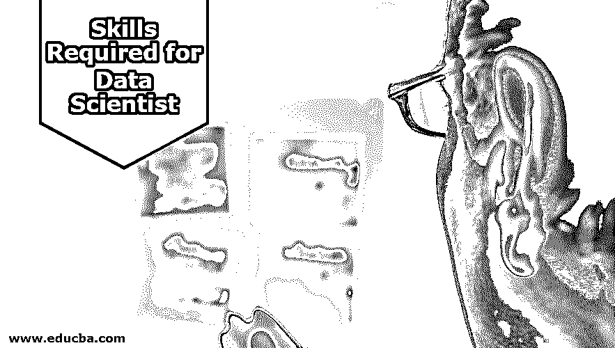
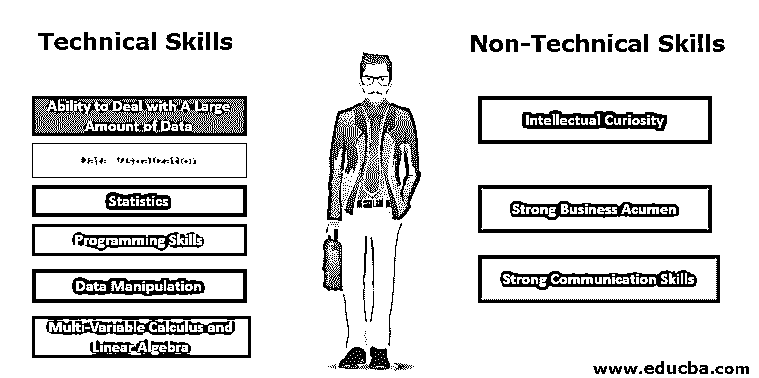

# 数据科学家所需的技能

> 原文：<https://www.educba.com/skills-required-for-data-scientist/>

## 数据科学家所需技能概述

2012 年，哈佛商业评论称“数据科学家是 21 世纪最性感的工作”。为了提前了解成为数据科学家所需的技能，我们先来看看数据科学家是做什么的。数据科学家可以有多种定义，但为了简单起见，让我们这么说吧，数据科学家可以从数据中提取意义并获得有价值的见解。数据科学家的工作主要包括收集、清理和处理数据。

### 技术和非技术技能

现在，让我们深入了解成为一名数据科学家所必需的技术和非技术技能。

<small>Hadoop、数据科学、统计学&其他</small>

#### 1.技术

下面给出了成为数据科学家所需的技能:

*   **处理大量数据的能力:**自过去几年以来，生成的数据量呈指数级增长，其中大部分被归类为非结构化数据。非结构化数据通常是指不驻留在传统行列数据库中的数据，这与结构化数据完全相反；非结构化数据的几个例子是视频、照片、音频消息。由于数据科学家的主要职责是从数据中提取意义，因此无论数据是结构化的还是非结构化的，都应该能够轻松处理大量数据。
*   **数据可视化:**公司中生成的数据必须转换成易于理解的格式，以便做出决策。作为一名数据科学家，必须能够借助 Tableau、Plotly、Visual.ly、D3.js 和 Power BI 等工具来可视化数据。对于数据科学家来说，熟悉可视化地将数据放在一起的原理也很重要。这是数据科学家的重要角色之一，因为数据可视化是公司直接处理数据的唯一选择。
*   **统计学:**统计学在数据科学中的作用非常关键。对于数据科学家来说，统计学是一门数学学科，它提供了必要的工具和方法来发现模式，并通过对复杂的数据集执行数学计算来提供洞察力。由于数据科学家的角色是通过识别数据中的模式来提取意义，因此统计知识是数据科学家的一项关键技能。
*   **编程技能:**对于 20 年前产生的数据量，Excel 足以处理它，但对于当今产生的结构化和非结构化数据量，科学家应该知道 Python、R、SQL 等编程工具，它们为使用许多统计技术训练数据集提供了更大的空间。他们在进行数据分析的同时提高了流程的效率。
*   **数据处理:**在大多数情况下，我们需要的数据是杂乱的，数据科学家很难处理这种类型的数据。从数据湖中获得数据后，第一步是处理那些不完善的地方。一些不完美的地方包括缺少数值，不规则的字符串如洛杉矶的 LA，日期格式如 10/09/2009 和 2009/09/10。在开始数据的训练或分析之前，必须对所有这些缺陷进行分类。
*   **多元微积分和线性代数:**理解矩阵的概念(线性代数)和微分(微积分)是一个数据科学家应该具备的重要技能。在一个组织中，it 的现有数据在做出未来预测方面起着重要作用，预测性能或算法优化方面的微小改进可以为组织带来巨大的变化。在数据科学家的初始阶段，当使用预编码模型时，不需要对矩阵或微积分有深入的理解。尽管如此，要理解模型下发生的事情或者构建它们自己的实现，理解这些概念是绝对必要的。

#### 2.非技术技能

下面给出了成为数据科学家所需的非技术性技能:

*   **求知欲:**在大多数情况下分析一个组织的数据时，没有人能够看到直接的结果或答案。你开始向自己提出的问题越多，你从数据中得到的答案就越多。一般来说，好奇心被定义为一种强烈的想要了解某事的欲望。这就是为什么求知欲是数据科学家的一个基本特征。
*   **强大的业务洞察力:**如果不了解组织的数据或业务模型中的元素，数据科学家拥有的所有技术技能都无法为组织获得所需的结果，因为他无法理解数据集中的哪些功能应该优先考虑，哪些应该最后考虑。对于科学家来说，据了解，组织的商业模式和数据将有助于解决潜在的挑战，以维持和发展其业务。
*   **强大的沟通技巧:**作为一名数据科学家，他应该准备一份关于其技术发现的演示文稿，并在职业生涯的某个时候向销售部门等非技术团队演示。作为一名数据科学家，一个人应该拥有像讲故事这样的技能(根据发现讲故事的能力)，因为如果一名数据科学家不能将信息正确地传达给企业高管，那么花费在进行数据探索、应用统计技术、找出结果以及所有其他事情上的全部时间和精力都将付诸东流。在大多数情况下，企业高管不会有兴趣听我们得出结论所遵循的所有步骤；他们将主要关注所呈现的结果和价值。因此，保持故事的简洁和切题总是一个最佳实践。

### 结论—数据科学家所需的技能

这些是一个人成为数据科学家应该具备的一些最重要的技能。他们的主要工作包括处理组织的数据，分析数据，并将其呈现给业务主管。

### 推荐文章

这是数据科学家所需技能的指南。在这里，我们讨论成为一名数据科学家所需的技术和非技术技能。您也可以浏览我们推荐的其他文章，了解更多信息——

1.  [数据科学职业](https://www.educba.com/data-science-career/)
2.  [数据科学语言](https://www.educba.com/data-science-languages/)
3.  [大数据分析薪资](https://www.educba.com/big-data-analytics-salary/)
4.  [数据分析师面试问题](https://www.educba.com/data-analyst-interview-questions/)

