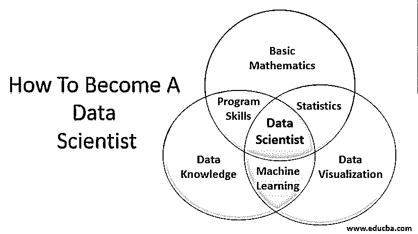

# 如何成为一名数据科学家

> 原文：<https://www.educba.com/how-to-become-a-data-scientist/>

## 如何成为数据科学家简介

你有没有想过一个数学家或者统计学家坐在 IT 公司里，做软件工作或者反过来？嗯，数据科学家的工作要求这样。它需要人们了解数学、统计学、领域专业知识和编程知识。一个对大量数据及其在这个世界上的用途非常感兴趣的人也会对数据科学感到惊讶。事实上，任何拥有基础本科学位的人都可以成为数据科学家。许多人都在寻找如何成为一名数据科学家。我认为这是互联网上搜索最多的话题。

### 什么是数据科学家？

让我们详细了解一下什么是数据科学家，无论是领域专业知识、编程背景还是数学。

<small>Hadoop、数据科学、统计学&其他</small>

#### 1.基础数学

我们中的许多人在童年时代可能讨厌数学，甚至不喜欢教数学的老师。我在这里揭露一个众所周知的秘密。数据科学领域非常需要数学，包括代数、矩阵和一些微积分。在探索海量数据时，我们会对这些“无用”的矩阵或微积分是如何做到的感到敬畏。如果一个人对数学感兴趣，数学本身就很迷人。培养对数学的真正兴趣，你会做得很好。现在，像我一样热爱数学的朋友们，向你们点头致意，开始吧。

#### 2.统计数字

在我童年学习概率和统计的时候，我从来没有想过概率会伴随我一生。但是，统计学在数据科学中的重要性是不可避免的。我们使用统计学的许多定理和公式来理解数据和预测数据的未来。即使你迷失在浩如烟海的数据中，统计学也能帮助你走上正确的道路。大科学家证明的理论和公式不会失效吧？在统计学的帮助下，可以很容易地进行数据的分发和探索。

#### 3.编程技能

在数学的帮助下得到一个数据的想法后，把它可视化真的很好。如果一些编码能帮助我们轻松做到这一点会怎么样！Python 和 R 是众所周知的编程语言，可以帮助数据科学家轻松完成他们的工作。统计很容易与这两种语言一起工作，通过两三步编码就可以很容易地看到大量数据的分布和探索。

没必要既懂手头的语言又懂手头的。然而，精通一门语言有助于你在数据科学职业生涯中达到更高的境界。如果你是 Python 或 R 的新手，深呼吸，振作起来。这两种语言都很容易学习和理解。没有什么能阻止你成为一名数据科学家。

#### 4.数据可视化

数据可视化在数据科学中非常重要，因为您应该知道数据在分析后的表现。如果您能很好地预见到这一点，那么您在开始数据探索时就已经成功了一半。在分析数据时，想象如果你采用正确的方法，数据会把你带到哪里。或者你走马路对面会怎么样？如果我说创造力是数据可视化的重要组成部分，人们可能会嘲笑我。但这是真的。图形和图表可以帮助你完成工作，而不用做所有的计算和编码部分。一些数据可视化工具包括 Excel、Tableau、Google charts 等。

#### 5.机器学习

数据科学是关于分析数据的；机器学习是从数据中建立一个模型。机器学习帮助你理解有标签和无标签的数据，给你一个各种类型回归的清晰画面，并预测未来的数据会如何。随着新技术和各种方式的出现，新的数据堆正在被创建，让我们手中的数据广为人知并帮助我们预测未来是很重要的。机器学习有助于做到这一点。传统的机器学习方法可以被深度学习取代。神经网络像人脑一样思考，bit AI 会用数据让我们的生活变得轻松。深度学习的基础知识对于成为一名高效的数据科学家很重要。

#### 6.数据知识

这应该是本页的第一个主题。了解你的数据非常重要。数据所属的域、是否缺少任何相关列、数据的形状和大小以及数据行为都是得出正确结论所必需的。应该根据列的相关性替换或删除缺失的数据。应该适当注意找出有标签和无标签的数据。在对数据进行适当研究后，必须考虑要遵循的回归方法。

#### 7.通讯技能

一旦数据清理、探索和分析结束，向相关团队成员和管理层通报进展情况是至关重要的。沟通技巧在这里很有用。用通俗易懂的语言展示你的作品是非常重要的，这样无论是谁，都可以得到你想要传达的信息的要点。与你工作中真正感兴趣的人交谈，从工作多年的人那里获取信息，让每个人都明白数据分析的重要性。良好的沟通有助于有条不紊地做所有这些事情。

### 结论

你应该了解市场的最新情况，并据此发展你的数据分析。为你的数据努力工作，做一个完美的分析，因为一个小错误意味着搞砸你的组织。没有人想那样做。数据科学家可以专攻任何领域，因为世界上每个科学领域都存在大量数据。上述所有主题的知识本身并不能让你成为一名熟练的数据科学家。你应该努力工作，并随时接受新的想法。随着世界的变化，数据领域也在变化。

### 推荐文章

这是如何成为数据科学家的指南。这里我们分别讨论简介和什么是数据科学家。您也可以浏览我们的其他相关文章，了解更多信息——

1.  [数据科学简介](https://www.educba.com/introduction-to-data-science/)
2.  [数据科学语言](https://www.educba.com/data-science-languages/)
3.  [数据科学算法](https://www.educba.com/data-science-algorithms/)
4.  [用于数据科学的 Python 库](https://www.educba.com/python-libraries-for-data-science/)

