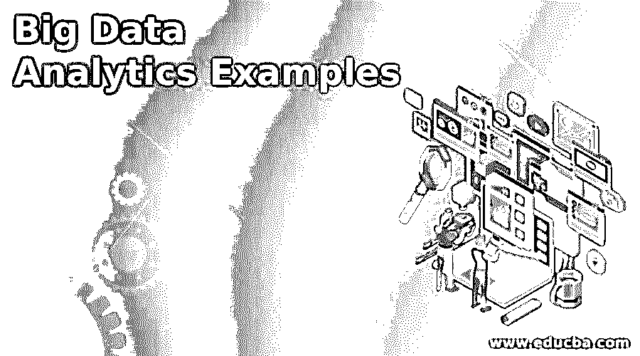

# 大数据分析示例

> 原文：<https://www.educba.com/big-data-analytics-examples/>

## 大数据分析简介

大数据代表数据集，它通常比通常由 RDBMS 处理的众所周知的数据集大得多，也复杂得多。众所周知，RDBMS 等传统数据管理应用程序无法管理这些数据集。根据要求和需求，大数据可以应用于非结构化、结构化和半结构化数据集。而大数据主要应用于非结构化数据集。许多著名的同步计算工具、[业务分析软件](https://www.educba.com/what-is-business-analytics/)都需要大数据来处理其大型数据集。如今，大数据分析已经应用于各个领域，如媒体、教育、医疗保健、制造、各种政府和非政府部门等。

### 大数据和大数据分析的概念

大数据开始在庞大而复杂的数据集上发挥作用，这些数据集可以从数 TB 到数 EB 不等。这种庞大而复杂的数据集无法由普通的传统数据管理应用程序(如 RDBMS)来处理。在这里，大数据被用来管理这些大型数据集。根据要求和需求，大数据可以应用于非结构化、结构化和半结构化数据集。而大数据主要关注非结构化数据集。如今，大数据分析已经应用于各个行业，如媒体、教育、医疗保健、制造、各种政府和非政府部门，并且还用于复杂分析、实时欺诈管理、交通管理、以客户为中心的分析等等。

<small>Hadoop、数据科学、统计学&其他</small>

### 大数据分析的关键特征

以下是大数据分析的不同关键特征:

*   **Volume:** Volume 代表实际存储和生成的数据大小。取决于数据的大小，已经确定数据集是否是大数据。
*   **变化:**变化代表正在使用的数据的性质、结构和类型。
*   **速度:**速度代表在特定的开发流程中，已经存储和生成的数据的速度。
*   **准确性:**准确性表示已获取数据的质量，也有助于数据分析达到预期目标。

### 大数据分析的类型

大数据分析有以下四种类型:

#### 1.预测分析

这种分析基本上是基于预测的分析。预测分析对数据集进行处理，并确定可能会发生什么。它主要分析过去的数据集或记录，以提供未来的预测。

#### 2.规定性分析

说明性分析对数据集进行处理，并确定需要采取的措施。这是一个有价值的分析，但没有广泛使用。许多卫生保健部门在各种活动的顶部使用这种分析来管理他们的商业活动。

#### 3.描述性分析

描述性分析实际上分析过去，并确定实际发生了什么以及为什么发生。这也有助于在仪表板中可视化这种分析，可以是图形表示的形式或一些其他格式。

#### 4.诊断分析

诊断分析在当前数据集上执行。它用于根据输入的实时数据集进行分析。商业智能工具等许多系统使用这种分析来创建实时仪表板和报告。

### 大数据分析示例

大数据分析示例有多种类型。一些组织使用这种[大数据分析](https://www.educba.com/big-data-analytics/)示例，根据其当前和过去的庞大数据集生成各种报告和仪表盘。大数据有不同类型的分析，如预测性分析、规定性分析、描述性分析和诊断性分析。大数据分析使用这些分析，根据当前和过去的记录生成各种图形报告和控制面板，这些记录可能是结构化、半结构化或非结构化的。

大数据分析示例用于生成各种报告，其中一些示例如下:

1.  欺诈管理报告，通常用于银行部门发现欺诈交易、黑客攻击、未授权访问帐户等。
2.  实时跟踪报告，通常由 Meru、Ola、优步和 Mega 等运输部门使用，用于跟踪车辆、客户请求、支付管理、紧急警报以及查找日常需求和收入等。
3.  销售报告和未来目标和目标分析，主要用于所有部门分析其销售、收入和客户需求，也用于确定未来目标等。
4.  许多基于实时数据的报告主要用于管理许多娱乐网站、股票市场、实时 Sensex 数据等的实时数据。
5.  基于不同的活动生成不同类型的警报，如数据中心生成的警报，此处使用了各种通知大数据分析示例。
6.  谷歌分析报告，我们可以得到多少用户的访问计数，从哪个位置的用户，从哪个设备的网站访问等等。
7.  如今，许多医疗保健组织迅速引入大数据预测分析来改善我们的日常生活。它已被用于更新医疗保健部门的许多协议，也用于改善整个人口的结果。
8.  大数据分析示例在许多灾难情况下也发挥了重要作用。2015 年 4 月，尼泊尔发生地震，造成多人伤亡。在这种情况下，北卡罗来纳州的 SAS 由 Analytics 开发，并在救援行动中发挥了巨大作用。
9.  大数据分析示例也已用于儿童福利。在伦敦的一个街区，一名英国医生收集并使用大量数据，提出了应对 19 世纪大规模霍乱袭击的解决方案
10.  大数据分析已用于在线和物理安全，以识别未经授权的活动，采取各种措施来防止这些攻击，引入实时监控以减少欺诈活动，并针对可疑行为激活警报。

### 结论

最后，我们可以说，使用大数据分析示例，我们可以为各种行业和业务增加巨大的价值，我们可以轻松地从海量数据集中找出任何复杂查询的结果，还可以预测未来的分析，这将有助于做出更准确的业务决策。

### 推荐文章

这是大数据分析示例的指南。在这里，我们讨论了大数据分析的基本概念、关键功能和示例。您也可以看看以下文章——

1.  [大数据分析工具](https://www.educba.com/big-data-analytics-tools/)
2.  [大数据面试问题](https://www.educba.com/big-data-interview-questions/)
3.  [大数据如何改变医疗机构](https://www.educba.com/healthcare-facilities/)
4.  [大数据职业](https://www.educba.com/careers-in-big-data/)

