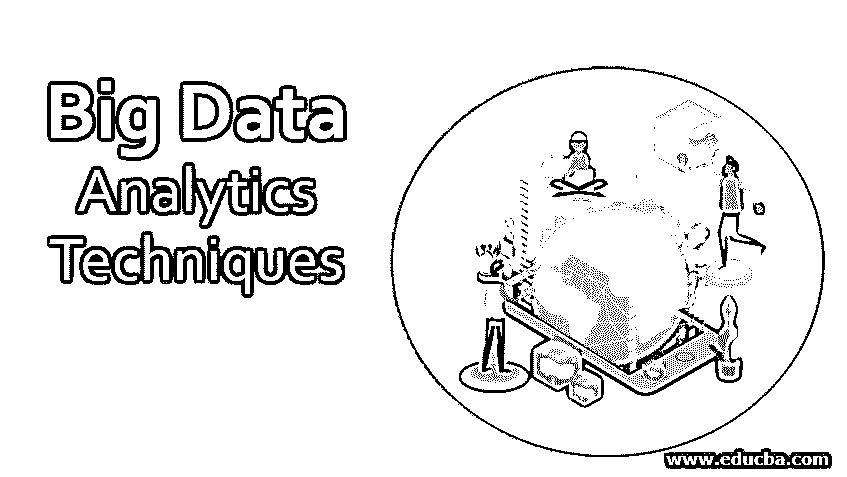
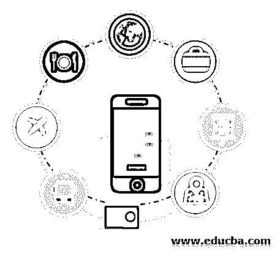

# 大数据分析技术

> 原文：<https://www.educba.com/big-data-analytics-techniques/>

## 大数据分析技术简介

在本主题中，我们将了解大数据分析技术。酒店业潜力巨大，在国家和全球层面都在快速发展。随着该行业向不同方向扩张，该行业的技术和资源适应性也越来越强。在区域、国家和地方一级，有许多由接待部门组成的部门；酒店和餐馆是这个行业的主要部分，也是他们利润的主要来源。

旅游业和酒店业通常被认为是相同的，并且经常相互重叠。然而，这是两个不同的行业，尽管它们彼此相关。旅游被定义为人们离开他们通常的环境，通常不超过一年的时间。这些人通常出差或旅游。另一方面，酒店业被定义为向那些生活在舒适之外的人们提供住宿、场地、餐饮和其他设施的行业。这意味着旅游业不是酒店业的一个部门，而只是游客满足其需求和期望的一个来源。酒店业的一些部门包括特许俱乐部、食品店、餐饮、展览、展览会组织者活动以及其他餐饮服务。

<small>Hadoop、数据科学、统计学&其他</small>

因此，在世界上许多国家，接待是一个焦点，但在旅游业是主要出口产业的国家，接待尤为重要。这意味着，当人们跨境旅行时，酒店业就会繁荣起来。这就是为什么它们是外汇兑换的主要来源，并雇用了相当多的人口。通过在全球范围内融合不同的文化，酒店业可以帮助各国大幅增加收入和外汇。

 

<address>Image source: pixabay.com</address>

酒店和餐厅是酒店行业不可或缺的一部分，负责向顾客和客户提供广泛的大数据分析服务。但是随着各种类型的酒店和餐馆越来越多，想要在人群中脱颖而出变得很难。这就是为什么利用所有机会是很重要的，因为在酒店行业脱颖而出需要不断的努力和努力。酒店业领先于竞争对手的方法之一是一方面提供完美的客户服务和高效的运营，另一方面提高技术。随着酒店行业技术的不断进步，中小型酒店必须抓住这个机会，以战略性和综合性的方式改进其服务。

### 酒店行业的技术趋势

这里有一些技术趋势，酒店业必须适应这些变化的时代。

1.  #### The importance of social media marketing and its impact on customer care:

酒店的营销专业人员以这样的方式接受培训，即他们可以吸引最大数量的顾客，从而有助于以实质性的方式增加利润。这意味着酒店必须学习新的和创新的方法来接触他们的目标受众。今天，数字媒体有能力吸引和联系国内外的观众。社交媒体是最快、最强大的数字媒体工具之一。根据最近一项名为“2013 年全球社交网络用户”的调查，超过 20%的世界人口正在定期使用某种形式的社交媒体。这一数字在未来几年将会增加，社交媒体的参与是未来几年最强大的驱动力之一。

这意味着，任何想要在竞争中保持领先的酒店企业都必须使用数字媒体，以一种增强的方式与客户联系。酒店业必须利用互联网向目标受众提供有价值的服务和产品信息，而不是使用已经使用了几十年的营销活动。活跃在社交媒体上有时会适得其反，因为客户可以利用这种媒体来投诉他们的服务。因此，酒店行业也必须准备好以快速和可持续的方式回答顾客的问题。通过对他们的服务负责，旅馆和餐馆可以在顾客的期望和欲望方面传达一种新的和更高的趋势。

<address>

</address>

2.  #### Create a system that is intelligently integrated into the hotel management system:

酒店和餐厅完全建立在客户关系的基础上。这意味着这些行业多年前就已经有了某种客户关系管理系统。但是，定期更新这些系统并与现有系统集成是很重要的。功能强大、技术先进的综合管理系统是酒店向顾客提供改善和提高服务的主要方式之一。以大数据分析技术为例，当客户预订酒店住宿时，他们可以通过各种选项来个性化他们的住宿，如选择迎宾饮料、房间温度和房间内的电视设施。一旦客户将这些数据输入到酒店的数据库中，酒店就可以为客户创造个性化的体验，使他们的住宿在真正意义上变得难忘和难忘。这是酒店与客户联系的重要方式，因为个性化体验有助于大数据分析技术保留和扩大客户群。

3.  #### Adjust the mobile device to make it more accessible:

今天，台式机越来越不受欢迎，因为移动设备能够执行比台式机更多的功能。甚至品牌也在关注移动设备，因为移动设备有助于他们以有效的方式与顾客、客户和合作伙伴联系。如今，平板电脑和手机是品牌将联系提升到下一个层次的媒介。许多酒店相关品牌现在发现，智能手机比传统台式机和电脑更符合他们的战略愿景、运营方式和预算。例如，礼宾专业人员可以在酒店的任何地方有效地吸引和联系他们的客人，并在他们使用快速智能手机设备时实时满足他们的需求。此外，与购买和维护台式电脑相比，智能手机通常更具成本效益。

### 数据分析如何帮助酒店以一种有效且具有战略意义的方式扩大其影响力？

随着影响力的不断扩大，酒店行业如今几乎每天都要接待近百万游客。每个顾客都有自己的期望和欲望，这使得酒店很难持续满足他们的期望。与此同时，重要的是要理解满足这些期望对于以有效的方式保留酒店的客户群是非常重要的。数据分析可以帮助酒店行业的品牌以系统的方式实现其目标和愿望。尽管许多营销专业人士不会承认这一事实，但在酒店老板的眼中，并非所有顾客都是平等的。虽然有些人在入住和离开酒店时不会遇到太大的问题，并且只使用最少的服务，但其他人会在美食、美容和其他活动上花费数千美元。

因此，第二类顾客是酒店品牌更大的投资，因为他们为酒店品牌提供了更多的价值。识别这些客户对酒店品牌和餐厅来说极其重要，但酒店很难通过一次访问来跟踪这些客户。以两个不同的客户为例。另一方面，一个人可能会来到酒店，将他的全部收入花在终身度假的想法上，另一方面，可能会有另一个客户在额外服务上花费很少，但可能会定期返回酒店，因此具有更高的长期价值。大数据分析技术可以帮助酒店以有效的方式进行区分。

<address> </address>

<address>

</address>

分析可以帮助品牌的另一个领域是产量管理。通过大数据分析技术，酒店可以了解房间的最佳价值，方法是考虑各种因素，如高峰需求季节、天气和当地事件以及特定时期入住的客人数量。大数据分析技术可以在所有这些领域为酒店提供帮助，尽管与零售和制造行业相比，它们的采用较少，但随着大型酒店和餐厅看到大数据分析技术的优势，这种情况在未来很快就会改变。这些大数据分析技术的一个很好的例子是在 2013/14 年，当时美国经济型连锁酒店 Red Roof Inn 利用创纪录的冬季，因此导致航班取消。

这意味着，由于每天都有大量乘客滞留，酒店利用分析来识别关于天气状况和航班取消的公开可用的公共数据库系统，以便他们可以通过向这部分客户提供酒店和客房服务来锁定他们。由于许多人会用手机搜索酒店，这家连锁酒店利用手机营销活动来增加业务和利润。使用[大数据分析](https://www.educba.com/big-data-analytics/)技术的另一个例子是 Denihan Hospitality，该公司在美国拥有多家精品酒店。通过整合整个供应链的交易和客户数据，并进一步将其与非结构化数据(即评论和客户反馈)相结合，该公司创建了有效的仪表板，以有效的方式了解消费者的期望和需求。这使得酒店品牌能够做出更多数据驱动的决策，以迎合从商务旅客到休闲旅客的所有类型的客户。

了解顾客的需求并以有效的方式满足他们是酒店品牌试图捕捉并整合其目标与顾客期望的一种方式。此外，酒店品牌还将这些分析报告的结果交给员工，员工只需点击一下手机，就可以轻松预测消费者的需求。客房部员工可以收到关于客户需求的实时更新，并毫无问题地满足他们的需求。如上所述，客户关系是任何酒店成功不可或缺的一部分，品牌必须专注于此，以确保更好的回报和利润。大数据分析技术为酒店提供了直接而重要的数据，可以帮助大数据分析公司成功实现这一目标。

与其他行业一样，酒店品牌和餐馆必须利用他们的分析数据来开展创新、有创意、最重要的是个性化的营销活动。这是因为个性化营销是酒店公司联系和吸引受众的唯一方式。创建电子邮件或有针对性的社交媒体计划是至关重要的工具，可以帮助酒店品牌利用这些信息，并将其瞄准正确的受众。这包括分析访问酒店的客户的信息，收集客户反馈，并使用其政党的忠诚度计划，通过完全符合消费者需求的计划有效地与目标受众建立联系。这些计划可以是任何东西，从免费早餐或晚餐到娱乐节目的门票。这些策略可以有效地帮助提高各个层次客户的预订量和参与度。

### 酒店业大数据分析技术的未来

大数据分析技术在成为酒店行业不可或缺的一部分之前还有很长的路要走。也就是说，这个部门可用的数据量几乎是无限的，这就是为什么这里有巨大的潜力和机会，这是其他部门所没有的。在酒店行业，客户从入住酒店的那一刻起就留下了数据踪迹，这些数据可以很容易地被使用并转化为见解，从而帮助酒店品牌真正理解并增强其客户群。

总之，大数据分析技术正在改变企业和品牌在所有行业和经济体中履行职能的方式。很快，它们将成为酒店业运作的一个重要方面，因为它们为酒店品牌提供了无限的机会，不仅在当地，而且在全国范围内扩大客户群。这适用于酒店行业的几乎每一个品牌，从大型连锁酒店到遍布每个角落的小酒店和餐厅。

### 推荐文章

这是大数据分析技术的指南。在这里，我们讨论了基本概念、酒店行业的技术趋势以及大数据的未来。您也可以阅读以下文章，了解更多信息——

1.  [跨国并购](https://www.educba.com/cross-border-merger-and-acquisitions/)
2.  [云计算和大数据分析](https://www.educba.com/cloud-computing-vs-big-data-analytics/)
3.  [大数据分析的挑战](https://www.educba.com/challenges-of-big-data-analytics/)
4.  [移动营销协会](https://www.educba.com/mobile-marketing-association/)

