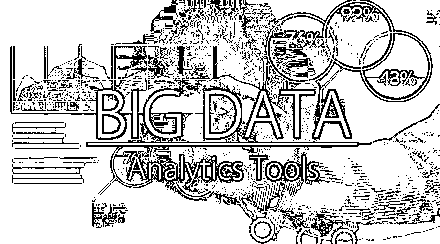

# 大数据分析工具

> 原文：<https://www.educba.com/big-data-analytics-tools/>

## 大数据分析工具简介

大数据分析是一个过程；它用于检查各种各样的大量数据集，以发现未知的相关性、隐藏模式、市场趋势、客户偏好和大多数有用的信息，这些信息可以帮助组织基于大数据分析中的更多信息做出业务决策。可以非常快速有效地处理数据。这包括分析数据和利用结果。这使得更少的努力和更有效的地方，这是不可能与更传统的商业智能解决方案。

### 大数据分析工具的概念

大数据分析工具对于企业和大规模行业非常重要，因为现代组织工具将使用大数据工具生成和管理大量数据。大数据分析工具有助于企业节省时间和资金，并获得洞察力以做出数据驱动的决策。

<small>Hadoop、数据科学、统计学&其他</small>

大数据分析是收集、搜集、组织和分析大量数据集(称为大数据)的完整过程，以观察/识别模式以及业务决策所需的其他有用信息。流程—大数据分析有助于组织更好地理解数据集中存在的信息。从事大数据分析工作的人通常拥有来自数据分析的知识。数据分析下有不同类型的工具可用于帮助改进数据分析过程，包括数据分析、数据清理、数据挖掘、数据可视化、数据集成、数据存储和管理。

对于大数据分析流程，需要非常高性能的分析。因此，为了分析如此庞大的数据量，大数据分析流程和预测分析、数据挖掘、文本挖掘、预测和数据优化应用程序需要专门的软件工具。

### 大数据分析的优势

使用大数据分析有许多优势。这种大数据分析流程在预测分析、数据挖掘、文本挖掘、预测数据和优化方面具有高性能，有助于企业在许多领域受益，包括业务中的新收入机会、更有效的产品营销、提供更好的客户服务、提高运营效率，还可以就相对于市场竞争对手的竞争优势做出决策。

具体来说，在大数据分析过程中，企业可以将海量数据分解/缩小为最相关的信息，并对其进行分析，从而做出关键的业务决策。这种积极主动的业务方法具有变革性，因为它为分析师和决策者提供了利用现有最佳知识和见解向前推进的能力，通常是实时的。

### 大数据分析的工作原理及其关键技术

如前所述，大数据分析流程不是包含大量数据的单一活动。相反，它的高级分析可以应用于大数据，但在现实中，几种不同类型的技术协同工作，以实现信息的最大价值。以下是大数据分析流程中涉及的最重要的技术:

*   数据管理
*   数据挖掘技术
*   Hadoop
*   内存分析
*   预测分析。
*   文本挖掘

大数据分析工具有很多，下面列出了一些用于存储和分析大数据的顶级工具。这些大数据分析工具可以进一步分为存储和查询/分析两类。

#### 1.Apache Hadoop

Apache Hadoop，一个大数据分析工具，是一个基于 java 的自由软件框架。它有助于在称为集群的存储位置有效存储大量数据。这个框架的特别之处在于，它在集群上并行运行，并且能够处理所有节点上的大量数据。Hadoop 中有一个存储系统，通常称为 Hadoop 分布式文件系统(HDFS)，它有助于拆分大量数据，并将其分布在集群中的许多节点上。它还在集群中执行数据的复制过程，从而提供高可用性和故障恢复，这提高了容错能力。

#### 2\. KNIME

KNIME Analytics Platform 是数据驱动创新的领先开放式解决方案之一。这个工具有助于发现隐藏在大量数据中的潜力；它还能挖掘新的见解或预测新的未来。对于数据科学家来说，KNIME 分析平台工具是一个非常有用的工具箱。

#### 3.OpenRefine

OpenRefine 是作为 Google Refine 引入的。该工具是处理大量杂乱数据的有效工具之一，这些数据包括:清理数据、将数据从一种格式转换为另一种格式，以及使用 web 服务和外部数据对其进行扩展。open refine 工具有助于轻松探索大型数据集。

#### 4.柑橘

Orange 是著名的开源数据可视化工具，有助于初学者和专家进行数据分析。该工具为交互式工作流提供了一个大型工具箱选项来创建相同的工作流，这有助于数据的分析和可视化。橙色工具具有许多不同的可视化效果，包括条形图、树形图、散点图、树状图、网络和热图。

#### 5.快速采矿机

RapidMiner 工具使用可视化编程进行操作，并且它还具有很强的数据操作、分析和建模能力。RapidMiner 工具通过将开源平台用于机器学习、数据准备和模型部署等所有工作，使数据科学团队更加轻松高效。由于其在[中的一致性，数据科学平台](https://www.educba.com/data-science-platform/)加快了在单一环境中构建完整分析工作流的速度，这有助于大幅提高效率并缩短数据科学项目的价值实现时间。

### 使用大数据分析工具的一些示例/领域

业务/企业非常需要大数据分析工具，这些业务/企业依靠快速而敏捷的决策来保持竞争力，而当业务决策基于之前的业务数据时，大数据分析工具很可能非常重要。下面是一些可以利用这种技术的不同类型的组织:

#### 旅行和招待

在旅游和酒店行业，让顾客满意是一个非常重要和关键的因素，但让顾客满意却很难衡量。例如，在度假胜地和娱乐场，将只有很短的时间来改变客户体验。因此，大数据分析的应用提供了收集客户数据、应用统计分析来更好地了解和改进这些业务的能力。

#### 零售

如今，与过去几十年相比，客户服务已经成为一棵大树；有见识的购物者总是不停地搜索，并期望零售商确切地了解他们想要什么，以及这些产品何时需要。在这里，大数据分析技术开始发挥作用，帮助零售商满足客户需求。

#### 政府

有一些特定的政府机构总是面临一些巨大的挑战，如如何在不影响质量或生产率的情况下为公众准备预算。因此，许多机构使用大数据分析，这有助于他们简化运营，同时让机构对犯罪活动有更正确的看法，以避免编制可行的良好预算。

#### 卫生保健

大数据分析也可以用于医疗保健行业。维护患者记录、他们的保险信息和健康计划，以及难以管理的所有其他类型的信息。因此，大数据分析技术在医疗行业的应用非常重要。

### 结论

在当前情况下，数据量随着世界人口增长和技术发展而增长。这清楚地表明了大数据分析解决方案日益广泛的用途和必要性。大数据不仅仅是一种技术趋势，它还是一种业务实践，可以帮助行业/企业在这个竞争激烈的世界中做出主动的数据驱动型业务决策，以提高销售和营销团队的绩效，增加收入。

### 推荐文章

这是现实世界中大数据分析工具的指南。在此，我们讨论了基本概念、工作方式、使用不同大数据分析工具的优势以及示例。您也可以阅读下面的文章来了解更多—

1.  [酒店行业的大数据分析](https://www.educba.com/big-data-analytics-techniques/)
2.  [大数据与预测分析](https://www.educba.com/big-data-vs-predictive-analytics/)
3.  [数据挖掘 vs 文本挖掘](https://www.educba.com/data-mining-vs-text-mining/)
4.  [大数据分析薪资](https://www.educba.com/big-data-analytics-salary/)

