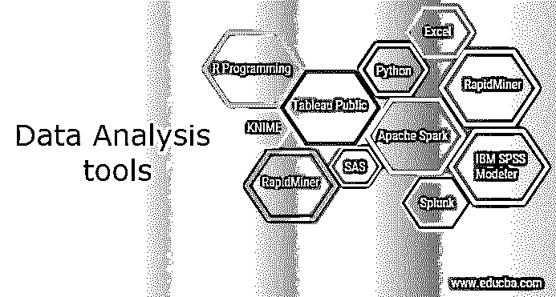

# 数据分析工具

> 原文：<https://www.educba.com/data-analysis-tools/>

## 数据分析工具简介

R 编程、Tableau Public、Python、SAS、Apache Spark、Excel、RapidMiner、KNIME、QlikView、Splunk 等数据分析工具。用于收集、解释和呈现各种应用和行业的数据，以便这些数据可用于业务的预测和可持续发展。由于这些工具，数据分析对用户来说变得更容易，并且由于其各种类型，它在市场上创造了对数据分析工程师的需求。

### 顶级数据分析工具

这里我们要解释一下顶级的数据分析工具。

<small>Hadoop、数据科学、统计学&其他</small>

#### 

1。r 编程

如果我说 Project R，一个 GNU 项目，已经在 R 中发布了呢？这主要是用 C 和 Fortran 写的。而且很多模块都是用 R 一个人拟定的。它是一种用于统计计算和图形编程的免费语言和软件。r 是业界领先的分析工具，常用于数据建模和统计。你可以用各种方式处理和展示你的信息。SAS 在许多方面都超越了数据容量、性能和结果。r 可以在许多平台上编译和运行，包括 macOS、Windows 和 Linux。t 可以选择按类别 11，556 包裹导航包裹。r 还提供了自动安装所有软件包的工具，可以根据用户的需要很好地组装大量的信息。

#### 

2。Tableau 公共

Tableau Public 提供免费软件，链接任何信息源，包括公司数据仓库、基于 web 的信息或 Microsoft Excel，生成信息显示、仪表板、地图等，并实时呈现在 web 上。可以通过社交媒体与客户沟通。文件的访问可以以各种格式下载。如果你想看到画面的力量，我们需要非常好的数据来源。Tableau 的大数据能力使信息变得至关重要，比市场上任何其他数据可视化软件都更好地进行分析和可视化。

#### 

3。大蟒

Python 是一种面向对象的、用户友好的开源语言，可以免费阅读、编写、维护。吉多·范·罗苏姆在 20 世纪 80 年代早期创建了它，支持函数式和结构化编程技术。Python 很容易理解，因为 JavaScript、Ruby 和 PHP 非常相似。Python 也有非常好的机器学习库，例如 Keras、TensorFlow、Theano 和 Scikitlearn。众所周知，python 是一个重要的特性，因为 python 可以在任何平台上组装，比如 MongoDB、JSON、SQL Server 等等。我们还可以说 python 也可以以非常好的方式处理数据文本。Python 非常简单，所以很容易理解，为此，我们需要一个唯一可读的语法。开发人员可以比其他语言更容易阅读和翻译 Python 代码。

#### 

4。斯堪的纳维亚航空公司

SAS 代表统计分析系统。它由 SAS 研究所于 1966 年创建，并在 1980 年代和 1990 年代得到进一步发展；它是一个用于数据管理的编程环境和语言，也是一个分析领导者。SAS 随时可用，易于管理，并且可以分析来自所有来源的信息。2011 年，SAS 推出了广泛的客户智能产品和许多 SAS 模块，通常用于网络、社交媒体和营销分析的客户档案和未来机会。它还可以预测、管理和优化他们的行为。它使用内存和分布式处理来快速分析巨大的数据库。此外，该工具有助于对预测信息进行建模。

#### 

5。阿帕奇火花

Apache 于 2009 年由加州大学伯克利分校 AMP 实验室创建。Apache Spark 是一个快速扩展的数据处理引擎，在 Hadoop 集群中，应用在内存中的运行速度比在磁盘上快 100 倍。Spark 以数据科学为基础，它的思想促进了数据科学。Spark 也因信息管道和机器模型的增长而闻名。Spark 还有一个库——ml lib，它为信息科学领域的递归方法提供了许多机器工具，如回归、分级、聚类、协作过滤等。Apache Software Foundation 推出了 Spark 来加速 Hadoop 软件计算过程。

#### 

6。擅长

Excel 是一个 Microsoft 软件程序，是 Microsoft Office 开发的软件生产力套件的一部分。Excel 是几乎每个行业都普遍使用的核心和通用分析工具。当需要分析客户的内部信息时，Excel 是必不可少的。它分析了汇总信息的复杂工作，使用数据透视表的预览来根据客户需求过滤信息。Excel 具有业务分析的高级选项，有助于对预先创建的选项进行建模，如自动关系检测、DAX 度量和时间分组。Excel 通常用于计算单元格、数据透视表和绘制多种工具的图表。例如，您可以为 Excel 创建月度预算，跟踪业务支出，或者使用 Excel 表格对大量数据进行排序和组织。

#### 

7。快速采矿机

RapidMiner 是由同一家公司创建的一个强大的嵌入式[数据科学平台](https://www.educba.com/data-science-platform/)，它在没有任何编程的情况下执行投影和其他复杂的分析，如数据挖掘、文本分析、机器训练和视觉分析。包括 Access、Teradata、IBM SPSS、Oracle、MySQL、Sybase、Excel、IBM DB2、Ingres、Dbase 等。，RapidMiner 也可以用来创建任何源信息，包括 Access。该工具非常强大，可以生成基于实际信息转换环境的分析；例如:对于预测分析，您可以管理格式和信息集。

#### 

8。娜蜜

康斯坦斯大学的软件工程师团队成立于 2004 年 1 月。用于信息处理构建和执行的开源工作流平台。KNIME 利用节点来构建从输入到输出的信息流图。凭借其模块化管道思想，KNIME 是一个主要的领先开源报告和内置分析工具，通过可视化编程，集成不同的数据挖掘元素和机器学习来评估和建模信息。每个节点执行一个工作流作业。在下面的实例中，用户使用文件读取器节点读取某些信息。随后使用行过滤器节点过滤前 1000 行。然后，您可以使用一个 statistics 节点来计算汇总统计数据，并由用户硬盘上的 CSV Writer 来完成结果。

#### 

9。QlikView

QlikView 有许多与众不同的特点，例如专利技术和内存处理，可以为最终客户快速执行结果并将信息存储在文档本身中。数据关联会自动保留在 QlikView 中，几乎可以压缩 10%的初始卷。信息连接的彩色可视化——对于关联信息和非关联信息，一种特定的颜色。作为一个汽车服务 BI 工具，QlikView 通常易于收集，而无需为大多数公司客户提供独特的数据分析或编程能力。它通常用于营销、人事和销售部门以及管理仪表板中，以在最高管理层监控一般的公司事务。大多数组织在为公司用户提供软件访问之前为他们提供培训，而不需要独特的能力。

#### 

10。Splunk

它的第一个版本于 2004 年推出，大部分受到了用户的赞赏。它逐渐在企业中传播开来，并开始购买他们的公司许可证。Splunk 是一种软件技术，用于实时监控、搜索、分析和查看计算机生成的信息。它可以跟踪和读取各种日志文件，并保存索引器上的信息。您可以使用这些工具在不同类型的仪表板上显示信息。Splunk 检索所有基于文本的日志信息，并提供一种简单的搜索方法；用户可以检索各种信息，进行各种有趣的统计，并以各种格式提交它们。

#### 

11。IBM SPSS 建模器

一个预测性的大数据分析平台是 IBM SPSS Modeler。它提供预测模型，为个人、组织、系统和公司提供支持。它包含各种复杂的分析和算法。它通过分析结构化和非结构化数据更快地找出并解决问题。当用于发现持续业务流程中的强大模式，然后通过部署业务模型来更好地预测选择并实现最佳结果时，它是最有效的。

### **结论**

虽然上面文章中提到的工具有助于评估，但是您提供和分析的数据只有在有用的时候才有用。花时间学习一些新鲜的技巧，接受挑战，让这些工具改进，完善你已经存在的逻辑和推理能力。

### 推荐文章

这是数据分析工具的指南。在这里，我们将详细讨论 11 种用户友好且以性能为导向的数据分析工具。您也可以阅读以下文章，了解更多信息——

1.  [QlikView 功能](https://www.educba.com/qlikview-functions/)
2.  [免费数据分析工具](https://www.educba.com/free-data-analysis-tools/)
3.  [数据分析工具研究](https://www.educba.com/data-analysis-tools-for-research/)
4.  [数据分析的类型](https://www.educba.com/types-of-data-analysis/)

