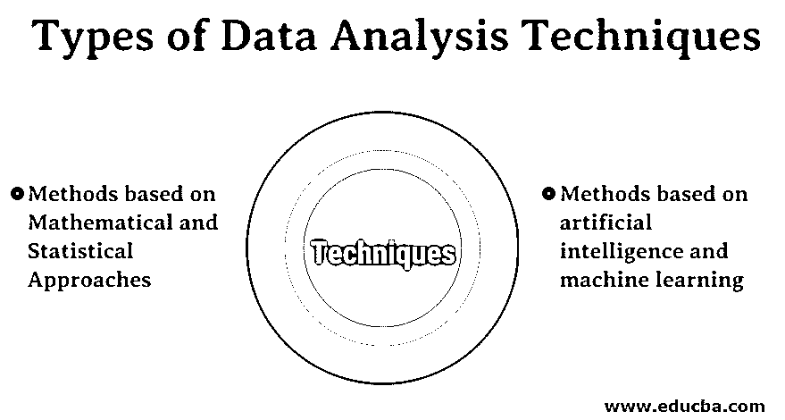
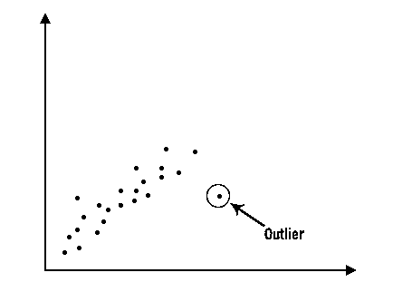
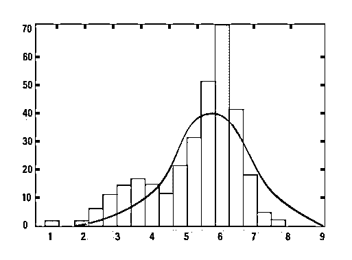
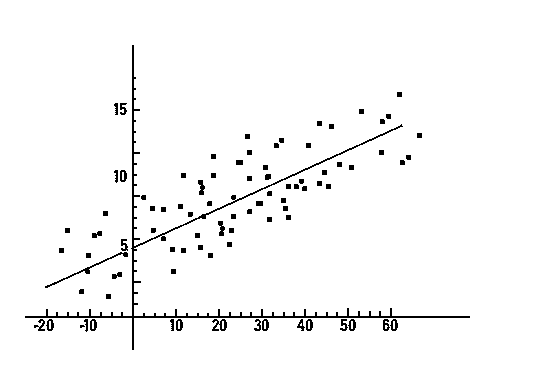

# 数据分析技术的类型

> 原文：<https://www.educba.com/types-of-data-analysis-techniques/>

## 数据分析技术介绍

数据分析是通过使用描述性分析、回归分析、离差分析、因子分析(独立变量以找到模式)和时间序列中的一种类型来检查、清理、转换和建模数据来捕获有用信息的过程，这些类型是基于数学和统计方法或决策树(用于选择不同路径的树状结构)、神经网络(一组算法)、模糊逻辑(非真或假的决策)的方法的一部分，这些方法是基于机器学习和人工智能的方法的一部分。

### 数据分析技术的重要类型

数据分析技术大致分为两种类型

<small>Hadoop、数据科学、统计学&其他</small>

*   基于数学和统计方法的方法
*   基于人工智能和机器学习的方法

#### 数学和统计方法

##### 1.描述性分析

描述性分析是进行统计分析的重要的第一步。它为我们提供了数据分布的概念，有助于检测异常值，并使我们能够识别变量之间的关联，从而为进行进一步的统计分析准备数据。对一个庞大的数据集的描述性分析可以通过把它分成两类而变得容易，它们是对每个单独变量的描述性分析和对变量组合的描述性分析。

##### 2.回归分析

[回归分析](https://www.educba.com/what-is-regression-analysis/)是目前业内使用的主要数据分析技术之一。在这种技术中，我们可以看到两个或多个感兴趣的变量之间的关系，并且在核心处，它们都研究一个或多个自变量对因变量的影响。为了了解变量之间是否有任何关系，我们首先需要在图表上绘制数据，如果有任何关系，这将是显而易见的。例如，考虑下面绘制的图表，以便有一个清晰的理解。

在数据挖掘中，这种技术用于预测特定数据集中某个变量的值。有不同类型的回归模型在使用中。其中一些是线性回归，逻辑回归和多元回归。

##### 3.方差分析

离差是分布被拉伸或压缩的程度。在数学方法中，离差可以以两种方式定义，首先是它们之间的值的差异，其次是平均值之间的差异。如果值和平均值之间的差异非常低，那么我们可以说在这种情况下离差较小。离差的一些常用度量是方差、标准差和四分位距。

##### 4.要素分析

因子分析是一种数据分析技术，它有助于发现一组变量的潜在结构。它有助于在描述关系模式和模型的数据集中找到独立变量。这是聚类和分类过程的第一步。因子分析也与主成分分析(PCA)相关，但两者并不相同。我们可以称 PCA 为探索性因子分析的更基本版本

##### 5.时间序列

时间序列分析是一种数据分析技术，处理时间序列数据或趋势分析。现在，让我们了解什么是时序数据？时间序列数据是一系列特定时间间隔或时段中的数据。如果我们从科学的角度来看，大多数测量都是随着时间的推移而执行的。

#### 基于机器学习和人工智能的方法

##### 1.决策树

决策树分析是一种图形表示，类似于树状结构，其中决策中的问题可以以流程图的形式出现，每个问题都有可供选择的答案的分支。决策树是一种自上而下的方法类型，第一个决策节点位于顶部，基于第一个决策节点的答案，它将被分为多个分支，并且它将继续，直到树到达最终决策。不再分裂的树枝称为叶子。

##### 2.神经网络

神经网络是一套算法，旨在模仿人脑。它也被称为“人工神经元网络”。神经网络在数据挖掘中的应用非常广泛。它们对噪声数据和高精度结果有很高的接受能力。基于必要性，目前使用了许多类型的神经网络，其中很少是递归神经网络和卷积神经网络。[卷积神经网络](https://www.educba.com/convolutional-neural-networks/)主要用于图像处理、自然语言处理和推荐系统。递归神经网络主要用于手写和语音识别。

##### 3.进化算法

进化算法使用由重组和选择启发的机制。这些类型的算法是独立的领域，他们有能力探索大型数据集，发现模式和解决方案。与其他数据技术相比，它们对噪声不敏感。

##### 4.模糊逻辑

这是一种基于“真实度”的计算方法，而不是常见的“布尔逻辑”(真/假或 0/1)。如上所述，在决策树的决策节点，我们要么有是或否的答案，如果我们不能决定绝对是或绝对否的情况呢？在这些情况下，模糊逻辑起着重要的作用。这是一个多值逻辑，其中真值可以在完全真和完全假之间，也就是说，它可以取 0 和 1 之间的任何真值。当值中有大量噪声时，模糊逻辑适用。

### 结论

所有企业或公司面临的棘手问题是，哪种类型的数据分析技术最适合他们？我们不能将任何技术定义为最佳技术，相反，我们可以尝试多种技术，看看哪种技术最适合我们的数据集，并使用它。上述技术是目前在工业中使用的一些重要技术。

### 推荐文章

这是一个数据分析技术类型的指南。在这里，我们讨论目前在行业中使用的数据分析技术的类型。您也可以看看以下文章，了解更多信息–

1.  [什么是数据分析？](https://www.educba.com/what-is-data-analysis/)
2.  [不同类型数据分析指南](https://www.educba.com/types-of-data-analysis/)
3.  [数据分析过程](https://www.educba.com/data-analysis-process/)
4.  [二次数据分析](https://www.educba.com/secondary-data-analysis/)
5.  [数据分析过程](https://www.educba.com/data-analysis-process/)

