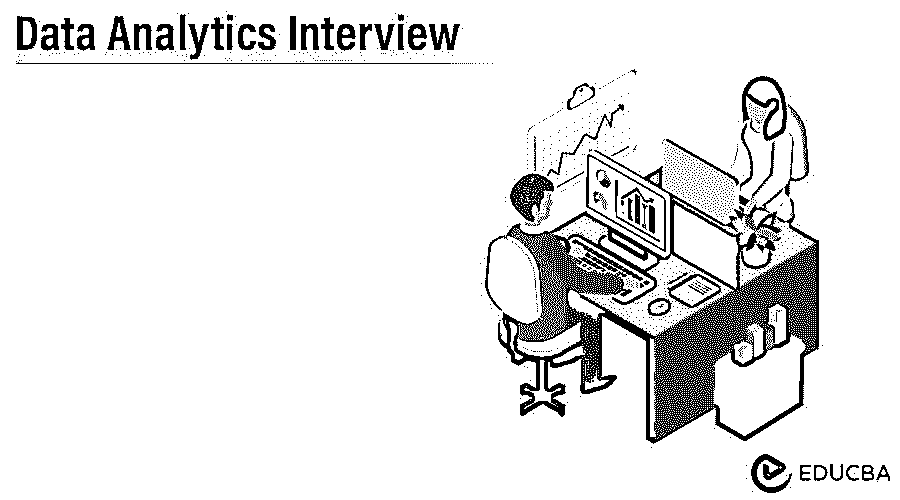

# 数据分析面试问题

> 原文：<https://www.educba.com/data-analytics-interview-questions/>

## 数据分析面试问题简介

你终于在数据分析领域找到了理想的工作，但是想知道如何通过 2022 年的数据分析面试，以及可能会有哪些数据分析面试问题。每个数据分析面试都是不同的，工作范围也是不同的。牢记这一点，我们设计了最常见的数据分析面试问题和答案，以帮助您在数据分析面试中取得成功。

以下是 2022 年数据分析面试中最常被问到的问题。这些分为两部分。

<small>Hadoop、数据科学、统计学&其他</small>

### 第 1 部分—数据分析面试问题和答案(基础)

以下是基本的面试问答:

#### Q1。数据挖掘和数据分析有什么区别？

**答案:**

| **数据挖掘** | **数据分析** |
| 数据挖掘不需要假设。 | 数据分析从一个假设开始。 |
| 数据挖掘需要干净且记录良好的数据。 | 数据分析涉及数据清理。 |
| 数据挖掘的结果并不总是容易解释的。 | 数据分析师解释结果，并将其呈现给利益相关者。 |
| 数据挖掘算法自动开发等式。 | 数据分析师必须发展他们自己的方程式。 |

#### Q2。提到分析项目中的各个步骤是什么？

**答案:**

数据分析处理数据的收集、清理、转换和建模，以获得有价值的见解并支持组织中更好的决策。

数据分析过程中涉及的步骤如下:

*   **数据探索:**探索完业务问题后，数据分析师必须分析问题的根本原因。
*   **数据准备:**在数据分析过程的这一步，我们会发现数据异常，比如数据中的缺失值。
*   **数据建模:**数据准备好后，建模步骤开始。建模是一个迭代的过程，在这个过程中，模型为了改进而反复运行。数据建模确保业务问题的最佳可能结果。
*   **验证:**在此步骤中，客户提供的模型和数据分析师开发的模型相互验证，以确定开发的模型是否满足业务需求。
*   **模型的实现和跟踪:**在数据分析的最后一步，正在进行模型的实现，之后进行跟踪，以确保模型实现正确与否？

#### Q3。数据分析师的职责是什么？

**答案:**

*   为客户解决业务相关问题，并执行数据审计操作。
*   使用统计技术解释数据。
*   确定有改进机会的领域。
*   分析、识别和解释复杂数据集中的趋势或模式。
*   从主要或次要数据源获取数据。
*   维护数据库/数据系统。
*   使用性能指示器定位并纠正代码问题。
*   开发 access 系统保护数据库。

#### Q4。什么是哈希表冲突？是如何避免的？

**答案:**

当两个不同的键散列到相同的值时，就会发生哈希表冲突。有许多技术可以避免哈希表冲突；这里我们列出两个。

*   **分离链接:**它使用散列到同一个槽的数据结构来存储多个项目。
*   **开放寻址:**使用第二个函数搜索其他槽，并将项目存储在第一个空槽中。

#### Q5。列出一些对数据分析有用的最佳工具？

**答案:**

*   活人画
*   快速采矿机
*   OpenRefine
*   KNIME
*   谷歌搜索运营商
*   解决者
*   NodeXL
*   超正析象管
*   沃尔夫拉姆阿尔法的
*   谷歌融合表

#### Q6。数据挖掘和数据分析的区别是什么？

**答案:**

数据挖掘和数据分析的区别如下:

*   **数据分析:**它的目标是对个别属性的即时分析，如价格变化、不同的价格及其频率、空值的发生率、数据类型、长度等。
*   **数据挖掘:**它关注于依赖关系、序列发现、几个属性之间的关系保持、聚类分析、异常记录的检测等。

### 第 2 部分—数据分析面试问题和答案(高级)

以下是高级面试问答:

#### Q7。解释 K-mean 算法和层次聚类算法？

**答案:**

*   **K 均值算法:** K 均值是一种著名的划分方法。在 K 均值算法中，聚类是球形的，即聚类中的数据点以该聚类为中心。同样，聚类的方差是相似的，即每个数据点属于最近的聚类。
*   **层次聚类算法:**层次聚类算法对现有的组进行组合和划分，并为它们创建层次结构，以显示组划分的顺序。

#### Q8。什么是数据清洗？提到几个在进行数据清理时需要遵循的最佳实践？

**答案:**

从给定的数据集中，对数据分析所需的信息进行排序是极其重要的。数据清理是一个至关重要的步骤，其中数据被检查以发现任何异常，删除重复和不正确的信息等。数据清理不涉及从数据库中删除任何现有信息；它只是提高了数据质量，以便可以用于分析。

数据清理的一些最佳实践包括:

*   制定数据质量计划以确定最大数据质量错误发生的位置，以便您可以评估根本原因并据此制定计划。
*   在必要的信息被输入信息之前，遵循一个惯例的方法来证实它。
*   识别任何重复数据并验证数据的准确性，因为这将在分析过程中节省大量时间。
*   跟踪对信息执行的所有改进操作是非常必要的，以便在必要时重复或取消任何操作。

#### Q9。对数据分析师有用的统计方法有哪些？

**答案:**

对数据科学家有用的统计方法有:

*   贝叶斯方法
*   马尔可夫过程
*   空间和集群过程
*   等级统计，百分位数，异常值检测
*   插补技术等
*   单纯形算法
*   数学优化

#### Q10。解释一下什么是插补？列出不同类型的插补技术？哪种插补方法更有利？

**答案:**

在插补过程中，我们倾向于用替代值代替缺失信息。

涉及的插补技术有:

*   **单一插补:**单一插补表示缺失值被一个值替代。在这种方法中，检索样本大小。
*   **热卡插补:**使用穿孔卡从随机选择的相似记录中插补缺失值
*   **冷卡插补:**其工作原理与热卡插补相同，但更先进一些，可从其他数据集中选择供体。
*   **均值插补:**用其他变量的预测值替换缺失值。
*   **回归插补法:**涉及到根据其他变量，用某个值的预测值替换缺失值。
*   **随机回归:**与回归插补相同；但是，它将普通回归方差添加到回归插补中。
*   **多重插补:**与单一插补不同，多重插补会对数值进行多次估算。

虽然单一插补被广泛使用，但它不能反映随机缺失数据造成的不确定性。因此，在数据随机缺失的情况下，多重填补比单一填补更有利。

### 推荐文章

这是数据分析面试问题和答案的指南，以便候选人可以轻松解决这些数据分析面试问题。您也可以阅读以下文章，了解更多信息——

1.  [敏捷面试问答](https://www.educba.com/agile-interview-questions/)
2.  [算法面试问题](https://www.educba.com/algorithm-interview-questions/)
3.  [计算机科学面试问题](https://www.educba.com/computer-science-interview-questions/)
4.  [数据工程师面试问答](https://www.educba.com/data-engineer-interview-questions/)

