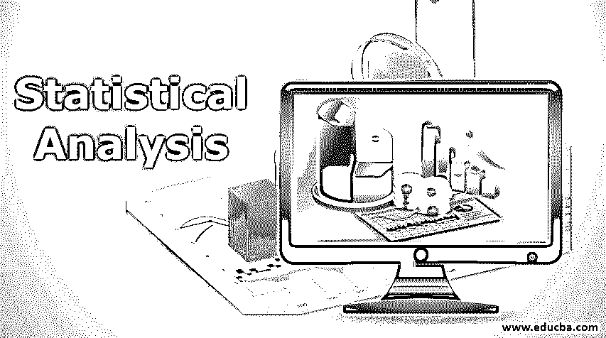
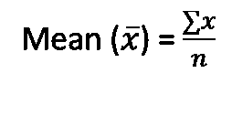
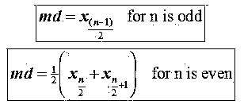
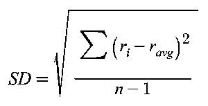
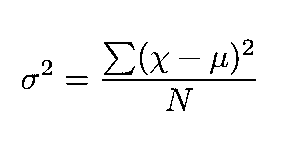

# 统计分析

> 原文：<https://www.educba.com/statistical-analysis/>

## 什么是统计分析？

统计分析是收集、预处理和应用一套统计方法来发现数据的洞察力或潜在模式的科学方法。随着廉价数据和增量带宽的增加，我们现在坐拥大量结构化和非结构化数据。除了需要获取和维护这些庞大的数据之外，一个主要的挑战是处理噪音并将数据转换成有意义的方式。统计分析提出了一套统计方法和工具来解决这个问题。

### 如何进行统计分析？

统计分析是数据分析本身的大量文献。让我们讨论一下最常见的统计数据分析方法:

<small>Hadoop、数据科学、统计学&其他</small>

#### 寻找中心趋势

在处理结构化数据时，了解数据集的中心趋势通常是第一步。假设你正在分析一个组织的工资数据。那么你可能会对下面的问题感兴趣比如一个在机构工作 3 年，资质某某的经理平均工资是多少？以下内容用于衡量集中趋势。

**均值:**均值基本上是所有数据点的平均值。平均值是总工资除以数据点数。

**中位数:**中位数是数据的第 50 个百分点。当我们寻求平均工资等信息时，中位数将是一个更稳健的衡量标准。它对异常值不太敏感。

**Mode:** Mode 是数字列表中出现频率最高的值。假设我们正在处理一系列数字[12，33，44，55，67，55，8，55]，这里的模式是 55。

#### 寻找分散

离差是对数据可变性的度量。离差帮助我们发现一个数据点如何不同于它的中心趋势。找到合适的分布对于根据用例决定使用哪个[机器学习算法](https://www.educba.com/machine-learning-algorithms/)是很重要的。

**标准差:**标准差量化了数据点与其中心趋势(离差)的变化程度。该值越低，与其中心值相同的数据点就越多。

**方差:**方差是标准差的平方。方差给出了数据的分布(可变性)。在处理高维数据时，我们经常会遇到需要降低维度或分析数据集的重要变量的情况。在这种情况下，我们以保持最大可变性的方式转换轴。这个新的旋转轴叫做主分量。我们从旋转分量中选择 N 个重要分量(具有高方差的轴)。

**四分位范围(IQR):** 四分位范围是数据集的第 25 和第 75 百分位值之间的数据范围。我们用盒子情节，小提琴情节等。用图表的方式分析 IQR。

#### 回归问题

回归是一组独立变量是连续变量的问题。例如，我们有汽车制造商的历史销售数据和影响汽车制造和销售过程的各种因素，我们需要预测特定品牌的销售。现在，我们将回归问题公式化为“根据因子 x1、x2、x3 等找出汽车品牌 ABC 的销售额”

### 使用统计分析的优势

以下几点解释了使用统计分析的优势:

*   [在大数据时代](https://www.educba.com/what-is-big-data/)，在实施任何机器学习用例时，如何从庞大的数据湖中选择样本至关重要。统计分析有助于我们确定适当的抽样方法(即随机、无替代随机、分层抽样等)并减少抽样偏差。
*   例如，我们正在处理二元分类问题，其中 80%的数据点属于 A 类，只有 20%属于 B 类。现在，如果我们想对总体样本执行任何统计测试，我们必须确保样本也是 80:20 的比例(80% A 类:20% B 类)。
*   无论是抽样还是决策，统计分析的基础都是历史数据。这使得统计数据分析作为行业标准比另一个[手动数据分析过程](https://www.educba.com/what-is-data-analysis/)更容易被接受。

### 为什么我们需要统计分析？

统计分析的主要目标是从数据中发现有价值的见解，这些见解可用于发现行业趋势、产品或服务的客户流失率、做出有价值的商业决策等。

从收集数据到发现数据的潜在模式，统计分析是所有数据驱动方法和经典机器学习的基础。

### 统计分析的范围

以下几点解释了统计分析的范围:

*   在当今世界，越来越多的行业正在转向基于数据的决策系统，而不是经典的确定性的基于规则的方法。
*   统计分析主要用于解决制造业、保险、银行和金融、汽车等领域的各种商业问题。从行业角度来说。
*   从技术角度来看，统计分析有助于解决线性回归、时间序列预测、预测分析等问题。

### 结论

在本文中，我们讨论了统计数据分析的各个方面，如方法、需求和用例范围等。统计分析是一个非常古老的研究领域，它为现代机器学习和数据驱动的商业模型奠定了基础。统计分析方法的实际实现根据用例的类型和行业而不同。

### 推荐文章

这是统计分析指南。这里我们讨论什么是统计分析，它是如何进行的？具有统计分析的优势和范围。您也可以浏览我们的其他相关文章，了解更多信息——

1.  [统计职业](https://www.educba.com/careers-in-statistics/)
2.  [数据分析的类型](https://www.educba.com/types-of-data-analysis/)
3.  [Tableau 工作簿](https://www.educba.com/tableau-workbook/)
4.  [什么是数据分析师？](https://www.educba.com/what-is-data-analyst/)
5.  [主成分分析快速浏览](https://www.educba.com/principal-component-analysis/)

