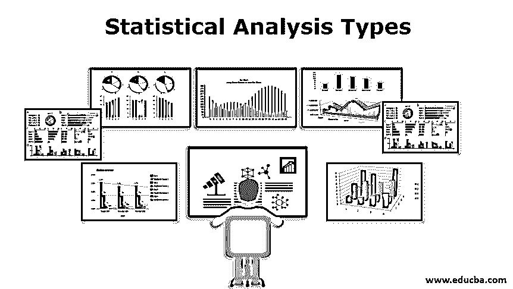

# 统计分析类型

> 原文：<https://www.educba.com/statistical-analysis-types/>

## 统计分析类型介绍

统计分析是一门收集、探索、组织、探索模式和趋势的科学，使用其中一种类型，即描述型(用于描述数据)、推理型(用于概括人口)、规定性、预测性、探索性和机械性分析，以回答诸如“可能会发生什么？”等问题，“应该怎么做？”、以及“为什么”等。因此，大多数企业依靠这些统计分析结果来降低风险和预测趋势，从而在竞争中保持优势。

### 不同类型的统计分析

下面给出了统计分析的类型:

<small>Hadoop、数据科学、统计学&其他</small>

*   描述性统计分析
*   推断型统计分析
*   规定性分析
*   预测分析
*   因果分析
*   [探索性数据分析](https://www.educba.com/exploratory-data-analysis/)
*   机械分析

#### 1.描述性统计分析

顾名思义，描述性统计分析有助于描述数据。它以一种可以从中解读有意义信息的方式获取数据摘要。使用描述性分析，我们得不到结论，但是我们知道数据是什么，也就是说，我们知道数据的定量描述。

例如，考虑一个简单的例子，其中您必须通过计算平均值来确定学生在整个学期的表现如何。这个平均数不过是该学期所有科目的分数之和除以科目总数。这个数字描述了学生在潜在的广泛学科经历中的总体表现。

每当我们试图用一个单一的值来描述一大组观察结果时，我们就会面临歪曲原始数据或丢失任何重要信息的风险。学生的平均成绩并不能决定学生的强项。它不会告诉你学生的特长，或者你不会知道哪个科目容易或强。尽管有这些限制，描述性统计可以提供一个强有力的总结，这可能有助于不同单位之间的比较。

有两种类型的统计数据用于描述数据:

*   **集中趋势的度量:**在这种情况下，单个值试图通过使用其在给定集合中的中心位置来描述数据。它们也被归类为摘要集。为了得到中心值，他们使用平均值、中值或众数。
*   **扩散的度量:**在这种情况下，通过描述数据扩散的程度来总结数据。例如，如果 100 名学生的平均分是 55，那么就会有学生的平均分低于 55 或高于 55。这意味着他们的分数将以平均值为 55 的方式分布。为了描述分布，我们可以使用任何一种统计技术，即范围、四分位数、变异、标准偏差和绝对偏差。

#### 2.间接统计

包含我们感兴趣的信息的一组数据称为人口。推断统计用于使用样本对总体进行概括。样本是从人群中抽取的。样本必须恰当地代表总体，不应有偏差。获得这种样本的过程称为采样。推断统计学来源于这样一个事实，即抽样自然会产生抽样误差，因此不能完全代表总体。

有两种类型的推断统计方法用于概化数据:

*   估计参数
*   统计假设的检验

以上两种是统计分析的主要类型。

#### 3.规定性分析

“应该怎么做？”通过问这个问题，对数据进行说明性分析。这是商业分析的一个常见领域，为一种情况确定可能的最佳行动。其整体理念是提供建议，旨在为决策过程找到最佳建议。它与[描述性和预测性分析](https://www.educba.com/predictive-analytics-vs-descriptive-analytics/)相关。描述性分析描述数据，即已经发生的事情，而预测性分析预测可能发生的事情。规定性分析在可用选项中找到最佳选项。

规范分析中使用的技术有模拟、图形分析、业务规则、算法、复杂事件处理和机器学习。

#### 4.预测分析

“可能会发生什么？”预测分析用于预测未来事件。它基于当前和历史事实。它使用统计算法和[机器学习技术](https://www.educba.com/machine-learning-techniques/)来确定未来结果的可能性，基于历史和新的数据和行为的趋势。企业正在实施预测分析，以提高竞争优势并降低与不可预测的未来相关的风险。预测分析的主要用户是市场营销、金融服务、在线服务提供商和保险公司。预测分析中使用的技术有数据挖掘、建模、人工智能等。

#### 5.因果分析

“为什么？”因果分析有助于确定事物之所以如此的原因。由于当前的商业世界充满了可能导致失败的事件，因果分析试图找出失败的原因。它试图找到根本原因，即某件事情能够发生的基本原因。这是 IT 行业中用于软件质量保证的常用技术。和应对重大灾难的行业。

#### 6.探索性数据分析

它是推理统计的指数，主要由数据科学家使用。这是一种分析方法，侧重于识别数据中的模式，并找出未知的关系。探索性数据分析的目的是检查缺失的数据，发现未知的关系，并检查假设和假设。它不应该单独使用，因为它只提供数据的鸟瞰图，并从中获得一些洞察力。这是数据分析的第一步，应该在其他正式的统计技术之前进行。

#### 7.机械分析

机械分析在大工业中起着重要的作用。虽然它不是统计分析方法的常用类型，但仍然值得讨论。它用于了解导致其他变量的给定变量的确切变化。它的工作原理是假设给定的系统会受到其内部组件相互作用的影响。它不考虑外部影响。它在像生物科学这样包含明确定义的系统中是有用的。

### 结论

在本文中，我们了解了不同类型的统计分析方法。这个领域有广阔的前景。酒店、服装设计、音乐商店、供应商、营销甚至政治等行业都严重依赖这些数据来保持领先地位。其他领域包括医学、心理学等。因为数据本身是有帮助的，所以统计分析有助于获得洞察力。

### 推荐文章

这是统计分析类型的指南。在这里，我们讨论了介绍，不同类型的统计分析以及实施的基本要点。您也可以浏览我们推荐的其他文章，了解更多信息——

1.  [SAS 替代方案](https://www.educba.com/sas-alternatives/)
2.  [什么是预测分析？](https://www.educba.com/what-is-predictive-analytics/)
3.  [数据分析软件](https://www.educba.com/data-analysis-software/)
4.  [什么是回归分析？](https://www.educba.com/what-is-regression-analysis/)

