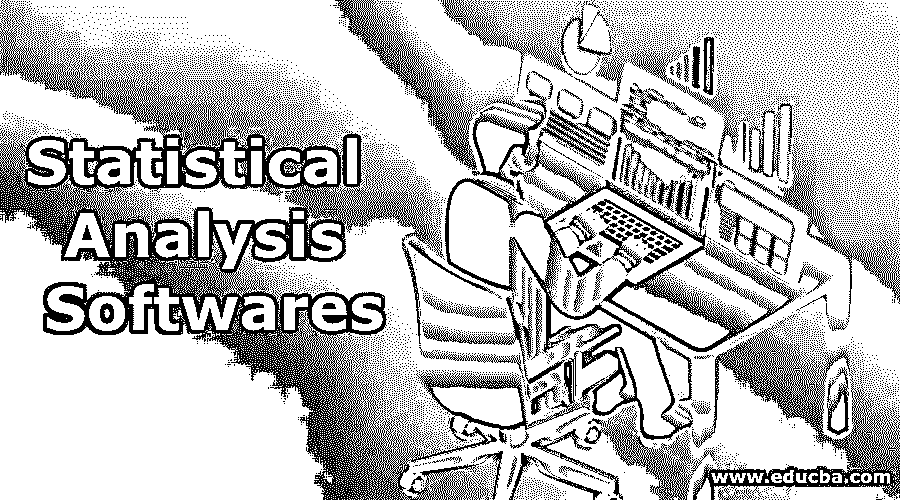
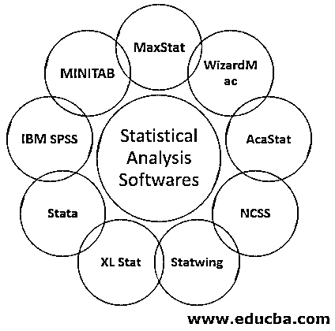

# 统计分析软件

> 原文：<https://www.educba.com/statistical-analysis-softwares/>

## 统计分析软件介绍

统计分析软件在短期内主要称为 SAS。SAS 是一个主要在全世界所有国家使用的单词。它用于解决复杂的业务问题。它们主要分为菜单驱动和命令驱动。它们基本上被当作另一种[编程语言](https://www.educba.com/what-is-a-programming-language/)。SAS 有其内置的语言，用于在代码执行期间控制代码。统计分析软件(SAS)的专家主要是专业的统计解决方案。

它基本上是 1970 年开始的软件和公司的名称，用于编译 C 编程语言。它是一种非常灵活的语言，可以理解任何类型的数据，从任何地方以任何类型的格式检索数据。SAS 使用 if-else 语句等循环格式，以系统的格式执行程序，以便更好地理解结构。
它有各种主窗口，例如:

<small>Hadoop、数据科学、统计学&其他</small>

*   **编辑窗口:**这里我们要根据需求写代码。
*   **日志窗口:**用于显示程序日志的格式结构，我们也可以在这里查看错误，并纠正错误以便进一步执行*。*
*   **输出窗口:**输出窗口和结果窗口用于查看我们在编辑窗口*中编写的程序的输出。*
*   **资源管理器窗口:**它是所有处理过的文件和已经生成的 SAS 内容都可用的东西。

### 不同的统计分析软件

下面我们将讨论 9 大统计分析软件:

#### 1.MaxStat

这是第一个最常用的 SAS 工具，因为它有一个可理解的代码结构，任何人都可以购买，因为它最合理。任何学生都可以理解如何处理输出。在本专业中，需求是可选的，因为它可以被任何人理解。我们只需要提供与我们的项目相关的信息，MaxStat 将通过选择相关的统计工具来相应地处理和执行结果。

#### 2.巫师 Mac

在这个工具中，没有艰苦的工作，没有编码和编程需要处理数据。这里有专业人员，他们在 WizardMac 的帮助下继续编程。它有一个简单的 GUI，可以很好地理解代码的结构。

#### 3.AcaStat

AcaStat 是唯一的在线统计工具，使用起来非常简单。与其他统计工具相比，它的工作速度非常快。它主要用于格式化数据，也用于设置缺失值。

#### 4.NCSS

NCSS 软件上有大量的统计和图形数据。它包括免费的在线培训，你可以组织你的文件在一个非常好的格式。邮件支持也可以帮助用户解决未来的任何问题。

#### 5.斯塔廷

Statwing 是用于尽早获得结果的工具。它比其他统计工具快 5 倍，也更完美。它允许新用户使用它并利用它。

#### 6\. XL Stat

XL Stat 有很多特性，主要是因为其惊人的特性而受到用户的青睐。您可以在 PC 或 Mac 上使用该工具。大多数情况下，它更多地与 MS excel 相结合，以改进统计工具，并根据用户需求获得输出。

#### 7.斯塔塔

Stata 是一个利用统计分析的完整软件包。这是用户需要的唯一在线统计分析工具。这是一个快速而聪明的过程。

#### 8.IBM SPSS

顾名思义，它包含了与 IBM SPSS 工具相关的所有信息，因为它是 IBM 的工具，而且他们主要将该工具用于市场研究目的。IBM 工具的界面非常用户友好，任何人都可以理解。在这里，质量和代码得到维护，并保持数据适当。

#### 9\. MINITAB

Minitab 是一个可以在网上获得所有物品的更详细信息的工具。因为它是基于网络的，所以它主要被学院和公司用来查阅详细的数据。它允许您将 Microsoft excel 文件转移到 Minitab 中，而无需任何手动干预，这是令人惊讶的，而且不耗时。

### 结论

SAS 什么也不是，只是一个计算机程序，主要用于任何地方。借助其逐步窗口周期，它可用于在更深层次上探索数据。大多数情况下，描述性统计和推断性统计是用来获得更好的结果的，两者携手合作，就像描述性统计用于数据组织，而推断性统计用于输出目的一样。SAS 主要用于业务需求，因为它始终需要更新的数据和新引入的功能。主要是 SAS 在许多方面更适合未来的需求。

### 推荐文章

这是统计分析软件指南。在这里，我们讨论的意义，并列出了前 9 个统计分析软件详细。您也可以浏览我们推荐的其他文章，了解更多信息——

1.  [什么是回归分析？](https://www.educba.com/what-is-regression-analysis/)
2.  [机器学习 vs 统计学](https://www.educba.com/machine-learning-vs-statistics/)
3.  [数据分析软件](https://www.educba.com/data-analysis-software/)
4.  [聚类算法](https://www.educba.com/clustering-algorithm/)

