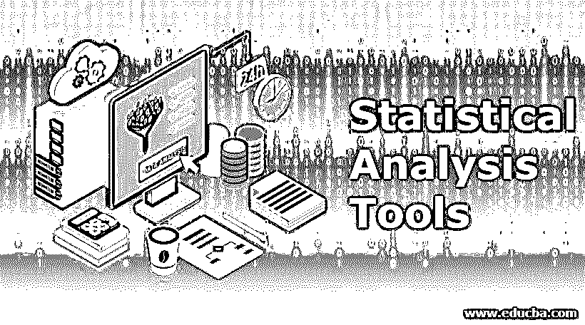

# 统计分析工具

> 原文：<https://www.educba.com/statistical-analysis-tools/>

## 统计分析工具简介

用于数据分析的数学计算称为统计学。数据的描述、总结和比较可以用统计分析工具来完成。可以使用各种工具来分析统计数据。统计数据分析的范围从简单的计算到高级的分析。基本分析的计算很简单，而高级分析的计算需要很好地理解高级水平的统计学和计算机软件。为统计分析设计的软件使理解如何处理数据以及如何进行结果解释的过程尽可能简单。

### 统计分析工具的类型

有几种工具可用于对数据进行统计分析。它们是:

<small>Hadoop、数据科学、统计学&其他</small>

#### 1.社会科学统计软件包(SPSS)

人类行为研究中最广泛使用的统计软件包是社会科学统计软件包。社会科学统计软件包提供了汇编描述性统计数据、参数和非参数分析、图形用户界面(GUI)以图形方式描述结果的能力。分析可以通过创建脚本实现自动化，这一选项包含在社会科学的统计软件包中。

#### 2.r 统计计算基金会

用于人类行为研究领域和其他领域的统计分析软件包是免费提供的，数据处理的不同方面可以通过工具箱提供的大量应用程序来简化。尽管 R 是一个强大的软件，但 R 需要一定程度的编码。r 也有一个陡峭的学习曲线。一个社区正在积极参与构建和改进 R 以及相关的插件。

#### 3.Matlab(数学工具)

工程师和科学家广泛使用一种叫做 Matlab 的分析平台和编程语言。学习曲线很陡，必须在某个时候创建自己的代码。研究问题可以使用大量可用的工具箱来回答。例如，可以使用 EEGLAB 工具分析脑电图数据。学习 Matlab 对初学者来说很难，但是如果编码可以完成的话，在你想做什么方面有很大的灵活性。

#### 4.微软优越试算表

Microsoft excel 并不是用于[统计分析](https://www.educba.com/statistical-analysis/)的高级解决方案，但是 Microsoft Excel 为数据可视化和简单统计提供了多种工具。对于那些希望通过生成汇总指标、可自定义的图形和数字来查看其数据基础的人来说，Microsoft excel 成为了一个有用的工具。许多个人和公司拥有并知道如何使用 excel，这使得任何人都更容易开始学习统计学。

#### 5.统计分析软件(SAS)

可以通过使用图形用户界面或在名为[统计分析软件](https://www.educba.com/what-is-sas/) (SAS)的统计分析平台上创建脚本来执行高级分析。这是一种用于医疗保健、商业、人类行为研究等领域的先进解决方案。可以执行高级分析，可以生成值得出版的图形、图表，即使对于不习惯这种方法的人来说编码是困难的。

#### 6.制图板棱镜

与生物学相关的统计利用了名为 GraphPad prism 的软件。GraphPad Prism 不仅用于生物学相关的统计，还可用于其他各种领域。就像社会科学的统计软件包一样，分析可以自动化，复杂的统计计算可以使用脚本选项进行，但图形用户界面是大多数工作的门户。

#### 7\. Minitab

数据分析可以使用一种叫做 [Minitab](https://www.educba.com/what-is-minitab/) 的软件提供的基本和高级统计工具进行。图形用户界面和脚本命令执行类似 GraphPad Prism 中的命令，使初学者和希望进行复杂分析的人都可以使用它。

#### 8.统计图形

Stat graphics 拥有为全球专业用户和企业设计的强大功能。通过使用 stat 图形，即使非统计人员也能体验到业务分析的优势。可以在直观的界面中运行统计分析、构建模型和设计实验。

#### 9.XL state

使用 XLSTAT 提供的各种工具可以增强 Excel 的分析能力。这使得它非常适合统计和数据分析需求。

#### 10\. Qlik Sense

可以通过使用商业智能(BI)和名为 Qlik sense 的可视化分析平台来支持分析用例。

#### 11.Origin Pro

用户友好的，点和点击界面，以可视化，分析和探索的数据被称为起源亲。批处理操作可以通过工作流进行优化。

#### 12.沃尔夫拉姆数学

这些工具用于图像处理、几何、可视化、机器学习、数据挖掘等。一个叫做 Wolfram Mathematica 的技术计算系统。

#### 13.Phocas 软件

Phocas 是一家位于 SaaS 的云计算公司，专门从事制造、分销和零售行业的数据分析。

#### 14\. Birst

Birst 是下一代商业智能和分析领域的领导者，为整个商业智能流程提供自动化、优化和灵活性。

#### 15.SAS 商业智能

SAS 商业智能软件是一种商业智能软件，用于准备数据，发现有价值的见解，并以一种受治理的自助方式分享这些见解。

#### 16.适马图

企业通过使用名为适马图的科学制图和数据分析解决方案，创建和管理二维和三维可视化数据。

#### 17.马托莫分析公司

Matomo Analytics 是一个开源的网络分析平台。它在 190 个国家的 140 多万个网站上使用。Matomo Analytics 的前身是 Piwik。

### 结论

有几种可用的软件工具，每种软件工具为用户提供不同的功能。我们选择的功能将取决于许多因素，如研究问题、统计知识和编码经验。这些因素意味着我们正处于数据分析的高峰期，但对于任何研究，获得的数据质量与研究执行的质量成正比。

### 推荐文章

这是统计分析工具的指南。在这里，我们详细讨论了 17 种不同类型的统计分析工具的基本概念。您也可以看看以下文章，了解更多信息–

1.  [统计分析回归](https://www.educba.com/statistical-analysis-regression/)
2.  [统计分析方法](https://www.educba.com/statistical-analysis-methods/)
3.  [什么是情景应用程序](https://www.educba.com/what-is-sas/)
4.  [大数据技术](https://www.educba.com/big-data-techniques/)

