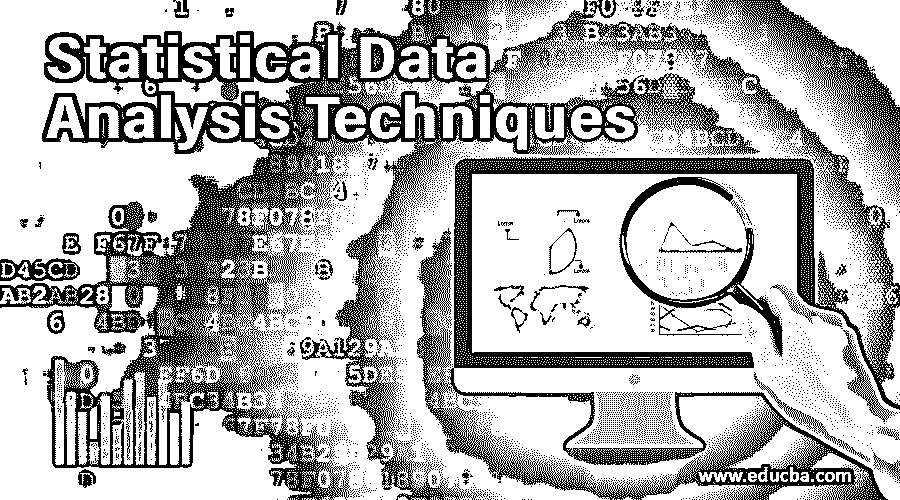
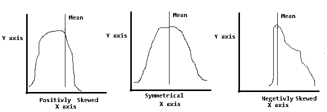
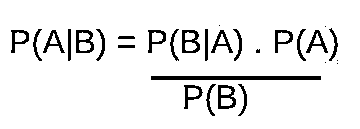

# 统计数据分析技术

> 原文：<https://www.educba.com/statistical-data-analysis-techniques/>

## 什么是统计数据分析？

统计数据分析是机器学习算法的基础，该算法使用诸如数据采样、集中趋势(均值、中值和众数)、随机变量(离散、连续、偏斜、方差等)、概率分布、统计推断、置信区间和假设检验等技术来分析、组织和生成来自可用数据点的统计上下文，以确保基于统计规则的数据解释的正确性。

### 统计数据分析技术

以下是数据分析中[涉及的统计技术列表。](https://www.educba.com/what-is-data-analysis/)

<small>Hadoop、数据科学、统计学&其他</small>

*   数据采样
*   集中趋势
*   随机变量
*   概率分布
*   统计推断
*   置信区间
*   假设检验

让我们详细了解每一种统计技术。

#### 1.数据采样

它是收集和分组[数据以进行统计分析](https://www.educba.com/statistical-analysis/)的过程。它有两类。

**人口:**

*   它指的是用例的整个数据集。
*   它包括所有可以相互关联的组。
*   例如:一个在线论坛的所有成员都在阅读文章。

**样本:**

*   它是人口的一个子集。
*   这些是数据点的随机样本。
*   从总体数据中确定样本的过程称为抽样。
*   示例:一组阅读技术文章的俱乐部成员样本。

#### 2.集中趋势

**的意思是:**

*   这是范围数据的平均值。
*   计算方法是将所有点的数据相加，然后除以数据点的总数。

**中位数:**

*   中位数是奇数个观察值的数据点的中间值。
*   如果观察次数为偶数，则通过平均两个中间数来计算中位数。
*   观测数据按升序缩短，以确定中值。

**模式:**

*   基于数据集中的重复次数或频率来计算模式。
*   该模式可用于分类数据。

#### 3.随机变量

随机变量是统计技术中使用的一种特殊类型的变量，用于量化通过随机过程产生的结果。随机变量通常用大写字母表示，如 X 或 E(X)或 y。它与过程结果的概率有关。

**离散:**

*   要计数的离散值。
*   它可以是有限或无限的可数。
*   示例:统计会议的与会者人数。

**连续:**

*   变量的连续值不能算作离散值。
*   它是一系列在本质上连续的值。
*   例如足球比赛中运动员的身高。

**偏斜度:**

还有一个重要的概念叫做偏度，这个过程决定了随机变量的偏度系数。它还包括检查数据分布的对称性。

检查偏斜度的过程包括识别。

*   **对称:**寓意均值=中位数=众数
*   **正偏:**暗示均值>中位数>众数
*   **负偏态:**暗示均值<中位数<众数

下面是偏斜度和对称数据分布的图形表示。

此外，有两个术语经常用于数据分析，用于分析数据分布或确定数据点与平均值的距离。这些也被称为数据扩散的措施。

**差异:**

*   它是随机变量与平均值的平方偏差。
*   Square 用于管理正负符号值。
*   方差表示为**σ2T3】。**

**标准差:**

*   它是方差值的平方根值。
*   高标准偏差值表示数据偏离平均值。
*   低标准偏差值表示数据分布更接近平均值。
*   用符号***X***表示，其中 X 为随机变量。

#### 4.概率分布

概率是确定未来某一事件发生的可能性的过程。它使用与事件过程结果相关的数值。集合论数学是概率确定的基础。

概率数据集的一个例子是抛硬币和结果。

*   Coin ={0，1}
*   其中 0 代表如果抛的硬币是“正面”的情况
*   1 表示如果抛的硬币是“尾巴”的情况

一个事件或观察的所有可能结果被称为“样本空间”。样本空间包含自然界中同样可能的元素。事件的概率可以表示为 P(事件)。如果我们用样本空间假设事件 A，那么 P(A)将是，

*   A 中特定元素的可能性/A 的样本空间中所有元素的可能性。

示例:对于抛硬币场景

*   p(正面)=正面结果的可能性/抛硬币的所有可能结果
*   P(A)=
*   P(A) =0.5 = 50 %

概率分布计算中还涉及到其他几个概念，

*   联盟
    *   它是两个数据集的联合
    *   p(美国)
*   交集
    *   它是两个数据集之间的交集或公共元素
    *   P(A ∩ B)
*   条件概率
    *   条件概率是在相关事件已经发生的情况下计算事件的概率。
    *   P (A|B)=P(A ∩ B)/P(B)
*   贝叶斯定理

上面的公式符号标签:

*   a，B 是事件
*   P(A)是事件 A 的独立概率
*   P(B)是事件 B 的独立概率
*   P(A|B)是假设事件 B 为真时事件 A 的概率
*   P(B|A)是假设事件 A 为真时事件 B 的概率

#### 5.统计推断

*   它是比较不同数据样本的统计度量以观察统计的显著性的过程。
*   总体特征称为参数，样本特征称为统计量。

#### 6.置信区间

*   这是群体参数将位于的值的范围。
*   它有助于测量取样过程中确定性的程度。
*   在大多数情况下，置信区间为 95%或 99%。

#### 7.假设检验

它是一种重要的数据分析统计技术。假设检验是一种有效的数据分析验证方法。统计假设主要是由关于数据的某些假设驱动的。这些假设是基于真或假的假设。

*   假设检验通常从零假设开始。
*   零假设假设陈述是真实的，除非被证明是相反的。
*   在统计符号中，它被称为 H0。
*   随后，交替假设被引入假设检验。
*   交替假设检验表示为 Ha。
*   替代假设的目的是检查是否有足够的证据来拒绝原假设。
*   随后的步骤包括使用 H0 和 Ha 来测试假设，以识别临界区域的拒绝并得到结论。
*   示例:对于一个销售用例，特定地区的平均周销售额为 10000 美元是一个假设，可以使用假设测试来验证该假设，以便企业向该特定地区推出新的优质产品。分析师需要推导并应用无效假设和替代假设，以根据可用数据进行假设检验。

### 结论

统计技术是机器学习算法的基础。有几个工具和应用程序，如 MS Excel、R 语言、Python 脚本，可用于将这些技术应用于统计数据分析。

### 推荐文章

这是统计数据分析技术指南。这里我们详细讨论 7 大统计数据分析技术。您也可以阅读以下文章，了解更多信息——

1.  [统计分析方法](https://www.educba.com/statistical-analysis-methods/)
2.  [数据结构中的图形](https://www.educba.com/graph-in-data-structure/)
3.  [统计分析类型](https://www.educba.com/statistical-analysis-types/)
4.  [统计面试问题](https://www.educba.com/statistics-interview-questions/)

