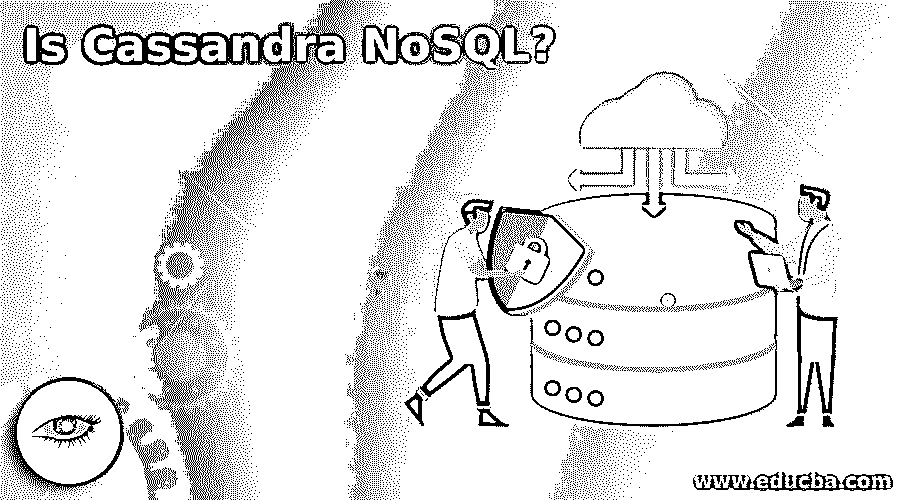

# 卡珊德拉是 NoSQL 吗？

> 原文：<https://www.educba.com/is-cassandra-nosql/>

## 卡珊德拉是 NoSQL 吗？

是的，Apache Cassandra 是一个 NoSQL 数据库。Apache Cassandra 是一种 NoSQL 列数据库。Apache Cassandra 是一个面向列的数据库。NoSQL 数据库是一个非关系数据库，能够处理结构化、半结构化和非结构化数据。

### 卡桑德拉

Apache Cassandra 是一个[开源 NoSQL 数据库](https://www.educba.com/what-is-nosql-database/)和高度可伸缩的数据库。Apache Cassandra 是一个分布式高性能数据库。这是一个 Apache 社区产品，可以免费获得。您不必为个人或专业使用许可证付费。这是一个高度可伸缩和可用的数据库，而不影响性能。Apache Cassandra 是一个完美的数据平台，具有容错性和线性可伸缩性。Apache Cassandra 设计用于处理大量数据。Apache Cassandra 允许跨多个商用服务器存储和管理高速结构化数据和非结构化数据。Cassandra 结合了 Google Bigtable 和 Amazon Dynamo 在数据库管理方面的所有优势。它提供没有单点故障的高可用性服务。Apache Cassandra 为商用硬件集群提供了强大的支持。

<small>Hadoop、数据科学、统计学&其他</small>

### NoSQL

NoSQL 代表“不仅仅是 SQL”。NoSQL 是一种新型的数据库管理系统。NoSQL 数据库从根本上不同于关系数据库系统。NoSQL 数据库不遵循传统数据库系统的所有规则，因为它允许您存储和处理非结构化和半结构化数据。NoSQL 是一个高度可伸缩和灵活的数据库。NoSQL 数据库通常支持水平缩放。NoSQL 数据库存储和管理数据的方式允许开发人员有很高的操作速度和很大的灵活性。NoSQL 数据库通过整合广泛的技术来解决这一问题，这些技术使系统可扩展并适合大数据操作。NoSQL 数据库因其易开发性、功能性和大规模性能而得到广泛认可。

### 卡珊德拉能取代 NoSQL 吗？

NoSQL 数据库有四种类型，可以以任何方式部署，柱状数据库、文档数据库、图形数据库、内存键值存储。在每个域中都有不同的数据库。Apache Cassandra 是一种列数据库。阿帕奇·卡珊德拉诞生于脸书。Cassandra 与 RDBMS 截然不同。Cassandra 是一个强大的列族数据模型，实现了无单点故障的发电机式复制。通过部署多节点 [Cassandra 集群](https://www.educba.com/cassandra-cluster/)并满足高可用性要求，Cassandra 可以轻松扩展以满足突然增加的需求。Cassandra 最大的优势是处理大量的非结构化数据。一些 IT 行业的大公司正在使用 Cassandra，如脸书、思科、易贝、网飞、Instagram、Twitter、Rackspace、易贝等等。Instagram 上每天有 8000 万张照片上传到 Cassandra 数据库。Apache Cassandra 是一种 NoSQL 数据库。NoSQL 的特征与卡桑德拉的奉献相一致。所以，NoSQL 不能取代卡桑德拉，或者卡桑德拉不能取代 NoSQL。

### 卡桑德拉和 NoSQL 的区别

*   Apache Cassandra 具有去中心化的架构，任何节点都可以执行任何操作。Cassandra 根据 CAP- Theorem 提供可用性和分区等功能，而 NoSQL 数据库是一种无模式、无共享的架构，可扩展，能够在大量节点上运行。
*   Apache [Cassandra 非常适合](https://www.educba.com/what-is-cassandra/)支持单行查询或基于列值索引选择多行，而 NoSQL 的架构提供了比关系数据库更高的每节点性能。
*   Apache Cassandra 从数据库向在线事务应用程序提供数据，在在线系统和商业智能的后端工作，而开源 NoSQL 数据库不需要昂贵的许可费，可以在廉价的硬件上运行，使其部署具有成本效益。

### NoSQL 数据库类型

以下是不同类型的 NoSQL 数据库:

*   **柱状数据库:** [HBase 和 Cassandra](https://www.educba.com/hbase-vs-cassandra/) 是柱状数据库的一种。列数据库读写数据的列，而不是行。每一列相当于关系数据库中的一个容器，键定义一行，一行有多列。
*   **文档数据库:** CouchDB 和 MongoDB 是文档数据库的一种。文档数据库以 XML、JSON 等文档格式存储和检索半结构化数据。
*   **图形数据库:** Polyglot，Neo4J 是图形数据库的一种。数据将实体的图形表示为网络，并将数据存储为实体和实体之间的关系，从而允许更快地执行遍历和连接操作。然而，这些图表可以使用 SQL 和 NoSQL 数据库来构建。有向图结构用于表示数据。
*   **内存键值存储:** Redis 和 Riak 是一种内存数据库。内存数据库适用于读取密集型工作负载和计算密集型工作负载，这些数据库将关键数据存储在内存中，从而提高系统性能。

### 卡桑德拉的特征

卡珊德拉在专业人士中很有名，原因如下:

*   **Always on architecture:**Cassandra 中没有单点故障，业务关键型应用程序可以连续使用，不会出现任何故障。
*   **可扩展架构:** Cassandra 是水平可扩展的。Cassandra 采用无主机设计，所有节点都在同一级别，这简化了操作并易于横向扩展。可以灵活地在集群中添加或删除任意数量的节点，而不会造成干扰。
*   **数据压缩:** Cassandra 可以压缩高达 80%的数据，没有任何开销。
*   **灵活的数据存储:** Cassandra 存储和处理所有格式的结构化、半结构化和非结构化数据。Cassandra 框架根据您的需要动态地适应数据结构的变化。
*   **CQL (Cassandra 查询语言):**一种类似 SQL 的语言，使得从关系数据库迁移变得非常容易。
*   **事务支持:** Cassandra 支持 ACID 属性和 [CAP 定理](https://www.educba.com/cap-theorem/)，如原子性、一致性、隔离性和持久性。
*   **灵活的动态数据模型:** Apache 在商用硬件上工作。Cassandra 支持快速读写的数据类型。

### 结论——卡桑德拉·NoSQL

数字化时代让世界产生了海量数据。大多数传统数据库没有准备好无缝地处理这些数据，这就产生了创建这样一种数据库的需要，这种数据库在存储数据之前不需要对数据结构进行建模和结构化。Apache Cassandra 是一种 NoSQL 数据库。Cassandra 数据库对于多种任务非常有用。Cassandra 旨在处理脸书、Instagram 等公司产生的实时数据。

### 推荐文章

这是卡桑德拉·NoSQL 的指南。这里我们还讨论了卡桑德拉像的基本概念以及卡桑德拉像和 NoSQL 像的区别。你也可以看看下面的文章来了解更多

1.  [十大卡珊德拉面试问题](https://www.educba.com/cassandra-interview-questions/)
2.  [Cassandra vs Elasticsearch |差异](https://www.educba.com/cassandra-vs-elasticsearch/)
3.  [MongoDB vs Cassandra |对比](https://www.educba.com/mongodb-vs-cassandra/)
4.  [Hadoop vs Cassandra |差异](https://www.educba.com/hadoop-vs-cassandra/)
5.  [Cassandra 查询语言](https://www.educba.com/cassandra-query-language/)
6.  [4 种不同类型的 Cassandra 数据类型](https://www.educba.com/cassandra-data-types/)

