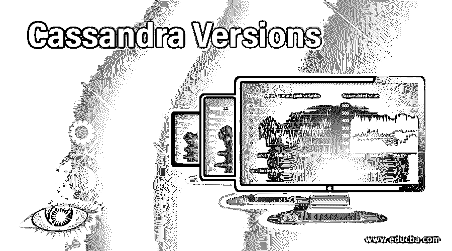

# 卡珊德拉版本

> 原文：<https://www.educba.com/cassandra-versions/>

## Cassandra 版本介绍

Apache Cassandra 版本指的是从它在脸书诞生到今天被 CERN 和 Apple 等一些最大的公司和组织使用的各种变化。在本文中，我们旨在通过 Apache Casandra 多年来的各种迭代或版本来了解它的演变。我们将看到 Casandra 是如何从脸书的一个内部项目发展成为《财富》500 强公司使用的非 SQL 数据库管理系统的全球解决方案的。

Apache Cassandra 是由脸书的 Avinash Lakshman 和 Prashant Malik 开发的，以增强其搜索收件箱功能。脸书随后将 Cassandra 作为谷歌代码的开源项目发布，并在 2008 年和 2009 年成为 Apache 孵化器项目。2010 年，它作为一个顶级项目启动，成为 Apache 软件基金会的一部分。

<small>Hadoop、数据科学、统计学&其他</small>

### 卡珊德拉的 11 大版本

以下是卡珊德拉版本如下:

#### 1.版本 0.6(2010 年 4 月)

这是 Apache Cassandra 在处于开发阶段、从 Apache 孵化器毕业并成为 Apache Software Foundation 的一部分(这意味着接受 Apache Foundation 的全面支持)后推出的。它整合了对 Hadoop、缓存和改进性能的支持。Hadoop 支持允许 Cassandra 使用 MapReduce 框架对存储在 Cassandra 中的数据进行各种分析。这种改变只是将架构变得更好，并提升了整体性能和用例。

#### 2.版本 0.7(2011 年 1 月)

在这个版本中，二级索引和在线模式更改是对 Cassandra 的重要更改和补充。列值的索引称为二级索引，它允许按值查询，可以在后台构建，不会阻塞读写。在此更新之前，必须在 Cassandra 的配置文件中描述键空间和列族。添加、删除或更新意味着滚动集群更新。这在 0.7 中是不需要的，因为 API 中添加了新的方法，并且无需重启集群就可以更改模式。

#### 3.版本 0.8(2011 年 6 月)

这是一个重大更新，其中引入了 Cassandra 查询语言的 CQL 以及其他更新，如自调优 memtables 和对零停机升级的支持。在这次更新中，Cassandra 提供了 CQL，它严格模仿 SQL，将数据存储在包含行和列的表中。

#### 4.版本 1.0(2011 年 10 月)

在此版本中，与以前的版本相比，读取和写入速度有了很大的提高，写入速度提高了 40%,读取性能提高了 400%。除了主要的性能改进，还有其他变化，如增加了集成压缩和级别压缩。

#### 5.版本 1.1(2012 年 4 月)

在这个版本中，Cassandra 的一个主要变化是行级隔离。Cassandra 存储引擎的日志结构特性使行级隔离更容易，确保行突变应用于当前 memtable，与其他读取和写入隔离，并且足以完成隔离。这被称为对 memtables 的“RowMutation ”,是此次更新除支持 SSD/旋转磁盘部署之外的主要功能。

#### 6.版本 1.2(2013 年 1 月)

此版本增加了跨虚拟节点的群集，从而提高了容量增加的粒度，并显著改善了性能

大型集群中的修复和重建时间、CQL3 改进，特别是增加了集合类型、可查询的系统信息和 CQL 本地协议，以及原子批处理，解决了其他性能改进中的中间批处理协调器故障的可能性。

#### 7.版本 2.0(2013 年 9 月)

Cassandra 2.0 带来了一些最具革命性的升级，比如让开发人员更容易从关系数据库中迁移出来，从而提高工作效率。2.0 的其他一些改进是，

*   基于 Paxos consensus 协议的轻量级事务确保了操作线性化，这类似于关系数据库提供的可串行化隔离级别，可防止并发请求期间的冲突。
*   触发器可以将性能关键型代码推送到它所处理的数据附近，还可以简化与 Apache Storm 等事件驱动型框架的集成。

#### 8.版本 2.1、2.2(2014 年 9 月)

这是一次增量更新，除了性能升级之外，其他一些功能包括改进的 Hadoop 支持、压缩后读取性能、增量节点修复、改进的行缓存。

此外，还添加了一些新功能，如用户定义的类型，它有助于处理表中相关信息的多个字段，集合索引，您可以在其中索引集合，并查询数据库以查找包含特定值的集合，以及更好的计数器实现，使它们更安全、简单和快速。在 2.2 版本中，除了增量更新之外，CQL 和基于角色的访问控制还增加了主要的 JSON 支持。

#### 9.3.0 版(2015 年 11 月)

这个版本增加了一个物化视图，这对于希望降低反规范化负担的开发人员和用户来说是一个很大的优势。使用物化视图可以在同一个故事上创建多个视图，每个视图都有不同的主键组合。此外，在 Cassandra 3.0 中，存储引擎被重构，原生协议 V1 和 V2 被丢弃

#### 10.版本 3.1 至 3.10 (2016-17 年)

每月发布的版本都是通过类似 tick-tock 的发布模式进行更新的，偶数版本提供新的特性和错误修复，而奇数版本只提供错误修复。

#### 11.版本 3.11(2017 年 6 月)

这是迄今为止卡珊德拉的最新稳定版本。它带来了一些小的错误修复和整体性能的改善。Apache Cassandra 的第 4 版预计将在今年任何时候发布，其中会有一些主要的增量更改。

### 结论

多年来，Cassandra 已经走过了漫长的道路，经历了无数次的迭代，现在被 CERN、Apple、网飞等组织和各种政府机构使用。对于任何对大数据领域感兴趣的人来说，了解 Apache Cassandra 等 NoSQL 数据库以及 Hadoop 和 Spark 等其他技术是非常必要的，这些技术一起使用可以对数据科学尤其是大数据有一个整体的了解。

### 推荐文章

这是卡珊德拉版本的指南。在这里，我们还讨论了 Cassandra 的简介和 11 个主要版本，包括 0.6、0.7、0.8 等。您也可以看看以下文章，了解更多信息–

1.  [卡珊德拉 vs Couchbase](https://www.educba.com/cassandra-vs-couchbase/)
2.  [卡珊德拉的键盘](https://www.educba.com/keyspace-in-cassandra/)
3.  [Cassandra 数据类型](https://www.educba.com/cassandra-data-types/)
4.  [卡珊德拉星团](https://www.educba.com/cassandra-cluster/)

