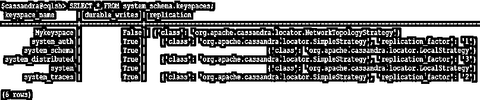

# 卡桑德拉的钥匙空间

> 原文：<https://www.educba.com/keyspace-in-cassandra/>

## 卡珊德拉中的 Keyspace 是什么？

Cassandra 中的 Keyspace 是一个对象，它是一个或多个列族(表)模式的集合。一个键空间是数据的最外层容器。在 Cassandra 中，keyspace 有点类似于 RDBS 的数据库。一个键空间有一组属性，这些属性定义了广泛的行为，如复制因子、数据中心意识、用于保存副本的策略等。一个集群中可以有多个键空间。每个应用程序也可以有多个键空间，但为了避免非结构化数据模型，不建议这样做。

### 如何在 Cassandra 中创建一个 Keyspace？

转到您机器上的 Cassandra 安装目录，启动 cqlsh 并运行带有属性的“CREATE KEYSPACE”命令。

<small>Hadoop、数据科学、统计学&其他</small>

**语法:**

`CREATE {KEYSPACE | SCHEMA } [ IF NOT EXISTS ] keyspace_name
[ WITH REPLICATION '=' '{' keyspace_property '}'] [ AND DURABLE_WRITES '=' {true |false}]`

**Note**: If the keyspace name which has upper and lower cases we should enclose the name in double-quotes.

**代码:**

`cassandra@cqlsh> CREATE KEYSPACE “Mykeyspace” with replication = {‘class’ : ‘SimpleStrategy’, ‘replication_factor’ : ‘3’};`

**其中，**

*   **我的密钥空间:**密钥空间的名称
*   **复制:**密钥空间的属性

**解释:**在上面的查询中，我们在这里配置的唯一属性是用于复制的。在 Cassandra 中，复制意味着在不同的节点存储多个数据副本，每个副本称为一个副本。

### 密钥空间中的副本

为了确定哪些节点持有密钥空间的副本，我们使用了一种称为副本放置策略的算法。有两种策略

*   **简单策略:**当我们只处理一个数据中心时，我们使用简单策略
*   **网络拓扑策略:**在多数据中心的情况下，使用网络拓扑策略

要定义我们要存储多少份数据副本，请更改复制因子属性，在上面的查询中，它被设置为 3，并且类是副本放置策略的 SimplesStrategy。

*   **Durable_writes:** 使用这个选项，我们可以指示 Cassandra 使用提交日志来更新当前的键空间。此选项不是必须指定的，默认情况下，它设置为 true。
*   如果 Cassandra 中已经存在 keyspace，那么它将抛出一个错误，除非使用“IF NOT EXISTS”选项。
*   让我们检查一下是否正确创建了密钥空间

成功执行后，我们可以看到上面的截图，名为 Mykeyspace 的 keyspace 已经用简单的策略和 3 个副本创建好了。其余的键空间由系统生成。

### 如何改变一个键空间？

“更改密钥空间”命令用于更改现有密钥空间的属性，如复制因子、策略名称、持久写入属性。

**语法:**

`ALTER KEYSPACE [ IF EXISTS ]  <”keyspace name”> WITH <”properties”>`

**其中，**

**用复制修改 key space“my key space”:**{ ' class ':' NetworkTopologyStrategy '，' replication _ factor ':4 }；

#### 更改密钥空间的属性

Alter keyspace 有两个属性:复制和持久写入:

*   **复制:**该选项指定副本放置策略和副本数量
*   **Durable_writes:** 使用这个选项，我们可以指示 Cassandra 使用提交日志来更新当前的键空间。此选项不是必须指定的，默认情况下，它设置为 true。

如果 Cassandra 中不存在 keyspace，那么它将抛出一个错误，除非使用“IF EXISTS”选项。

**说明:**

*   在上面给出的 alter query 中，我们正在更改名为 Mykeyspace 的 keyspace 的复制属性，其中类被更改为 Network topology strategy，复制因子被设置为 4。
*   我们还可以改变一个键空间的 durable_writes 属性，下面给出了相同的 CQL。

**代码:**

`ALTER KEYSPACE “Mykeyspace” WITH replication = {‘class’ : ‘NetworkTopologyStrategy’, ‘replication_factor’ : 4} AND DURABLE_WRITES=false;`

**输出:**

在成功执行“ALTER KEYSPACE”命令后，策略名称更改为网络拓扑，复制因子更改为 4，durable_writes 选项设置为 false。

### 如何删除一个密钥空间？

要删除一个键空间，使用“DROP KEYSPACE”命令，该命令将从 Cassandra 中删除包括所有数据、列族、用户定义的类型和索引的键空间。在删除之前，Cassandra 负责捕获密钥空间的快照。如果 Cassandra 中不存在 keyspace，那么它将抛出一个错误，除非使用“IF EXISTS”选项。

**语法:** `DROP KEYSPACE [IF EXISTS]<”keyspace name”>`

即

成功执行该命令后，名为“Mykeyspace”的密钥空间将与所有数据和模式一起从 Cassandra 中删除。下面是当我们试图访问删除的键空间时抛出错误的快照。

### 结论

它很像 RDBMS 世界中的数据库，在这里我们已经介绍了如何创建一个新的密钥空间，修改它或从 Cassandra 中删除它。Keyspace 帮助我们确定数据节点上的数据复制和一些其他属性。

### 推荐文章

这是卡桑德拉的钥匙空间指南。在这里，我们讨论语法，如何创建一个新的密钥空间，以及在 Cassandra 中的修改和删除操作，并给出相应的例子。您也可以浏览我们的其他相关文章，了解更多信息——

1.  [卡珊德拉星团](https://www.educba.com/cassandra-cluster/)
2.  [Cassandra 数据类型](https://www.educba.com/cassandra-data-types/)
3.  [Cassandra 中的数据模型](https://www.educba.com/data-model-in-cassandra/)
4.  [如何安装 Cassandra](https://www.educba.com/install-cassandra/)

