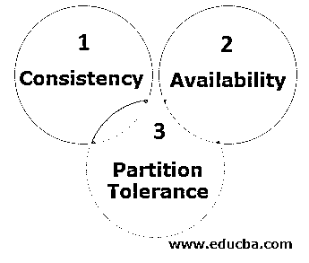

# 卡桑德拉星团

> 原文：<https://www.educba.com/cassandra-cluster/>

## Cassandra 集群简介

Apache Cassandra 旨在应对传统数据库管理系统无法应对的扩展挑战。如今，需要管理的数据持续不断，数量庞大。大型组织无法在一台机器上存储如此大量的数据。这就是像 Cassandra 这样的分布式架构的数据库变得重要的时候。大型组织在多个节点上存储大量数据。这些节点相互通信，这是建立 Cassandra 集群的目的。

集群是代表单个系统的节点集合。这些集群形成了 Cassandra 中的数据库，以有效地实现高水平的性能维护。随着集群规模的增长、客户机数量的增加以及更多键空间和表的添加，对集群的需求将开始向不同的方向发展。经常使用基线来衡量集群的目标性能将变得越来越重要。

<small>Hadoop、数据科学、统计学&其他</small>

### Cassandra 集群的先决条件

设置集群有以下要求。

*   应该有多台机器(节点)
*   节点必须在局域网(LAN)上相互连接
*   Linux 必须安装在每个节点上
*   应该有卡珊德拉企业版
*   JDK 必须安装在每台机器上

### 重建群集中的节点

[Cassandra 帮助](https://www.educba.com/what-is-cassandra/)使用复制数据自动重建故障节点。当每个节点仅拥有一个令牌时，该节点的整个数据集将被复制到多个节点，数量等于复制因子减 1。例如，复制因子为 3 时，给定节点上的所有数据都将复制到另外两个节点上

虽然最初用完全相同的机器构建 Cassandra 集群可能很简单，但在某个时候，旧机器需要被新机器替换。vnodes 允许您指定令牌的数量，而不是必须确定特定的范围，从而简化了这项工作。为更新、更强大的节点选择一个更大的数字要比确定正确的令牌范围容易得多。

### 添加到 Cassandra 集群

在创建包含多个节点的集群之前，我们需要确认存在一个包含单个节点的工作集群。然后通过增加集群或增长集群来继续。让我们从手动案例开始，因为 vnodes 流程是其中的一个子集。

在没有启用 vnodes 的情况下，向集群增加额外节点的过程在大多数情况下可能并不直接。第一步是计算新的总集群大小，然后计算所有节点的令牌。

使用 vnodes 的主要区别是，不需要生成或设置令牌，因为这是自动发生的，并且没有理由运行 nodetool move。您应该根据所需的数据分布设置 num_tokens 属性，而不是设置 initial_token 属性。

随着时间的推移，您的集群在节点大小和容量方面可能会自然地变得异构。过去，当使用手动分配的令牌时，这带来了一个挑战，因为很难确定会产生平衡群集的正确令牌。

Cassandra 使用一种数据结构来实现可用性和可伸缩性，这种数据结构允许系统中的任何节点轻松地确定特定键在集群中的位置。

### CAP 定理

CAP 首字母缩略词指的是复制系统中的三个理想属性:

*   **一致性:**这意味着数据在集群中的所有节点上都应该是相同的
*   **可用性:**这表示系统应该始终保持可用以接收请求
*   **分区容差:**这表示即使在部分故障的情况下，系统仍能运行

### 要记住的事情

由于 Cassandra 被设计为部署在商用硬件上的大规模集群中，一个重要的考虑因素是使用较少的大节点还是较多的小节点。无论您使用的是物理机还是虚拟机，都有一些关键原则需要记住:

RAM 越多，读取速度就越快，所以 RAM 越多，它们的性能就越好。处理器越多，写入速度越快。

显然，如果你想存储更多的数据，你需要更多的磁盘空间。可能不太明显的是对压缩策略的依赖。在最坏的情况下，SizeTieredCompactionStrategy 可以使用比数据本身多 50%的磁盘空间。作为上限，尝试将每个节点上的数据量限制在 1-2 TB。Cassandra 被设计为使用本地存储，因此它不使用共享存储。

### 结论

分布式数据存储的一个最主要的方面是它处理数据和跨集群复制数据的方式。如果每个分区都存储在一个节点上，系统将会有多个故障点，任何一个节点的故障都可能导致灾难性的数据丢失。这些系统必须能够跨不同的多个节点复制数据，从而降低任何节点发生故障或数据丢失的可能性。

Cassandra 有一个设计良好的复制系统，提供机架和数据中心感知。因此，即使在发生灾难性事件(如交换机故障、网络分区或数据中心中断)时，it 部门也可以配置副本来维护可用性。Cassandra 还包括一个在节点故障期间维护复制因子的计划策略。

### 推荐文章

这是一个 Cassandra 集群的指南。在这里，我们讨论带有重建节点和 CAP 定理的 Cassandra 集群的介绍和先决条件。您也可以阅读以下文章，了解更多信息——

1.  [MongoDB vs Cassandra](https://www.educba.com/mongodb-vs-cassandra/)
2.  [Cassandra 数据建模](https://www.educba.com/cassandra-data-modeling/)
3.  [Cassandra 查询语言](https://www.educba.com/cassandra-query-language/)
4.  [甲骨文中减号的例子](https://www.educba.com/minus-in-oracle/)

