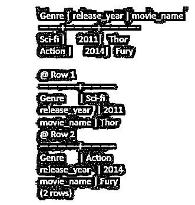
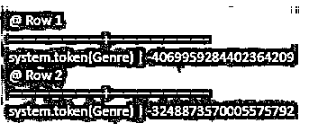

# 卡珊德拉分区键

> 原文：<https://www.educba.com/cassandra-partition-key/>

## Cassandra 分区键介绍

以下文章提供了 Cassandra 分区键的概要。让我们来看看 Cassandra 表中键的作用，通常键在关系数据建模中不会给你留下超级重要的印象。大多数人会创建一个代理主键字段，它是一个自动递增的列或一个 UUID。你花了很多心思用关系数据库来索引结构，因为你要建立所有这些索引。在卡桑德拉，所有的注意力都集中在钥匙上。所有对表的读写都基于这个键。您不能在其他列上建立索引，这将使您忽略主键，所以键是中心键。

### 如何使用 Cassandra 分区键？

主键作为一个整体唯一地标识一行。主键由两部分组成——分区键和聚集键或聚集键。Cassandra 主键中可以有许多列。在 Cassandra 中，主键中有多个列是非常典型的。

<small>Hadoop、数据科学、统计学&其他</small>

假设我们有一个包含以下列名的电影表。

电影 id，发行年份，标题

让我们得到一个更详细的表格，叫做 movies_by_actor。

现在，我们已经看到反规格化正在发生。在关系数据库中，很明显，你会有电影和演员，还会有一个外键。我们这里不是这么做的。我们将在表之间复制数据。我们要有一个满足这个电影记录的表。现在，如果我们想按演员查找电影，我们会制作一个完全不同的表格。一部电影通常可以参与一个以上的类型。当然，在一个集合中，你不能重复元素。所以做两次喜剧没有任何意义。但是你可以是一部喜剧和一部恐怖电影，或者一部剧情片和一部动作片，或者类似的电影。这个表显然是可估价的，所以这就是我们的模式。现在，注意这个主键。它有三列。actor 得到了一组额外的括号。这意味着一个参与者就是我们所说的分区键。

现在，分区是表中的一组行，保证是某个节点的本地行。这是一个分布式数据库，将有多个服务器像一个数据库一样运行。分区键，也就是说每个 actor——每次 actor 列具有相同的值时，所有这些行都保证位于相同的节点上。所有的布拉德·皮特排，所有的艾玛·斯通排，所有这些都将在同一个服务器上。这些被称为分区。分区是一组具有公共分区键的行。分区键确保它们都是节点本地的，因为它们是节点本地的，所以我们可以用它们做一些我们不能在节点之间做的有趣的事情，这就是集群列的用途。

所以，看看代码，release_year 和 movie_id 是集群列。因此，聚集列的作用是为表中的行提供顺序。在表格中插入一些数据会有所帮助。给定演员分区中的所有行，所以所有的，比如说，布拉德·皮特的电影，都将在这里按发行排序。我们可以在聚类列上进行范围查询，以查看 2001 年之后和 2019 年之前的所有布拉德·皮特电影。您可以预期这是一个高性能查询，因为它发生在一个节点内。你也可以确定一年。例如，你想看 2012 年布拉德·皮特的所有电影。无论这些电影在哪里，你都会得到这些结果。现在一个分区可以有几万甚至几十万行。所以这些可能很大。这些可能是数百兆字节的数据和数十万行。

这里有一些权衡，对吗？空间有限。分区有大小和高度的限制。但潜在的是，它们可能是大型数据集群。在这些大的数据集群和分区中，我们可以对集群列进行范围查询，做一些有趣的事情。我们可以有多个聚类列。现在，假设聚类列是 UUID，以确保我们得到了唯一性。我们不会对 UUID 进行范围查询。那完全没有意义。这在 Cassandra 中很常见，当你看到一个主键有一个聚集列组件，在末尾添加一个 UUID，只是为了个性化行，并确保它唯一地引用一个东西。

聚类键是我们添加到主键的东西。它给出了行分区的顺序。在这种情况下，我们按照发行年份对它们进行排序。分区键，聚簇键，它们共同组成了主键，如果你愿意，这也是 Cassandra 中表设计的关键部分。

**语法:**

Cassandra 使用第一个列名作为分区键。

`CREATE TABLE users ( user_name varchar PRIMARY KEY, password vachar, gender varchar, state varchar,Age int);`

### Cassandra 分区键示例

下面是提到的例子:

**代码:**

`create table movie (Genre, release_year, movie_name,
primary key (Genre));
insert into movie (Genre, release_year, movie_name) values (Sci-fi,2011,’Thor′);
insert into movie (Genre, release_year, movie_name) values(Action,2014,’Fury′);`

`select * from movie;`

**输出:**

**代码:**

`select token(Genre) from movie;`

**输出:**

**代码:**

`create table actor(movie_name,actor_name, Genre,release_year
primary key (Genre,actor_name));
insert into actor(movie_name,actor_name, Genre,release_year) values (‘Troy’ ,’Bradd Pitt’ ,’Drama’,2004);
insert into actor (movie_name,actor_name, Genre,release_year) values (‘Thor’, ‘Chris Hemsworth’,’Sci-fi’ ,2012);
insert into actor (movie_name,actor_name, Genre,release_year) values (‘Fury’,’Brad Pitt′,Action ,’2014’);`

`select * from actor;`

**输出:**

### 结论

总之，我们知道 Cassandra 将定义中主键声明的第一列视为分区键，其余的列是聚集列。当满足特定查询所需的数据位于同一个分区键中时，Cassandra 可以实现最佳性能。Cassandra 通过这个分区键在一个节点上存储一整行数据。因此，要将数据分布在多个节点上，需要定义一个复合分区键。

### 推荐文章

这是一个卡桑德拉分区键指南。这里我们讨论一下入门，如何使用 cassandra 分区键？和示例。您也可以看看以下文章，了解更多信息–

1.  [卡珊德拉星团](https://www.educba.com/cassandra-cluster/)
2.  [Cassandra 数据建模](https://www.educba.com/cassandra-data-modeling/)
3.  卡桑德拉是 NoSQL 吗？
4.  [卡桑德拉管理局](https://www.educba.com/course/cassandra-administration-course/)

