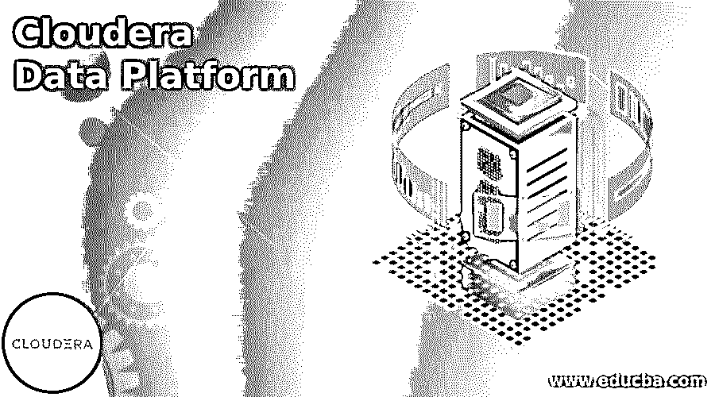
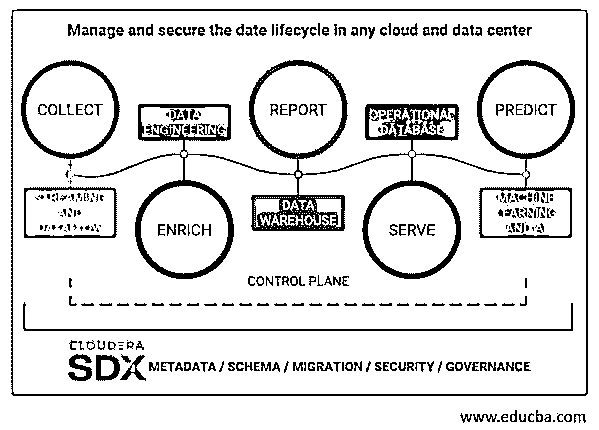

# Cloudera 数据平台

> 原文：<https://www.educba.com/cloudera-data-platform/>

## Cloudera 数据平台简介

Cloudera 数据平台是一个混合云平台，专为任何云、分析和数据而设计。Cloudera 数据平台管理和保护主要公共云和私有云的数据生命周期。CDP 将内部环境无缝连接到公共云，实现混合云体验。Cloudera Data Platform 是业务和 IT 领域的一个大平台，因为它易于使用，并且在设计上受到保护。让我们更深入地了解 CDP，了解它的服务、架构和优势。

### Cloudera 数据平台概述？

作为一个可扩展的开放平台，它主要被数据工程师和科学家使用。此外，CDP 在内部和公共云中可用，并且是手动和自动的。

<small>Hadoop、数据科学、统计学&其他</small>

CDP 是一个具有两种外形的平台:CDP 公共云和 CDP 私有云

CDP 提供了一个数据驱动的决策，使得与真实生命周期数据的连接更容易、更快速、更安全。数据在生命周期中的移动分为五个阶段。

CDP 提供了对所有数据的可见性，没有盲点；控制平面允许跨多个云环境管理数据、分析、基础架构和工作负载，所有 Cloudera 共享体验在整个生命周期中提供一致的安全性和治理。

### Cloudera 数据平台服务

在 CDP 的公共云中，我们有专为解决企业数据云使用案例而设计的云服务，包括 Cloudera Runtime 的 Data Hub、机器学习、数据仓库、数据流和数据工程等自助服务应用程序。管理控制台作为管理层，数据湖、Replication Manager、Workload Manager 和数据目录作为 SDX 服务。

**管理层:**管理控制台是 CDP 使用的通用服务，用于从单一控制台跨环境管理、协调和监控 CDP 服务。假设用户在数据中心和多个公共云中有任何部署。在这种情况下，用户可以在一个地方管理所有服务，即创建、供应、监控和销毁服务。

**工作负载集群:** Data hub 是 Cloudera Runtime 提供的启动和维护工作负载集群的服务；这是一个开源发行版，包括 CDH 和 HDP。它提供了工作负载和弹性的完全隔离，因此每个工作负载、应用程序和部门都可以拥有一个包含不同软件版本、配置和基础架构的集群。此外，由于数据中心的自动化生命周期更容易启动，用户可以按需创建，如果不需要，用户可以将资源返回到云中。

### 工作量服务

Data Engineering 是一种无服务器服务，允许用户向自动扩展集群提交 Spark 作业。

数据流使用户能够安全有效地导入和部署数据流定义。它是云原生的，具有端到端的数据流管理，与传统的以集群为中心的方法相比，它为用户提供了以流为中心的体验。它还减少了操作和集群管理开销。

数据仓库为数据分析师团队管理和创建自助式数据仓库。该服务允许用户快速创建数据仓库，并在任务完成后终止。

机器学习用于创建和管理自助式机器学习工作区。它使数据科学家团队能够开发、培训、测试和部署机器学习模型，以在企业数据云中管理的数据上构建预测应用程序。

操作数据库是创建操作数据库的自助服务。这是一个由 Apache HBase 和 Phoenix 开发的自治数据库。用户可以将它用于低延迟和高吞吐量的使用情形，包括访问层和熟悉 CDH 和 HDP 的相同存储。

**安全和治理** **，**共享数据体验是一套技术，允许企业用户将所有数据集中到一个地方。用户可以以安全和可控的方式与各种团队和服务共享它。SDX，共享数据体验，有四个不同的服务，即数据湖，复制管理器，数据目录，和工作负载管理器。

数据湖是一种创建安全、受保护和受管理的数据湖的功能，它为存储在 HDFS 或云存储中的数据提供保护环。

数据目录用于在企业云中组织、搜索、管理数据和保护数据。此外，它还用于管理者搜索、浏览和标记数据湖的内容，以及管理和创建授权策略。

Replication Manager 用于在数据云中的环境之间拷贝、迁移、拍摄快照和恢复数据。数据管理员和管理员使用它来移动、拷贝、备份、复制和恢复湖中或湖之间的数据。

Workload Manager 用于优化和分析企业云中的工作负载，由数据库管理员用于故障排除、优化工作负载和分析，以提高性能成本。

### Cloudera 数据平台架构

如果用户想要创建虚拟专用集群，他们需要了解计算集群的架构以及它与数据上下文的关系。

*   计算集群配置了计算资源，如 Hive 或 Spark execution。
*   数据上下文是常规群集的连接器，被指定为基本群集；它定义了访问数据所需的基本集群中部署的数据、安全服务和元数据。
*   基本集群和计算集群由 Cloudera Manager 的同一个实例管理。
*   基本集群必须有一个要部署的 HDFS 服务，并且包含 Cloudera 运行时服务。但是，只有 HDFS、Atlas、Hive、亚马逊 S3、Ranger 和微软 ADLS 可以使用数据上下文共享。
*   计算集群上需要 HDFS 或核心配置服务作为永久和临时空间。
*   计算集群使用服务来存储在多阶段 Map Reduce 作业中使用的临时文件。
*   以下服务可以根据需要部署到 CDP，

色相，蜂巢执行服务，火花 2，卡夫卡，纱，Oozie，HDFS 作为必需品。

### Cloudera 数据平台的优势

*   CDP 可以跨临时集群和云查看数据沿袭。
*   CDP 可以通过恢复、自动扩展和暂停来控制云成本。
*   CDP 基于分析和机器学习优化工作负载
*   CDP 在混合云和多云中使用单一控制台
*   CDP 可以扩展到数 Pb 的数据和数千个不同的用户。

### 结论

至此，我们将结束“Cloudera 数据平台”这一主题我们已经了解了 Cloudera 数据平台(CDP)的含义及其服务，包括管理层、数据中心、工作负载服务和 SDX 服务。还研究了 CDP 的架构，包括 Cloudera Manager、基本集群、数据上下文等。最后，列出了 CDP 的一些好处，让用户更好地理解这个概念。谢谢！快乐学习！!

### 推荐文章

这是 Cloudera 数据平台的指南。这里我们讨论一些 CDP 的好处，让用户更好地理解这个概念。您也可以阅读以下文章，了解更多信息——

1.  [云迁移的优势](https://www.educba.com/cloud-migration-benefits/)
2.  [云迁移工具](https://www.educba.com/cloud-migration-tools/)
3.  [甲骨文营销云](https://www.educba.com/oracle-marketing-cloud/)
4.  [数据准备工具](https://www.educba.com/data-preparation-tools/)

