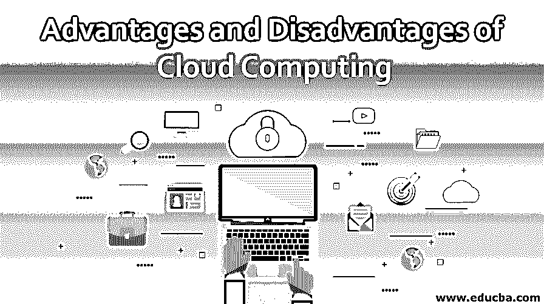
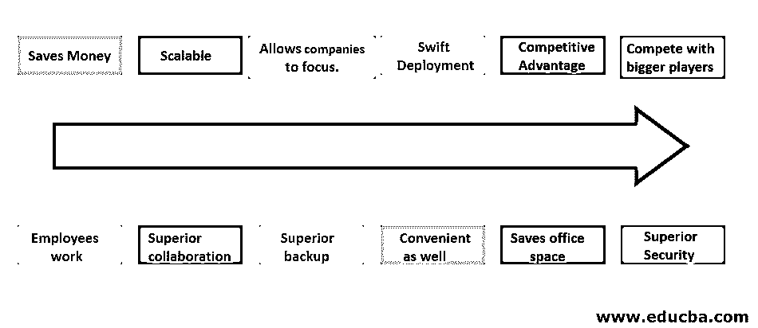
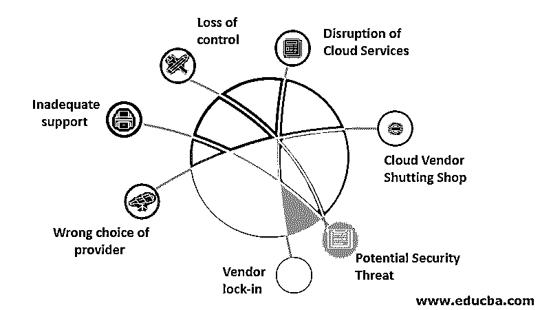

# 云计算的优势和劣势

> 原文：<https://www.educba.com/advantages-and-disadvantages-of-cloud-computing/>

## 云计算的优势和劣势介绍

“云计算”一词如今非常流行。在云计算的优势和劣势中，数据、应用程序和软件不是存储在内部硬件上，而是存储在远程服务器上。用户使用互联网从远程服务器访问数据、应用程序和软件，并为此付费。用户可以从远程服务器访问数据、运行应用程序/软件。不需要内部硬件。计算服务由远程实体提供，如数据库、软件、分析以及智能。远程硬件被称为云。它的使用非常广泛，并提供了许多好处。

### 云计算的优势

以下是云计算的优势。

<small>Hadoop、数据科学、统计学&其他</small>

#### 1.省钱

你不必购买软件和硬件。云提供了它们。因此，您可以节省办公空间租金、电力、空调、维护和运营费用等成本。此外，您只需为您使用的服务付费。以前，对于使用内部硬件和软件的组织来说，有一些未使用的硬件和软件。云消除了这方面的业务。

#### 2.可攀登的

您可以从云向上或向下更改您需要的资源。这在以前是不可能的。当需求增加时，公司不得不购买额外的资源。当需求减少时，他们会剩下不需要的资源。

#### 3.允许公司专注于他们的核心业务领域

以前，企业必须分配人力资源、时间、金钱和精力来管理内部硬件。云负责企业的所有硬件和软件方面。这使得企业可以专注于自己的领域。

#### 4.快速部署

多亏了云，您的业务系统可以在几分钟内启动并运行。这使使用传统或常规方法的公司领先一步。

#### 5.竞争优势

利用云的企业比不利用云的企业拥有战略优势。这是因为他们可以快速起步，拥有最新的硬件和软件服务。

#### 6.与更大的玩家竞争

云创造了一个公平的竞争环境。即使是小公司也买得起。他们不必一开始就花费大量资金来开始运营。云订阅成本远低于直接购买最新的硬件和软件。

#### 7.员工可以随时随地工作

云服务全天候可用。即使办公室关门了，工作还可以继续。只要您有支持互联网的设备，您就可以在任何时间、任何地点工作。

#### 8.卓越的协作

由于有了云技术，位于不同地方的公司员工可以方便地进行协作，同时保持高度的安全性。

#### 9.高级备份

与需要花费大量时间进行备份和恢复的本地技术相比，您可以在云平台上轻松方便地进行备份和恢复。基于云的平台减少了停机时间。后者提供了更快和相对更准确的信息检索以及应用。

#### 10.方便且容易实现

云技术让公司保留相同的业务流程，而不必处理后端技术。

#### 11.节省办公空间

由于公司场所安装的硬件最少，管理硬件和软件所需的人员也更少，因此节省了大量的办公空间。鉴于目前商业房地产价格昂贵的趋势，这是一个重要的好处。

#### 12.卓越的安全性

云主机完全处理安全的重要职责。你不必担心或处理安全问题。云主机安装最新的安全硬件和软件。他/她还定期更新安全服务，应用安全补丁并审查安全级别。

虽然云是最新的技术，有很多好处，但重要的是不要忽视它的缺陷。我们应该意识到它的缺点。

### 云计算的缺点

以下是云计算的缺点。

#### 1.失控

通过选择云服务，您将交出您的数据和应用程序。如果出现任何硬件或软件问题，您需要依赖云提供商。在这种情况下，服务的速度和质量可能不符合您的期望。

#### 2.云服务中断

如果云提供商遭受网络攻击、停电或互联网连接中断，您的企业可能会遭受不必要的停机。

#### 3.云供应商关门大吉

您的云服务提供商有可能会停业或改变其业务领域。在这种情况下，你的企业将停止运营。你必须尽快找到另一家既可靠又有能力的云服务提供商。

#### 4.潜在的安全威胁

黑客目前的目标是知名网站，比如知名云服务提供商的网站。您无法控制数据、应用程序和软件的安全性。此外，如果您的云服务提供商的安全遭到破坏，您可能会遭受损失和停机。

#### 5.供应商锁定

如果从当前平台迁移到另一个云平台，您可能会遇到重大问题，因为这两个平台可能非常不同。挑战可能包括缺乏支持、配置问题以及额外成本。

#### 6.供应商选择错误

如果你在选择合适的云服务提供商时没有做好功课或询问可靠的参考资料，那么你可能会有麻烦。服务质量可能不尽如人意，或者云服务的某些功能可能无法提供。这可能会影响您的业务或运营的整体或部分功能。

#### 7.支持不足

一些云计算提供商未能向他们的客户提供足够的支持。此外，他们会要求您查阅技术问题的常见问题解答，这对于非技术人员来说是一项困难的任务。

### 结论

尽管云计算有利有弊，但总的来说，它利大于弊。做你的研究，以确保你选择一个好的和可靠的云提供商。对云计算的投资应该是长期的，云计算领域预计将在未来进一步发展。

### 推荐文章

这是一个关于云计算优缺点的指南。在这里，我们将详细讨论云计算的基本概念以及优缺点。您也可以浏览我们推荐的其他文章，了解更多信息——

1.  [云计算挑战](https://www.educba.com/cloud-computing-challenges/)
2.  [云计算的风险](https://www.educba.com/risks-of-cloud-computing/)
3.  [云计算工具](https://www.educba.com/cloud-computing-tools/)
4.  [云计算的优势](https://www.educba.com/benefits-of-cloud-computing/)

