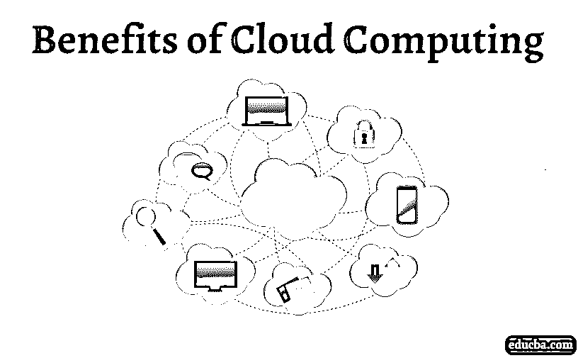
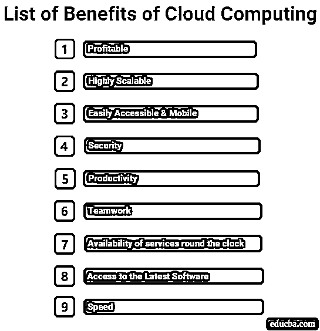

# 云计算的优势

> 原文：<https://www.educba.com/benefits-of-cloud-computing/>

## 云计算优势介绍

如果你有一个电子邮件账户，更确切地说，是一个 Gmail 账户，我敢肯定你用过或者至少听说过 Google drive。你有没有想过它位于哪里或者是什么？Google Drive 就像你系统硬盘上的 c 盘或 D 盘一样。在本主题中，我们将了解云计算的优势。

但是，谷歌驱动并不完全在你的系统上；这是一个可以通过互联网访问的驱动器。那么 Google drive 在哪里呢？嗯，Google drive 恰好位于我们称之为“云”的位置。Google Drive 是迄今为止最受欢迎和使用最广泛的云存储。

<small>Hadoop、数据科学、统计学&其他</small>

另一方面，术语“计算”指的是利用技术来执行手边的任务。

因此，云计算可以被定义为利用互联网上可用的各种技术提供的服务。

### 云计算的优势列表

多年来，云计算在市场上快速增长，从 2013 年的 24 亿用户增加到 2018 年的约 36 亿用户。云计算提供的众多优势如下:

#### 1.有益的

事实证明，使用云计算具有很高的成本效益，因为公司可以一起放弃购买和维护存储驱动器、软件和服务器的相关成本。而不是通过互联网使用云提供的服务，如存储或软件，只需为自己使用和需要的服务付费。这种按需付费的系统使得整个过程在更大范围内更有利可图。

#### 2.高度可扩展

人们可以根据自己的需要轻松升级或降级所需的服务。例如，与其他应用程序相比，用户可能需要更多空间来执行某些应用程序。根据运行/执行该软件所需的空间要求，可以向服务提供商增加或减少空间要求。人们也不必担心任何版本更新，这有时会很昂贵。云服务拥有一切。所有这些使我们能够满足客户的期望，而没有太多的麻烦。

#### 3.易于访问和移动

云必须提供的最大优势之一是其可访问性，即只要连接到互联网，就可以从任何地方远程访问它。一个人可以利用云提供的服务，而不必依赖任何特定的系统或任何地理位置。这使得人们可以近距离地与客户端以及手边随时可用的各种设备(如笔记本电脑、平板电脑甚至智能手机)密切合作。

#### 4.安全性

在当今世界，保护数据安全是大多数组织关心的主要问题。当涉及数据安全时，云使用加密方法。这些加密利用复杂的算法来加密和解密数据。此外，它还在最底层限制任何类型的未授权用户的访问，有助于保持服务器及其所有内容的安全。云还提供备份设施，以避免由于数据丢失而导致的任何不必要的灾难。这允许用户在需要时从备份中恢复数据。

#### 5.生产力

由于服务停机，许多组织损失了大量时间、收入和生产力。安全补丁、版本升级等可能会导致服务中断。云为您减轻了这些问题。从而提高你的工作效率，让你在截止日期前遇到更少的障碍。这不仅有助于组织，也给客户留下了积极的影响。

#### 6.协力

云计算让团队工作变得更加容易。这是因为团队成员现在可以跨易于访问的云平台查看、共享和贡献内容。这完全消除了向团队成员发送最新工作相关文档的开销。人们只需要传达放置文档的位置。这导致团队成员之间更好的协作。它还减少了对任何特定人员的依赖，因为来自同一团队的另一个人可以从他的团队成员停止的地方继续工作。

#### 7.全天候服务的可用性

它对按时向客户交付产品有着重要的影响。对于组织来说，在安全修补或升级以获得更好的负载平衡能力或由于各种其他原因而面临服务器停机是相当常见的。这些事情由云处理，因为大多数云提供商据说保持 99.9%的正常运行时间，使得服务器和其他服务可以全天候使用。这使得组织可以专注于业务交付，而不会在工作流中产生任何障碍和延迟交付。

#### 8.获取最新软件

云提供商允许用户轻松使用最新的软件版本。这在提高组织的生产力方面起着重要的作用，而不必在软件升级上投入任何时间。相反，节省下来的时间可以更好地用于设计产品、规划和制定战略。此外，这有助于避免任何类型的版本不兼容，并向市场发布提供所有最新功能的更新/最新产品。

#### 9.速度

由于云提供商按需提供服务，因此与必须购买具有所需存储空间的硬盘或购买软件的传统流程相比，在云上获得所需的存储空间或最新软件要快得多。大多数云提供商都提供自助服务选项，用户可以选择所需的服务并付费。根据客户的选择计算成本。

### 结论

云计算给组织的运营方式带来了巨大的变化。他们在许多方面改进了整个过程。我们已经看到了云计算提供的一些主要优势。

### 推荐文章

这是云计算优势的指南。在这里，我们将讨论云计算众多主要优势中的几个。您也可以浏览我们推荐的其他文章，了解更多信息——

1.  [什么是云计算中的虚拟化？](https://www.educba.com/what-is-virtualization-in-cloud-computing/)
2.  [云计算工具|类型](https://www.educba.com/cloud-computing-tools/)
3.  [免费云计算](https://www.educba.com/free-cloud-computing/)
4.  [云计算应用](https://www.educba.com/cloud-computing-application/)

