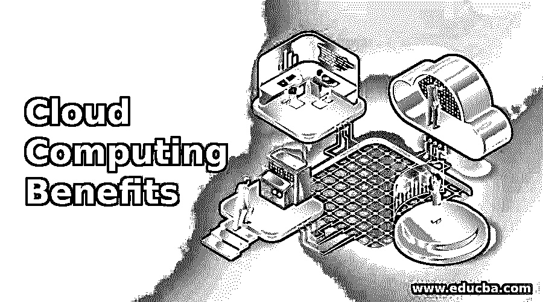

# 云计算的优势

> 原文：<https://www.educba.com/cloud-computing-benefits/>

## 云计算优势介绍

以下文章概述了云计算的优势。云本质上是一组通过互联网提供的资源和服务。它可以是各种各样的服务来源，例如办公应用程序、台式机，或者仅仅是一个 web 服务。如今，云已经渗透到几乎所有与互联网相关的领域。我们每天都在使用许多云服务。我们的智能手机中充满了应用程序，它们都与云远程同步。在我们的桌面上，我们使用 Picasa 这样的服务，它可以远程管理界面。

### 云计算概念

云后端的云计算基础是一系列服务器机架，每个机架都有大量的数据存储和处理能力。这些服务器机器有很强的处理能力。

<small>Hadoop、数据科学、统计学&其他</small>

正是这些处理机器，其中一个仓库被远程设置，为云背后的硬件提供动力。使用一种称为虚拟化的技术，这些机器启动并向任何需要的东西提供它们的计算资源。

从远程托管多个虚拟机(为任何需要的人提供整个基础架构)到提供软件开发框架，虚拟化在协调和提供云背后的技术方面承担了大量责任。

这里是关于开放堆栈的云计算基础知识，那么 OpenStack 在哪里呢？OpenStack 本质上是一款开源软件，用于管理整个云生态系统。所谓云生态系统，我们指的是整个硬件、运行在该硬件上的虚拟化实例以及运行在智能手机和台式机后端的其他最新云技术。

它提供了运行云环境的基本管理层。让我们再举一些云计算基础知识的例子，好吗？让我们假设您正在使用一个 web 服务应用程序，并使用它来开发一个运行软件的框架。

为此，您需要租出一台虚拟机来测试您的框架。所以你从亚马逊这样的云厂商那里购买云虚拟机，使用随用随付的计费系统。

现在，供应商如何确保公平计费？你付费使用他们的硬件。那么，您如何确保计算出正确的用户统计数据呢？为了填补这一空白，管理层介入其中。Open-stack 是为此开发的开源管理软件。

云计算的好处 OpenStack 是一款云操作系统软件，恰好是开源的。因此，整个软件的开发严重依赖于充满活力和活跃的社区。

该社区每六个月发布一次软件的新特性和增强功能，并得到 IBM、Oracle 等 IT 巨头的支持。

主要的是云计算基础知识中需要的东西。他们的主要要求是**云必须易于实施，并且应该是可大规模扩展的**。这意味着开放堆栈软件更注重易用性和灵活性，通过轻松吸收更多开发的组件来适应最新的技术进步。****

 ****云计算的好处是，尽管 OpenStack 涵盖了广泛的云技术，但它通常由供应商和 it 公司作为基础设施即服务(IaaS)来部署。这意味着 OpenStack 技术主要用于监控企业或私人使用的整个 IT 基础设施。

在他们的网站上，你可以去下载他们的整个软件。OpenStack 项目有不同的风格；但是，它们的核心组件保持不变。

### 云计算优势的类型

open-stack 项目提供了三个主要组件作为其项目的一部分，这将帮助您了解更多关于云计算基础知识和云计算优势的信息:

#### 1.计算

项目中的计算资源为开发人员提供了一整套 API，使他们能够开发不同的云应用程序。对于普通用户和数据中心管理员，它提供了一个 web 界面来监控正在运行的虚拟基础架构。

此外，整个计算架构还可以水平扩展，这意味着它提供了一个根据个人或公司需求进行开发的框架。

#### 2.对象存储

OpenStack 对象存储提供了存储选项的必要功能。它为存储用户数据提供了一个经济高效的解决方案，可以与其他计算平台一起部署，也可以作为独立的存储机制部署。对象存储项目的关键特性是分布式访问。它为开发人员提供了一组 API，使用这种分布式访问特性来实现对象存储平台应用程序开发。

对于最终用户，它提供了与其他应用程序的集成，并提供了数据备份和保留。

#### 3.计算+对象存储

完整的 OpenStack 功能，它提供了 OpenStack 的计算能力和存储平台功能。它包括 OpenStack 作为软件使用的整套核心服务。它通常用于在数据中心级别独立部署和监控基础架构。对于开发人员来说，它提供了完整的 API 集，对于最终用户来说，它提供了一个复杂的软件套件来管理虚拟机的各个方面，包括部署、映像管理、备份和计费系统。

OpenStack 部署了这些核心项目、它们自己的一组核心组件和几个可选组件。核心组件是软件的基本构建模块，没有核心组件，OpenStack 将无法运行。该软件的每个版本都附带了核心组件，或多或少带有对可选组件的增强和支持。只有通过这些核心组件，可选组件才能集成。OpenStack 软件套件的可选组件是一组随着新兴云技术的发展而开发的组件。

这意味着它在 OpenStack 之上提供了额外的功能，使整个 OpenStack 软件在可扩展性方面非常灵活，这是 OpenStack 软件的首要要求。其中一些可选组件提供增强的图形访问，如 Horizon (OpenStack Dashboard)，而其他组件则提供新兴功能，如按需数据库(TROVE)。然而，OpenStack 的核心在于核心组件。因此，这是云计算基础的要点。

**推荐课程**

*   在线 R 工作室方差分析技术培训
*   安圭拉航线
*   ISTQB 一级培训课程
*   软件测试基础课程

### 开放式堆栈的核心组件

下面是 open stack 的核心组件:

#### 1.迅速发生的

它属于对象存储服务的范畴，提供了通过基于 RESTful HTTP 的 API 机制访问数据对象的特性。这实际上意味着它提供了使用 web 界面或浏览器访问数据的功能。一款成功实现 Swift 部分对象存储功能的软件是 Google Picasa。同样，您使用 URL 访问您的图像，Swift 允许使用基于 HTTP 的 REST 机制进行类似的数据访问。

通过对象复制，它提供了分布式数据存储的特性。它可以部署在多种架构中，具有高度的可伸缩性。它不同于传统的文件存储系统，因为数据是以对象的形式存储的。因此，存储的数据将被转换成字节，并通过连接它们的元数据文件分布在不同的系统架构中。在以这种方式分发数据的过程中，Swift 提供了复制数据存储，使其具有高度容错性，并提供了一种安全且高度可靠的数据存储方法。

#### 2.煤渣

Cinder 为运行虚拟机提供了持久存储介质。这实质上意味着 Cinder 就像一个普通的硬盘，为任何需要的人提供实际的物理存储空间。它像传统的文件系统一样操作和存储数据，在物理磁盘上创建大量扇区。然而，Cinder 的独特之处在于它提供了可插拔架构的特性。

这意味着 Cinder 可以作为外置硬盘使用。因此，一个设备的数据可以存储在云中，可以虚拟地取出并连接到任何其他设备。虚拟存储机制将确保数据的实际内容不受损害。然而，与 Swift 不同，Cinder 没有任何数据复制功能。这意味着如果实际的物理设备损坏或分区丢失，就没有办法恢复数据。

#### 3.新星

Nova 是计算机项目的组成部分。Nova 完成了促进整个虚拟机配置的所有脏活累活。也就是说，Nova 提供了 API 和机制来与所有其他底层和正在运行的 OpenStack 组件或服务进行交互。

使用它们，Nova 启动虚拟机作为服务使用。它还分配虚拟机背后所需的必要细节，例如存储空间、网络的 IP 地址、虚拟 CPU 的数量、所需的内存以及虚拟机的其他重要部分。

本质上，它充当计算软件，使用自己的一套算法来生成虚拟机。除了生成虚拟机之外，它还负责重新调度、停用和管理正在运行的虚拟机的整个清单。

#### 4.中子

如果 Nova 是 OpenStack 软件的核心，Neutron 将是它背后的大脑。它提供了网络即服务的功能，OpenStack 使用该功能分配和监控虚拟机的整个网络方面。它向用户提供访问，并向开发人员提供 API，以根据他们的要求定义、描述和创建他们自己的网络。创建的网络可以高度灵活，以插件的形式集成了额外的组件。

这些额外的附件允许开发者和用户部署 OpenStack，并为他们的虚拟机提供所需的任何类型的计算机[网络拓扑](https://www.educba.com/what-is-network-topology/)。这包括支持许多供应商的虚拟网络技术，如 Cisco、NEC 等。因此，使用 Neutron 和 Cisco 路由器插件，人们可以创建自己的 Cisco 虚拟路由器，并使用 OpenStack 在 Cisco 路由器上测试他们的软件。

#### 5.拱顶石

Keystone 是把关者，是 OpenStack 的本质安全机制。OpenStack 使用 RESTful API，这意味着每个请求-响应机制都必须通过有效的令牌进行认证。Keystone 出现在这里，它为不同组件之间的请求-响应交换提供了必要的令牌机制。它提供不同组件请求的授权，使用它；其他组件可以基于它们的响应，因为在产生的几个虚拟机之间，一次有数百个请求-响应机制在运行。

Keystone 是 OpenStack 非常必要的特性，也是所有 OpenStack 项目中唯一部署的组件。这是因为 keystone 充当了一个中央访问机制，每个 OpenStack 组件，无论是核心组件还是可选组件，都在这里相遇。换句话说，Keystone 作为一个重要的目录来监控所有 OpenStack 组件。Keystone 的安全机制功能可防止任何未经授权的访问。它清楚地将软件套件分为不同的用户访问级别，只有管理员被授予访问整个软件的最高权限。

#### 6.闪光

OpenStack 的最后一个核心组件是映像供应服务。Glance 提供了一个全面的图像管理套件。Nova 与 glance 大量交互，选择可用图片列表。这些映像只是虚拟机的虚拟化实例。虚拟化技术中广泛使用映像来生成虚拟机。

这些由 Nova 产生的虚拟机存储在这些映像中，并在运行虚拟机时使用。这些映像可以包括任何东西，从定制的框架到整个操作系统。Open-stack 使用 Glance 保存所有可用图像的列表，并使用 Glance 向用户提供选项列表。

### 云计算优势概述

云和 OpenStack 正迅速成为同义词。这是因为 OpenStack 提供了一系列云软件套件，可以更轻松地管理多种云技术。

OpenStack 的基础是虚拟化技术，它提供了部署虚拟机的配置。通常用作基础设施即服务(IaaS)。

OpenStack 使用这种虚拟化技术来提供必要的框架，以实现这种云功能。它位于云架构的中间件中，与六个核心组件和几个可选组件捆绑在一起，这都是关于云计算的基础知识。

使用云计算基础组件，OpenStack 设法提供高度可扩展的软件架构，以简化云管理。核心组件分别以 Nova、Cinder、Swift、Neutron、Keystone 和 Glance 的形式提供计算能力、存储、网络、认证和图像管理功能，这就是云计算的好处。

此外，有了一个充满活力和非常活跃的开放堆栈社区，几乎每天都有新功能和错误修复。开放堆栈继续以当前的形式发展，似乎有望成为未来领先的云管理平台。这都是关于云计算的基础知识。

### 推荐文章

这是云计算优势的指南。在这里，我们讨论云计算优势的介绍和类型。您也可以阅读以下文章，了解更多信息——

1.  [云计算面试问题](https://www.educba.com/cloud-computing-interview-questions/)
2.  [云计算 vs 虚拟化](https://www.educba.com/cloud-computing-vs-virtualization/)
3.  [云计算公共 vs 私有](https://www.educba.com/cloud-computing-public-vs-private/)
4.  [云计算的类型](https://www.educba.com/types-of-cloud-computing/)

****