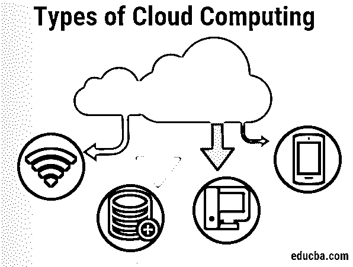

# 云计算的类型

> 原文：<https://www.educba.com/types-of-cloud-computing/>

## 云计算类型介绍

通过互联网提供的服务被概括为云计算，分为 IaaS、PaaS、FaaS 和 SaaS，主要分为两种类型，即部署和服务模式，其中部署模式包括云计算服务，如公共云、私有云、私有云和混合云，用于博客托管、创建新应用、视频和音频流等应用。

### 云计算的类型

云计算主要有以下两种类型:

<small>Hadoop、数据科学、统计学&其他</small>

*   部署模型
*   服务模型

基于三种类型的部署模型，可以使用以下几种云计算:

*   公共
*   社区云
*   私人的
*   混合物

#### 1.公共云

公共云被描述为由第三方供应商通过公共互联网提供的计算服务，使那些想要使用或购买它们的人可以访问它们。它可以是免费的，客户也可以按需为每次使用消耗的周期、存储或带宽付费。

**例子:**太阳云，AWS，微软 Azure

#### **2。社区云**

来自具有共同问题的组织的特定客户群只能使用云基础架构。它可能由一个或多个社区组织、第三方或它们的混合体拥有、经营、管理和经营。

#### 3.私有云

私有云是一种云计算系统，其中 IT 服务通过私有 IT 设施提供给一个组织专门使用**。**单个组织仅运营[云基础设施](https://www.educba.com/cloud-infrastructure/)。它可以由组织或第三方在现场或非现场运行**。**私有云术语通常与[虚拟私有云](https://www.educba.com/virtual-private-cloud/) (VPC)互换使用。从技术上讲，VPC 是使用第三方云提供商的基础设施的私有云，而内部云是强制的。

**示例:** AWS、VMware

#### 4.混合云

混合云是一种融合了政府云和私有云以共享信息和应用程序的计算机环境。组织可以获得政府云的灵活性和计算机容量，以实现基本和不敏感的计算功能，同时在企业防火墙后安全地运行关键业务应用和信息。

**举例:**

当涉及敏感数据时，联邦机构会选择个人云。

根据服务模型的类型，可以使用以下几种云计算:

*   IAAS
*   PAAS
*   SAAS
*   法斯

**什么是 IaaS？**

IaaS 是一种云计算模式，在这种模式下，公司的[外部云提供商](https://www.educba.com/top-cloud-providers/)为企业提供和管理虚拟化基础设施。借助 IaaS，企业可以将基于互联网的存储、服务器、数据中心和网络元素外包出去，实现与本地基础设施相同的功能。IaaS 广泛使用的一些例子包括自动化策略，如支持、集群、内部联网、恢复、跟踪、托管站点等。提供商负责服务器和存储构建、防火墙/安全网络以及物理数据中心。该供应商负责服务器和存储建设、防火墙网络以及安全和物理信息中心。

**什么是 Paas？**

PaaS 构建于 IaaS 之上。云供应商在这里提供计算资源来创建和测试应用程序，包括云和硬件基础设施部分，如中间件和操作系统。除了构建和维护所需的设备，PaaS 环境还允许云用户安装和存放信息集、开发工具和公司评估软件。贝宝系统的一些主要参与者包括 CloudBees、Salesforce.com、Engine、Heroku、Google App、Bluemix。

**什么是 Saas？**

软件即服务(SaaS)是一个软件分发系统，由第三方供应商托管并通过互联网向客户提供应用程序。SaaS 主机应用程序管理模式类似于 ASP，由提供商托管客户的软件，并通过互联网交付给经批准的最终用户。提供商向基于网络的客户提供应用程序的唯一拷贝，该应用程序是由提供商专门为软件按需 SaaS 模型中的 SaaS 发行版设计的。应用程序的源代码对于所有客户端都是相同的，并且在开发新的功能时由所有客户端实现。

**什么是 Faas？**

Faas 代表服务器的功能。FaaS 带来了另一层 PaaS 抽象，让设计人员与堆栈中他们软件下的所有东西完全绝缘。在狭窄的功能中安装代码块，并将它们设置为由某个事件激活，而不是与虚拟服务器、容器和应用程序运行时相关的危险。在事件发生之前，FaaS 应用不会消耗 IaaS 资源，从而降低费用。

### 云计算的使用

虽然你可能没有意识到你现在正在使用云计算，但我们大多数人都使用互联网服务来发送电子邮件、编辑记录、观看电影等。云计算很可能在幕后让一切成为可能。如今，从小型初创企业到公共组织，许多组织都在使用以下技术。

*   创建全新的应用程序和服务，保存、备份和检索信息。
*   博客和托管网站。
*   视频和音频流。
*   根据要求提供软件服务。

### 结论

在本文中，我们已经了解了什么是云计算、云计算的类型及其用途，以及云计算中使用的不同类型的服务模型。

### 推荐文章

这是云计算的指南。在这里，我们讨论了云计算的类型、它们的用途以及使用的不同服务模型。您也可以阅读以下文章，了解更多信息——

1.  [什么是云计算？](https://www.educba.com/what-is-cloud-computing/)
2.  [什么是 C++](https://www.educba.com/what-is-c-plus-plus/)
3.  [云计算 vs Hadoop](https://www.educba.com/cloud-computing-vs-hadoop/)
4.  [云计算公共 vs 私有](https://www.educba.com/cloud-computing-public-vs-private/)

