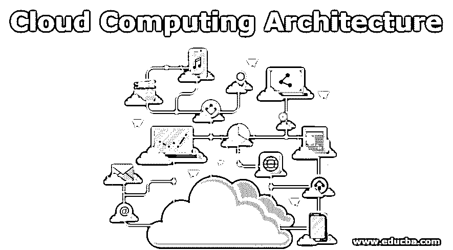
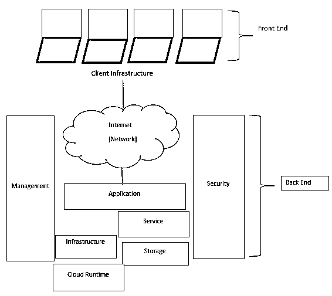

# 云计算架构

> 原文：<https://www.educba.com/cloud-computing-architecture/>

## 云计算架构介绍

下面的文章“云计算架构”提供了云计算架构的概要。技术在进步，这是真的。云计算是需要存储数据并在其领域内提供可扩展服务的新兴技术之一。

进入计算领域的主要焦点是:

<small>Hadoop、数据科学、统计学&其他</small>

*   [SOA(面向服务的架构)](https://www.educba.com/what-is-soa/)
*   软硬件组件的虚拟化
*   网格计算
*   效用计算

它的基本关注点是在所有云服务消费者、客户和像 Red Hat 这样的开源社区之间共享资源。此外，资源共享是在各种云层次或级别上完成的，如基础架构云、软件云、应用程序云和业务云。所有这些类型的云和共享的主要目标是资源管理和有效的预算管理，从而为整体业务带来良好的潜力。用户不需要任何特殊的知识来连接他们的计算机系统和服务器，因此我们可以把互联网看作是云计算的隐喻。云计算是一种随需应变的 IT 服务模式，需要虚拟化和具有计算技术的分布式系统。

### 云计算的架构

云计算的架构具有以下特征:

*   同时供应
*   灵活且可扩展
*   需求服务，即“按需服务”，通常带有计费和监控系统。
*   通过 WS API 管理程序。
*   抽象资源。
*   硬件、软件、数据库等资源的即时共享。

一个好的云架构有许多松散耦合的组件类型，但我们将它们分为两大类:

*   前端
*   后端

如前所述，互联网是我们云计算技术的隐喻。事实证明，对于每一端，都需要一个合适的网络来进行通信。这个架构描述了[前端和后端](https://www.educba.com/front-end-vs-back-end/)通过网络进行通信的端到端流程，网络在这里充当接口。

### 云计算架构图

**注意**:云架构和云基础设施都有不同的组件和概念。云架构描述了客户端和服务器通过网络进行通信的高级概述，而[云基础设施](https://www.educba.com/cloud-infrastructure/)讲述了服务器、存储、虚拟化和各种服务。

*   如前所述，云架构包括前端和后端。因此，我们首先想到的是这是什么，或者这种架构如何解决我们复杂的资源共享问题。
*   让我们走过这个架构；客户端或前端将类似于[与 web 应用](https://www.educba.com/what-is-web-application/)相遇，或者具有为用户和数据库之间的访问和交互而配置的协议和端口的应用的接口可以说是云计算平台。例如网络浏览器。
*   后端指的是云本身。它由提供云计算服务的资源组成。它包括大数据存储、安全性、虚拟机等所有必需品。
*   由于机制、流量控制和协议的内置安全性，托管在云场所后端的所有应用程序都是安全的。
*   这些协议是相互之间建立成功通信的中介或中间件。
*   如果我们将重点放在具有服务器管理、虚拟机管理程序、网络、服务器和存储所有功能的云基础架构上，将会为整个项目提供很好的帮助，也就是说，它非常适合项目管理。
*   它有一个虚拟机管理程序的概念，这在某种意义上起着非常关键的作用，它有助于创建许多微服务，而不是在操作系统上提供全部负载，而虚拟机管理程序将通过在其上创建轻量级微服务来提供帮助，如为虚拟机创建的容器化技术 docker、Kubernetes、OpenStack，这是另一种有效的资源管理和共享方式。

每个云基础架构都会遇到一些限制，例如:

*   **透明性**:这可以通过资源共享的例子，虚拟化来实现。
*   **可伸缩性**:基本上处理日常的供应和取消供应。
*   **安全性**:数据中心应该受到保护，因为内置安全性已经存在。
*   **智能监控**:要实现以上所有功能，非常需要具备智能监控的能力。

### 结论

最后，来自云计算范例及其架构的总体热情是，它必须作为一种实用工具来工作，这应该有可能改变 it 行业的很大一部分，使整个 IT 尽可能具有吸引力，以便具有创新想法的开发人员不应该依赖硬件来部署他们的服务或大量人力来操作它。

不需要为项目管理支付任何巨额的额外费用，并且可以毫无阻碍地使用最新技术进行完全自动化。因此，可以得出结论和一些未来的工作，就像它可以通过降低成本和简化云服务的交付来帮助所有的社区和人们。未来的研究可能包括更多关于云解决方案迁移的新态度和策略，并根据需要开发更多云解决方案。

### 推荐文章

这是云计算架构的指南。在这里，我们将讨论云计算的架构，以及带有详细解释的框图。您也可以浏览我们推荐的其他文章，了解更多信息——

1.  [什么是云计算？](https://www.educba.com/what-is-cloud-computing/)
2.  [云计算中的虚拟化](https://www.educba.com/virtualization-in-cloud-computing/)
3.  [云计算的类型](https://www.educba.com/types-of-cloud-computing/)
4.  [云计算的优势](https://www.educba.com/advantages-of-cloud-computing/)
5.  [云计算工具(前 5 大工具)](https://www.educba.com/cloud-computing-tools/)
6.  [免费云计算](https://www.educba.com/free-cloud-computing/)

