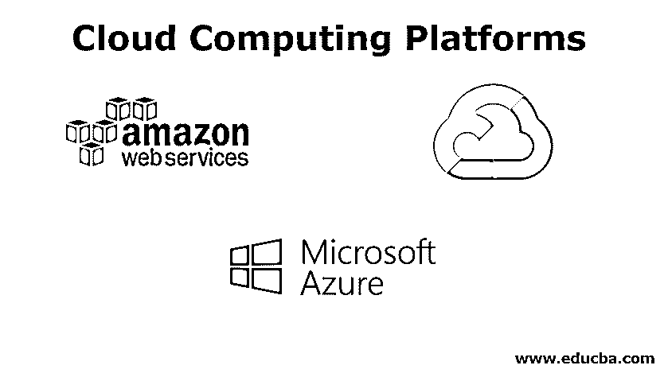
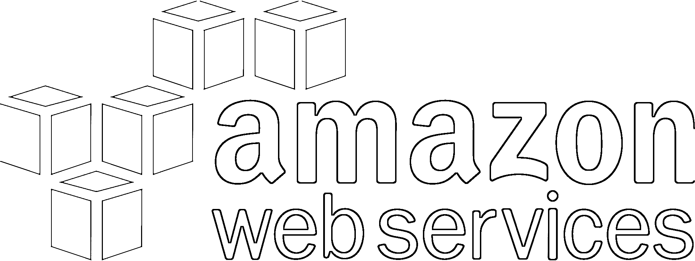

# 云计算平台

> 原文：<https://www.educba.com/cloud-computing-platforms/>

## 云计算平台简介

在本文云计算平台中，互联网最重要的方面是云计算。像谷歌、脸书、亚马逊、微软等公司。已经花费了数百万美元建立他们的数据中心(云)来提供互联网服务。在过去的几年中，其中一些公司已经向公众开放了他们的云服务。因此，任何拥有笔记本电脑和互联网连接的人都可以通过云计算平台的力量在互联网上创业。计算、存储和成本是决定云计算平台的最重要参数。然而，由于费率的不断波动以及各种服务的各种折扣，成本的估算非常复杂，因此比较起来有些困难。

### 三大云计算平台

以下是目前最好的云计算平台:

<small>Hadoop、数据科学、统计学&其他</small>

#### 1.亚马逊网络服务(AWS)

亚马逊是云计算平台的先驱。早在 2006 年，亚马逊就推出了 AWS，结合了他们最初的独立服务，如 S3(云存储)、SQS(简单排队服务)和 EC2(弹性云计算)。现在，AWS 拥有 150 多种服务来满足您的各种需求。AWS 有所谓的区域和可用性区域。它们分别是不同的地理区域和孤立的位置，由存储数据和执行计算的数据中心组成。到目前为止，大约有 70 个可用区域和 20 多个地区。这有助于企业或个人在其最近的位置运行应用程序，并减少延迟。

**计算:**

AWS 提供了各种各样的选项。您可以根据自己的需求配置 EC2 实例，或者使用 Lambda 完全不用服务器。您可以使用 EMR (Elastic Map Reduce)生成分布式计算机集群，或者通过 EC2 裸机服务访问单台计算机。AWS 提供现货实例，根据需求和供应对 EC2 机器提供高达 90%的折扣。这些是当前可用的实例，并且无限期运行，除非其他用户要求它们以原始价格运行。但是，AWS 在删除这些实例之前会给出 2 分钟的通知，以保存作业并关闭集群。

**存储:**

AWS 支持各种数据格式和结构，为存储和检索数据提供了合适的选项。如果您的所有应用程序都有结构化数据，那么您可以选择 DynamoDB、RDS 等数据库服务。如果您有多媒体文件，那么 S3 提供廉价的基于卷的存储，对于您的分析工作负载和复杂的查询，您有像 Redshift 和 Athena 这样的服务。AWS 现在支持跨区域复制和同区域复制。之前，资源在其他 3 个可用性区域中复制，但现在您可以在不同的地理位置复制数据或整个 S3 存储区。

#### 2.微软 Azure

微软 Azure 于 2010 年发布，为其企业客户提供云计算服务。随着 AWS 的成功，微软在过去几年中推出了许多服务来与之竞争，现在正在慢慢获得市场份额。与 AWS 类似，Azure 也有可用性区域和地区，但有一点 AWS 遗漏了，那就是地理冗余特性。这意味着存储帐户被复制到另一个区域，该区域不太远但足够远，以避免在当前区域中引起的区域性灾难，从而数据总是被备份并且没有丢失。

**计算:**

Azure 允许用户启动虚拟机，这是微软版本的 EC2。然后我们有 [Azure Functions](https://www.educba.com/azure-functions/) 这是一个无服务器平台。尽管 AWS 和 Azure 在提供的服务方面不相上下，但 Azure 实例往往会随着它们的规模而增加成本。Azure 提供低优先级虚拟机，但与 AWS Spot 实例不同，价格是固定的，可用性通常很低。

**存储:**

Azure 提供三种类型的存储:

*   **热存储:**数据需要随时可用的地方。这里存储成本高，访问成本低。
*   **冷存储:**数据访问不那么频繁的地方。这里存储成本低，访问成本高。
*   **归档存储:**数据很少被访问的地方，如备份文件。这里存储成本极低，接入成本极高。

Azure 上的数据资源可以使用 Azure 的 Blob 存储、Cosmos DB、Data Lake 等进行管理。，按照我们的要求。

#### 3.谷歌云平台(GCP)

GCP 提供的云计算服务与谷歌搜索和 Youtube 运行在同一个平台上。GCP 以低价和高安全性著称。苹果使用 GCP 的数据存储来存储它的云服务，最近 Twitter 和 GitLab 据说也搬到了 GCP。凭借 20 个区域和 61 个可用分区，GCP 还提供多区域存储，通过保持跨多个区域的冗余来提供备份。

**计算:**

GCP 的 IaaS 组件被称为谷歌计算引擎，它使用户能够启动虚拟机。它有 App Engine，这是一个 PaaS 组件，允许开发人员托管和管理 web 应用程序。它还会自动分配更多资源来处理额外需求。GCP 的可抢占虚拟机是短期和低成本的虚拟机，允许用户以更低的成本运行短期应用程序。这些虚拟机可以存活 24 小时，并在删除前发出 30 秒的通知。

**存储:**

GCP 有 4 种储物选择:

*   **Coldline 存储:**类似于 Azure 的存档存储，其中的数据很少被访问一次。
*   **近线存储:**这类似于 Azure 的冷存储，数据每月访问不到一次。
*   **标准存储:**这是我们存储“热”数据的地方，即需要随时方便访问的数据。

GCP 提供[云存储](https://www.educba.com/what-is-cloud-storage/)作为[数据湖](https://www.educba.com/what-is-a-data-lake/)；云 SQL 是一个数据库服务，BigTable 和 Datastore 是 [NoSQL 数据库](https://www.educba.com/what-is-nosql-database/)和各种其他类型的存储服务。

### 结论

如你所见，云计算彻底改变了我们在网上做生意的方式。随着如此多的平台相互竞争，我们，这些服务的消费者，受益最大，因为我们可以从所有可用的选项中进行选择，并获得最佳的回报。

### 推荐文章

这是云计算平台指南。在这里，我们讨论云计算平台，如亚马逊网络服务(AWS)，微软 Azure，谷歌云平台(GCP)。您也可以浏览我们推荐的其他文章，了解更多信息——

1.  [云计算架构与特点](https://www.educba.com/cloud-computing-architecture/)
2.  [云计算与网格计算|主要差异](https://www.educba.com/cloud-computing-vs-grid-computing/)
3.  [云计算技术的优势](https://www.educba.com/cloud-computing-technologies/)
4.  [你应该知道的云计算面试问题| 10 大](https://www.educba.com/cloud-computing-interview-questions/)

