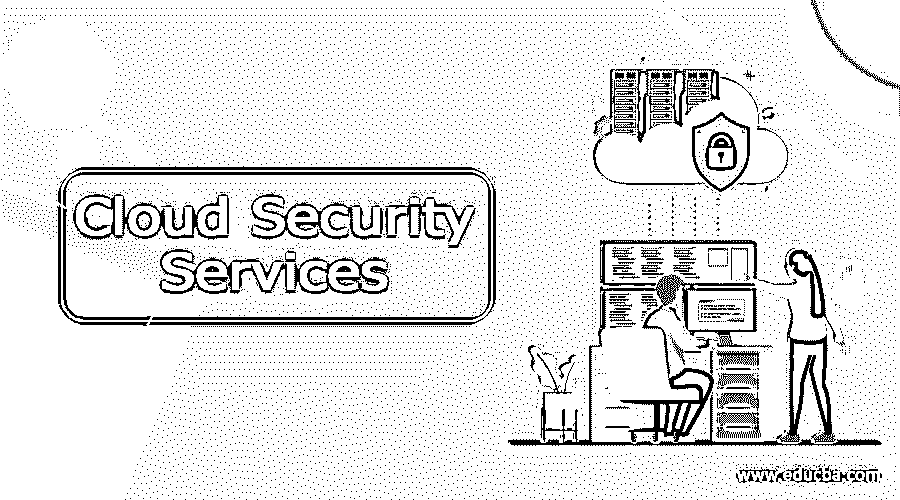

# 云安全服务

> 原文：<https://www.educba.com/cloud-security-services/>

## 云安全服务简介

保护云系统及其数据和架构的一系列策略、控制、身份验证规则、技术和方法称为云安全服务。各种措施，例如管理网络流量以维护数据安全性、设备登录到同一云目录的授权规则、遵守所有法规和合规性规则，以保护云系统的安全性。云安全由云所有者提供，云用户无需担心，因为云包也在系统中包含云安全。

### 云安全服务列表

#### 数据加密:

企业在云系统中存储了大量的数据，这些数据对于企业自身的生存至关重要。如果数据被盗，它可以被出售给竞争公司，他们可以利用这些数据来开发产品，使市场竞争更加激烈。考虑到日常活动中不再使用的数据，我们可以将这些数据称为静态数据。最好对静态数据进行加密，因为这些数据将包含所有关于市场趋势和同一公司即将推出的产品的图表和研究。静态数据加密在云安全服务中非常重要，因为当黑客试图访问静态数据时，它会提醒用户。

<small>Hadoop、数据科学、统计学&其他</small>

#### 防火墙保护:

当用户最初试图从系统访问任何云系统时，根据防火墙保护，他们将被阻止这样做。设备必须在防火墙安全设置中注册，之后用户才能访问云系统中的数据。这种内部和外部防火墙保护由云系统配置，因此任何未经授权的登录都会被防火墙阻止。当数据通过同一个 IP 地址发送时，数据包的来源和目的地将由防火墙进行验证。此外，检查数据包的稳定性，以确保数据包的真实性。一些防火墙会检查数据包的内容，以确定数据包中没有病毒或恶意软件。外部和内部防火墙对于验证数据不会以任何形式泄露给外人非常重要。

#### 监控:

所有登录到系统中的 id 都在云日志系统中被监控和记录，以便当任何安全威胁发生时，如果是来自内部，这种跟踪有助于识别在特定时间登录的个人。甚至防火墙规则也被更新，以防止可疑的日志记录企图，从而使云存储中的数据安全。监控通常会检查身份验证规则和 IP 地址，以便在检测到任何可疑登录时，阻止他们访问存储中的数据。这是在粒度级别上完成的，因此权限不是直接授予个人，而是授予一组人，他们共同承担责任。这有助于监控其他人的活动，并通知安全团队任何未经授权的数据调制。

#### 数据中心的安全性:

如果所有通过系统访问数据的方法都失败了，黑客还有一种方法可以直接通过服务器访问数据。这不会检查防火墙保护，也没有身份验证规则。这就是为什么所有的物理服务器都受到物理安全部门的严密监控，并由闭路电视摄像头 24 小时监控。生物识别技术也存在于服务器机房中，只有授权的安全人员和维护人员才能进入并检查服务器的工作情况。此外，对于进入和离开房间的人以及在服务器房间内花费的时间，启用了日志。当相关人员的工作时间超过许可时间时，会向安全部门发送警报，以便他们检查服务器机房是否有未经授权的人员。

#### 隔离网络:

当云系统中有重要的部署，并且必须对相应的资源组成员隐藏数据时，最好在虚拟隔离的网络中进行部署。应该在所有网络系统中实施安全策略，并且应该保护系统本身免受恶意威胁和病毒攻击。应该定制访问和认证，并且必须使用专用网络链路将数据传输到更高的环境。

#### 异常检测:

当日志很大时，很难手动管理日志，因为云供应商利用基于人工智能的算法来描述日志模式中的异常。这有助于管理日志详细信息并监控日志中的差异。此外，可以扫描漏洞，从而知道哪个计算服务具有较少的安全系统。这使得系统提高了安全性，保护了数据的核心。数据库的位置可以保持在监视之下，这样我们可以确保数据没有存储在未经验证的数据库中。在将数据部署到云和更高环境的所有部署中都安装了检查点，以确保数据保存在正确的云存储中，并以正确的格式保存文件夹详细信息。

#### 通过 API 进行保护:

为了防止数据落入未经授权的人员之手，云用户可以使用 API 和 web 应用来保护数据的安全。这有助于保护容器和虚拟机免受不安全登录的影响。非官方登录可以引发汽车事故，这有助于保护系统和云存储数据。如果威胁带来了严重的风险，可以在云存储中设置实时警报，以防止他们访问数据。

我们的系统、移动设备和存储磁盘中的所有数据都将成为云存储数据，因此为这些设备安排良好的云安全服务至关重要。云提供商提供云安全，如果不满意，用户可以通过私有软件的帮助来达到预期的安全级别。

### 推荐文章

这是云安全服务指南。这里我们讨论一下简介，云安全服务列表。您也可以看看以下文章，了解更多信息–

1.  [云计算安全](https://www.educba.com/cloud-computing-security/)
2.  [云安全工具](https://www.educba.com/cloud-security-tools/)
3.  [云计算安全挑战](https://www.educba.com/cloud-computing-security-challenges/)
4.  [云迁移的优势](https://www.educba.com/cloud-migration-benefits/)

