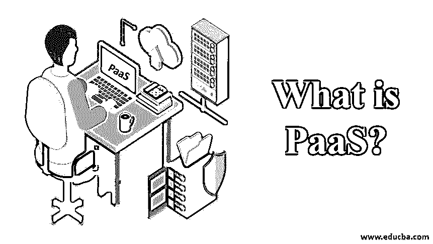
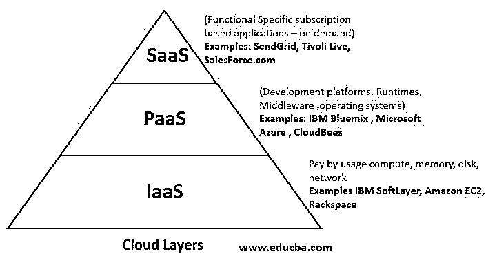

# 什么是 PaaS？

> 原文：<https://www.educba.com/what-is-paas/>

## PaaS 简介

PaaS 是一种云计算产品，其中服务提供商为客户提供一个平台，使他们能够构建、操作和管理业务应用程序，而无需此类软件开发所需的基础架构。由于开发人员和其他用户看不到底层基础设施，PaaS 架构类似于无服务器原则，云服务提供商拥有、操作服务器并控制资源分配。

### 什么是 PaaS？

平台即服务是一种基于云的开发模式，使用户能够交付从日常生活所需的简单应用程序到大型组织所需的集中式应用程序。

<small>Hadoop、数据科学、统计学&其他</small>

*   PaaS 的工作流程是在云中提供一个流畅的工作原理，包括云中的整个应用开发阶段。
*   在 PaaS [云计算平台](https://www.educba.com/cloud-computing-application/)中，后端的云服务提供商处理可扩展性，最终用户不必担心管理基础设施。
*   在 PaaS 的帮助下，我们还获得了额外的资源，包括数据库管理系统、编程语言、库和各种软件开发工具，这些工具在云上工作，使我们的日常生活变得更好。
*   它有各种各样的用途，其中，它降低了安装额外软件许可证、核心应用程序和其他平台资源的价格和麻烦。
*   这些架构用于向开发人员和其他最终用户隐藏其底层基础设施。因此，该模型成为无服务器计算模型和功能即服务架构，云服务提供商管理和运行服务器，并控制资源的分配。
*   它帮助我们组织和维护有用的应用程序和服务，而第三方提供商在云中维护所有其他服务。

### PaaS 如何工作？

平台即服务(Platform-as-a-Service)是继 IaaS 之后最好的云计算技术之一，它成本更低，拥有配置完善的管理系统，可以击败任何其他旧的传统云系统。

然而，它到底是如何工作的呢？我们将提供一些包含工作原理的基本要点:

*   PaaS 实际上是 SaaS 和 IaaS 之间的夹层，包含所有的中间件平台工具。
*   PaaS 提供了按使用付费的功能。因此，不需要购买、配置、开发、维护和安装每个应用程序来工作和使用它们，也不需要强大的维护团队来维护它们并对它们进行日常服务，人们可以容易地使用它们并支付它们使用所需的价格。这就是为什么为了恰当和最佳的利用，人们可以只为他们的应用程序的使用付费。

有各种类型的 PaaS 服务提供商提供非常有用的功能。

1.  PaaS 为用户提供基本的数据存储和服务器，用于维护服务所需的所有计算系统。
2.  支持使用强大的网络引擎和平台，包括谷歌应用。
3.  支持像脸书这样的社交网站。
4.  真正改变日常生活的日常必需品。

### PaaS 包含哪些内容？

它包括各种功能和服务。

供应商提供的主要产品包括:

*   **开发工具:** PaaS 供应商提供软件开发的必要工具，包括调试器、编译器和其他作为框架一起工作的基本工具。提供的具体工具将取决于供应商，但 PaaS 产品包括开发人员构建应用程序所需的一切。
*   中间件:作为服务提供的平台包括中间件，因此开发者不必自己构建。中间件是夹在用户应用程序和机器操作系统之间的软件。中间件是运行应用程序所必需的。
*   **操作系统:**PaaS 供应商维护开发人员工作和应用程序运行的操作系统。
*   数据库管理: PaaS 管理员维护数据库系统。他们通常也会为开发者提供一个数据库管理系统。
*   **基础设施:** PaaS 是 IaaS 的下一层，拥有 IaaS 中包含的一切。PaaS 提供商要么管理服务器和存储，要么从 IaaS 提供商那里购买。

### PaaS 的优势和劣势

下面给出了提到的优点和缺点:

#### 优势:

*   **简化开发:**程序员可以专注于开发和创新，而不用担心基础设施和云计算工具，通过减少工作量和使用智能工作，使用尽可能少的代码来构建应用程序，从而最大限度地缩短时间。
*   **灵活性和可移植性:**一些 PaaS 服务提供商为用户提供了多种平台选择，如 PC、笔记本电脑和其他电子设备，以更快地开发应用程序并使其可移植。
*   **经济实惠:** PaaS 让个人或组织能够经济实惠地使用他们选择的云软件，而不必安装额外的软件或支付安装和维护软件的额外费用。
*   **与开发团队协作:**由于使用 PaaS 开发的应用程序可以通过互联网访问，因此团队可以在全球范围内一起工作，而不必考虑任何地点。
*   **效率:** PaaS 一直在高效地管理云中的应用程序开发阶段，包括在同一云服务器内定期测试、管理和更新应用程序，并提供优质高效的基础设施。

#### 缺点:

*   **数据隐私:**数据是一个很大的风险，大部分时间都是保密的，存储在服务器里，维护数据隐私。
*   **集成:**在集成数据时，可能会出现数据不匹配的情况，因为数据同时存储在本地存储和云中。因此很难区分它们，用户在任何时候想要访问数据时都会感到困难。

### 结论

PaaS 已经成为仅次于 IaaS 的云计算模式中的佼佼者，它具有极高的速度、自动化管理和扩展平台上的应用程序，支持连续交付并降低基础架构运营成本。

### 推荐文章

这是一个什么是 PaaS 的指南？这里我们讨论一下什么是 PaaS？它是如何工作的？以及不同的功能和服务。您也可以浏览我们的其他相关文章，了解更多信息——

1.  [云服务的类型](https://www.educba.com/types-of-cloud-services/)
2.  [网络安全工具](https://www.educba.com/cyber-security-tools/)
3.  [Azure Paas vs Iaas](https://www.educba.com/azure-paas-vs-iaas/)
4.  [什么是云技术？](https://www.educba.com/what-is-cloud-technology/)

