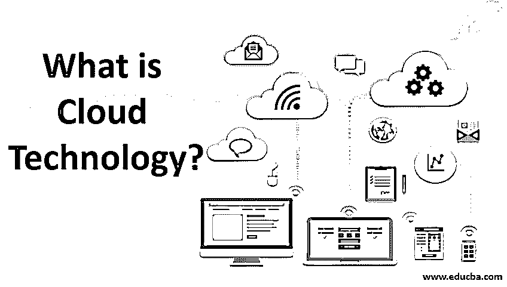

# 什么是云技术？

> 原文：<https://www.educba.com/what-is-cloud-technology/>

## 云技术简介

云计算是各种互联网服务的交付。这些工具包括数据存储、服务器、数据库、应用程序和网络。基于云的存储允许你将文件保存在一个中央网络上，而不是一个专有的本地存储设备或硬盘上。只要电子设备接入互联网，数据和软件程序就可供使用。出于许多原因，
云计算是个人和公司的热门选择，包括节省成本、提高生产力、速度和效率、性能和保护。

### 什么是云技术？

[云计算技术](https://www.educba.com/cloud-computing-technology/)是一种按需技术，用户利用互联网平台上的 IT 资源，并采用按使用付费的机制，而不是以前基于订阅的技术。

<small>Hadoop、数据科学、统计学&其他</small>

以下是几点:

*   它指的是云计算，将数据和资源存储在一个在线服务器上，用户获取这些数据和资源供自己使用，而不是直接保存在计算机的硬盘上，这样使用起来不安全。
*   这里的云指的是虚拟空间或在线平台，这种技术变得越来越普遍，最终用户可以在远程服务器上存储大型文件和应用程序，这使他们能够在世界任何地方远程工作。
*   一些云技术服务向最终用户提供以某一价格消费设施，其中一些技术服务通过网络向一些特定的用户客户端集合提供设施以使用资源。

有各种各样的云技术服务，在当今世界非常流行和广泛使用的是巨大的存储和备份，测试和维护应用程序，分析数据，按需交付相关软件。

### 我们为什么使用它？

云计算技术是一个互联网驱动的平台，其中资源通过网络通道从服务器转移到客户端，取代了物理硬件和软件的使用。

所以，在当今这个技术以光速升级的世界，知道该去追求哪种技术，以及正确使用技术是非常重要的。因此，云技术应运而生，尽管对互联网有负面影响，但它仍然是最快的技术，并成为当今市场的最新趋势。因此，使用它的目的是通过互联客户使全球资源多样化，并通过在适当的时间利用适当的资源，让企业用户通过留住他们在该领域的客户来扩大他们的市场。在我看来，每个人都使用云的最大原因是，它为我们提供了最好的备份系统，可以备份任何文件大小的任何资源，如果这些资源保存在本地驱动器或存储设备中，可能会损坏或变得不可用。It 专业人员可以从世界任何地方访问资源和工作，这使得工作和处理客户更加灵活，这是最近技术趋势的巨大繁荣。

### 优势

如果我开始写我们可以从云技术中获得的好处，这将是一个永无止境的话题，因为它的优势极大地消除了它的小缺点。

尽管如此，我还是列出了它值得考虑的主要优点:

*   **成本优化:**这项技术带来了各种有用的资源，利用了整体成本，节约了成本。这项技术不需要任何物理硬件安装，用户可以按使用付费而不是订阅费来使用它。

*   **可扩展性和资源利用率:**该技术通过利用跨平台的资源提供了最佳的可扩展性，为用户提供了更好的存储可靠性。

*   **数据安全性:**将大量数据存储在一个云服务器中仍然可以提供最佳的数据备份和资源安全性，并使用户随时可以使用这些数据。**T3】**

*   **协作和易用性:**云技术平台提供了一种有效的协作，使世界各地的用户通过互联网以虚拟方式相互连接。

*   **资源的快速软件更新:**软件更新和升级自动快速进行，无需任何手动步骤来集成所选的应用程序。

*   **高速度和灵活性:**云[计算服务](https://www.educba.com/cloud-computing-services/)随时可供客户端工作，获取和利用资源的高速度使他们可以随时随地工作。

*   **快速部署:**云技术平台让我们能够通过云更快地部署资源。因此，在部署之后，所部署的资源和系统在几分钟之内就变得完全可用并准备就绪。

### 云技术的运作

如今，云技术提供了各种需要互联网连接的有用服务，用户可以随时随地从任何物理设备访问和下载数据。用户还受益于各种[云存储提供商](https://www.educba.com/cloud-storage-providers/)的使用，这些提供商提供无限的免费云存储空间，最大限度地减少了对 CD、DVD 和笔驱动器上有限空间的使用。

云技术的主要工作模式有两层:

**1。前端:**该端包括拥有自己的用户界面的客户端或用户系统。这一目的还包括客户需要使用的必要资源。这一端是通过互联网连接的云接收资源的接收器。

**2。后端:**这一端包括构成云的数据存储系统和服务器。它包含一个专用的服务器来处理云性能。

### 结论

因此，总而言之，云技术是当前发展最快、盈利最快的技术中的革新，让每个用户的生活都变得轻松。互联网或云通过其网络分支系统将我们联系在一起，使我们的生活舒适并感到安全和有保障。

### 推荐文章

这是一本关于什么是云技术的指南？.在这里，我们讨论基本概念，工作，为什么我们使用它，以及各自的优势。您也可以浏览我们推荐的文章，了解更多信息——

1.  [云计算架构](https://www.educba.com/cloud-computing-architecture/)
2.  [云计算服务提供商](https://www.educba.com/cloud-computing-service-providers/)
3.  [云计算的风险](https://www.educba.com/risks-of-cloud-computing/)
4.  [云安全工具](https://www.educba.com/cloud-security-tools/)

