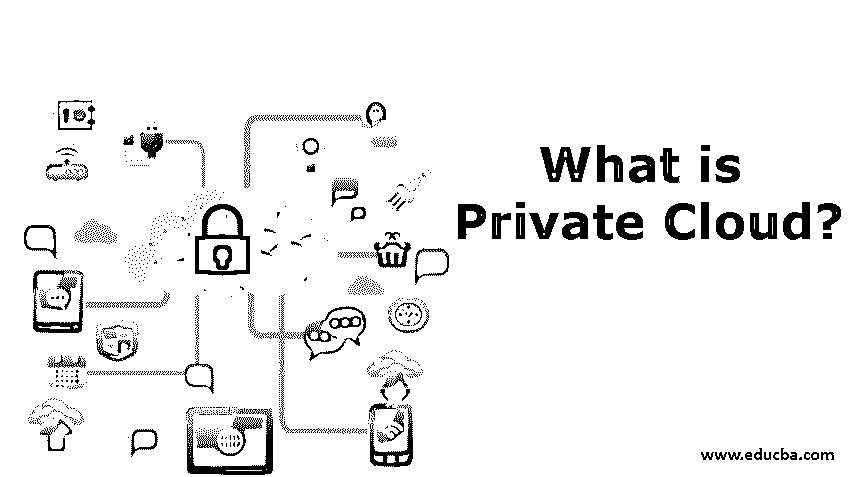
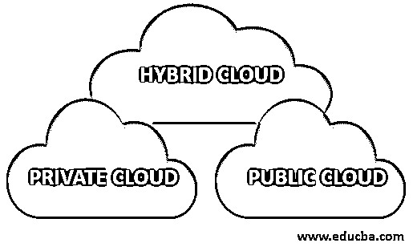

# 什么是私有云？

> 原文：<https://www.educba.com/what-is-private-cloud/>

## 私有云简介

在计算环境中，在《个人电脑杂志》看来,“云”指的是“通过互联网而不是你电脑的硬盘来存储和访问信息和程序”。通常，云服务提供商操作保存数据和运行程序的服务器。就私有云而言，用户属于特定的企业或组织。它可能基于或不基于酒店，但设施和基础设施始终通过专用网络进行管理。

**云计算的类型**

<small>Hadoop、数据科学、统计学&其他</small>

以下是云计算的类型:

1.  私人的
2.  公共
3.  混合物

### 什么是私有云？

您组织的需求决定了您所寻求的云设置类型。一般来说，政府机构、金融相关机构或中型企业都会选择它。如果您属于这些类别，那么最有可能的是，您会选择私有云。说到私有云，它的用户属于某个特定的企业或组织。它可以位于您的场所或远程，但服务和基础设施始终通过专用网络维护。他们使用的软件和硬件专门满足您的需求。

**不同类型的私有云:**

*   内部的
*   管理
*   款待
*   社区

**供应商:**

*   VMware
*   我的云
*   ibm 蓝色混合云
*   谷歌云
*   亚马逊副总裁云
*   戴尔云
*   SAP HANA
*   思杰
*   大功率(High Power)ˌ高压(High Pressure)ˌ高性能(High Performance)ˌ高聚物(High Polymer)
*   红帽子
*   华为
*   ASG
*   团状的模塑料（bulkmoldingcompounds）
*   思科系统

### 利益

用户需要订阅的原因可能有 n 个；我们已经考虑把更常见的发现列举下来；让我们看看:

#### 1.灵活的

如果您有不同的资源需求和管理，那么私有云是适合您的解决方案。它们为用户量身定制，以满足各种不同的应用需求。可以根据需要相应地调整服务器，最终确保更好地利用资源。

#### 2.安全性

作为企业所有者，您需要安全的数据，因为这是您企业的需要；政府和金融机构必须保证其数据的安全，以免被盗。你可以照顾你的隐私需求。数据与特定的组或特定的组织共享，因为您完全有可能自定义它。

#### 3.费用

对于任何规模的企业来说，成功经营的一个最重要的方面就是在不影响质量的前提下，最大限度地降低运营成本。几乎每个业务类型都有 IT 部门；他们有责任找到最佳的解决方案。它为用户提供了这一优势，是私有云在质量上无可匹敌的。

#### 4.用户化

正如我们所知，没有一个适合所有问题的解决方案，这是私有云的最佳部分；有多种级别的定制可供使用，每个组织都可以使用这些定制找到满足其业务和技术需求的最佳解决方案。您可以选择特定存储和相关网络功能所需的基础架构类型。

#### 5.云特征

通过每个私有云订阅，用户获得了访问云性能以及带宽详细信息的专有权利。

### 我们为什么使用私有云？

我们使用它是因为以下原因:

*   **按需自助服务:**用户无需任何 IT 支持团队或服务托管提供商，即可快速高效地管理托管在云上的应用中的必要服务限制。
*   **IaaS:** IaaS 是公司选择私有云的重要原因之一，但它并不仅限于此。
*   **存储区域网络(SAN)**:[存储区域网络](https://www.educba.com/what-is-storage-area-network/)是虚拟机(VM)和数据中心之间的接口。因此，我们可以说在私有云的情况下，我们有一个专用的 SAN。
*   **学习曲线**:任何具有更多功能和定制的技术都会提供最大的学习曲线和职业范围，这是一条经过检验的规则。
*   **可预测的成本:**与公共云或混合云设置不同，私有云有固定的成本。
*   **提供清晰的所有权和责任:**每个游戏计划都会在某个时间点出现；我们很清楚在某个时间点会出问题。在[公共云](https://www.educba.com/what-is-public-cloud/)的情况下，您必须与内部和外部利益相关方讨论问题以应对情况，但在私有云的情况下，您拥有它，并可以在与外部各方讨论后有效地对其进行优先排序。这是每个政府和金融机构更喜欢私有云网络的另一个主要原因。
*   **统计数据为私有云说话:**私有云用户群体有了巨大的增长。2016 年，这一比例为 66%，现已上升至 77%。

### 结论

随着市场上每一项新技术的出现，商业世界也在不断变化；云在各个方面都为用户提供了大量的产品。我们在文章中讨论了这种订阅的优点。我们遇到了一些有趣的事实，以及为什么应该使用它们。

### 推荐文章

这是一本关于什么是私有云的指南？.在这里，我们讨论为什么我们使用它，以及它的类型和不同的好处，如灵活性，安全性，成本等。您也可以浏览我们推荐的文章，了解更多信息——

1.  [云计算 vs 网格计算](https://www.educba.com/cloud-computing-vs-grid-computing/)
2.  [云计算技术](https://www.educba.com/cloud-computing-technologies/)
3.  [云计算面试问题](https://www.educba.com/cloud-computing-interview-questions/)
4.  [云安全工具](https://www.educba.com/cloud-security-tools/)

