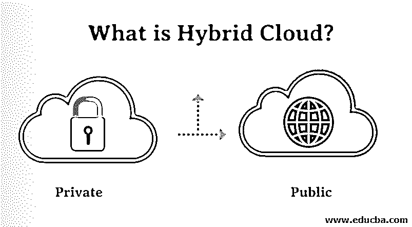

# 什么是混合云？

> 原文：<https://www.educba.com/what-is-hybrid-cloud/>

## 混合云简介

混合云主要是指由两个以上的云组成，这两个云可以是私有云、公共云或社区云，它们在某种程度上是不同的实体，但也以某种方式绑定在一起，从而提供各种部署模式的众多优势。此外，术语混合云还与连接、专用服务以及使用云资源进行管理相关联。

根据 Gartner 对混合云的定义，它仅仅是一种服务，通常是基于云计算的服务，由不同服务提供商提供的私有、社区和公共云服务组合而成。

<small>Hadoop、数据科学、统计学&其他</small>

它可以跨越隔离，也可以跨越服务提供商设定的界限，因此不容易归入上述三个类别中的一个类别。聚合、定制或集成的能力可以集成到其他云服务中。

基本上，它是本地、私有云、第三方云和基于公共云的服务的完美融合，以及这些服务之间的协调。由于不断增加的工作负载和提供的各种优势，以及计算需求和成本价格的变化，这有时是必不可少的。此外，混合云还为企业提供了更高的灵活性和各种各样的部署选项。

### 混合云架构

下面给出了混合云架构的详细解释。

*   混合云架构包括 IaaS(基础设施即服务)的可用性，IaaS 是一个公共平台，如 [AWS(亚马逊 Web 服务)](https://www.educba.com/what-is-aws/)、[谷歌云平台(GCP)](https://www.educba.com/what-is-google-cloud-platform/) 和微软 Azure。
*   它还包含内部系统。私有云构建，可以是内部构建，也可以通过私有云托管的服务器提供商构建。还需要一个有效的 wan 系统，即广域网，来建立它们之间的连接。通常，企业将使用公共云来访问计算实例、存储资源和大数据系统等其他资源，以及集群或基于云的无服务器计算单元。
*   如果从企业的角度来看，企业无法直接控制公共云架构的使用。
*   在这种情况下，混合云开始发挥作用，因为[应该使用私有云](https://www.educba.com/what-is-private-cloud/)通过利用所需的云(公共云或私有云)来实现兼容性。这可能涉及数据中心内部硬件的使用，其中也包括服务器、大容量存储、负载平衡器和一个巨大的局域网(LAN)。混合云架构的其他组件包括混合用户界面、混合处理、混合备份、混合后端、混合数据、混合应用程序功能、混合多媒体和基于 web 的应用程序、混合开发环境。
*   当您从传统的云域迁移到新的高级多云或混合设置时，现有应用程序会带来一些限制，突出了每个计算环境必须提供的独特特性和功能。其中之一是分层混合，将大多数应用程序分类为前端或后端类型。那些基于前端的应用程序直接暴露给目标用户或设备，因此它们是对性能敏感的应用程序，需要快速发布和增强。后端应用程序通常涉及数据的存储和管理。另一方面，前端应用程序都是无状态的，或者只用于管理小块数据。后端服务面临的主要挑战包括大量数据处理和帮助数据得到适当保护。

### 优势

下面介绍了一些优点。

*   基于前端的应用程序强烈依赖于后端，偶尔也依赖于基于前端的应用程序，但是后端是独立的，与前端无关。因此，与后台应用程序的迁移相比，隔离和迁移前端往往变得不那么复杂，后台应用程序的迁移也具有复杂的依赖性。
*   基于前端的应用程序通常在本质上是无状态的，或者它们本身没有数据管理，因此它们在迁移时不容易出错。
*   前端系统主要受到快速和频繁更改的影响，因此当这些应用程序在公共云设置上运行时，它简化了 CI/CD 部署和流程，可用于以自动化和高效的方式推出更新。
*   对性能敏感的前端和所有那些经常发生变化的前端都从云部署支持的负载平衡、[自动扩展功能](https://www.educba.com/what-is-autoscaling-in-aws/)和基于多区域的部署中受益匪浅。
*   无论是实施用户界面或 API，还是处理数据摄取或物联网，这些前端应用都可以直接受益于云服务的设施和功能，如 CDN use cloud IoT offer、Firebase 等。

### 混合云管理工具

市场上有大量的混合云管理工具和软件解决方案，在这篇文章中，我们列出了其中的一些。

*   多云朵
*   wrike！wrike
*   生物界
*   IBM 云协调器
*   Zoolz 智能云
*   Apache 云栈
*   Rightscale 云管理
*   赛门铁克云和网络安全
*   微软 Azure 成本管理
*   管理引擎应用经理
*   云运行状况
*   mix 应用程序
*   Cloudcraft
*   立即服务云计算管理
*   摩耳甫斯
*   OpenStack
*   云化
*   集中应用服务
*   智能合同
*   云生命周期管理

让我们详细讨论其中的一些。

#### wrike！wrike

*   这是一个用于项目管理的在线软件，能够处理不同行业的多种功能。
*   它还充当分布式和协同定位团队的整合工作空间，因此该平台用于提供最全面的技术和工具集，这对云管理至关重要。
*   这些功能包括任务自动化、分析和性能测量。还提供企业级安全解决方案，以确保与公司相关的机密信息不会被泄露，并始终受到保护。
*   该平台还具有一组强大的 API 和功能，有助于根据业务需求扩展产品的用户功能。

#### IBM 云协调器

*   这是一种高效的云管理平台服务，旨在通过使用基于策略的工具来实现云服务供应的自动化，这些工具可用于配置、部署开发环境、供应和服务管理。
*   同样，管理、监控、保护环境和备份只需几分钟。所有这些都可以通过使用单一服务和自助服务界面来完成。
*   它提供了一系列可定制的功能，并遵循严格的 SLA。它还提供端到端的云服务和管理。除此之外，云配置、部署和供应也是 IBM cloud orchestrator 容易处理的事情。
*   云管理工具和软件解决了复杂任务的优化和简化流程问题，包括高效管理私有、混合和公共云系统以及基础架构系统。
*   在这种情况下，软件可以被视为收集和部署可扩展和灵活的基于云管理的工具，这些工具是专门设计来帮助企业追求基于云的计算策略的。诸如安全审计、灾难恢复、合规管理和应急计划等任务通常是策略的一部分。

您可以轻松发现的其他特性和功能包括:

**1。多个云管理**

这是与互操作性有关的一个特性，它通过确保配置和代码不被更改，允许为一次性环境构建的应用程序在另一个环境中工作。

**2。基于应用的生命周期支持**

这带来了检查、管理和监控由典型应用构建的各种生活事件的能力，包括代码更新、性能优化、安全补丁、备份等。

**3。自动化**

在这种情况下，应用程序是以编程方式管理的，当涉及到较大的环境时，可以包括许多与重复性任务相关联的应用程序。

**4。灵活性**

这一项负责允许对基于应用程序的框架、数据库和实例大小以及其他属性进行简单的更改和定制，以帮助应对复杂性并将所有这些置于控制之下。

**5。成本管理**

这一部分负责提供成本报告、显示和预测等，尤其是在 IaaS 或基础架构即服务以及云价格飙升可变且通常按实例或小时计费的情况下。

**6。安全性**

这有助于防范网络和易受攻击的威胁。
[云托管服务](https://www.educba.com/best-cloud-hosting/)和应用都包含在 SaaS(软件即服务)之下，这成为当今最流行的基于云的计算模式。成功的设计要求同时兼顾预期的经济、战略、技术和风险属性，复杂的设计并不总是更合适。这完全取决于你所在的组织。

### 推荐文章

这是什么是混合云的指南？这里我们讨论架构和不同类型的混合管理工具。您也可以浏览我们推荐的其他文章，了解更多信息——

1.  [什么是云计算？](https://www.educba.com/what-is-cloud-computing/)
2.  [云计算 vs 网格计算](https://www.educba.com/cloud-computing-vs-grid-computing/)
3.  [云计算是虚拟化吗？](https://www.educba.com/cloud-computing-virtualization/)
4.  [四大云托管提供商特色](https://www.educba.com/cloud-hosting-providers/)

