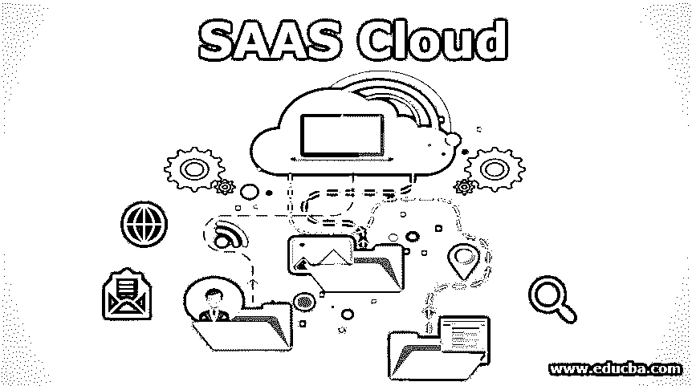

# SAAS 云

> 原文：<https://www.educba.com/saas-cloud/>

## SAAS 云简介

SAAS(软件即服务)云是指软件许可和交付模式，其中第三方云提供商通过互联网平台托管应用程序和服务，用户需要使用这些软件服务的许可证。SAAS 是最重要的云计算服务之一，在 20 世纪 90 年代后期扩展了 ASP 模型的概念后，它变得越来越重要。它通常基于网络，从 2012 年开始，SAAS 供应商继续开发和管理自己的软件。由于它的灵活性，它已经被广泛使用，因为它只需要一个网络浏览器就可以运行。

### 什么是 SAAS 云？

这代表了最大的云应用服务，它们在当今的数字市场中增长迅猛。顾名思义，它将必要的软件作为服务提供给用户，由一些第三方服务管理。所提供的软件应用程序可以直接在任何网络浏览器上运行，而不需要安装软件。SAAS 基本上是一种基于网络的模型，按需生产软件，云供应商在服务器上托管应用程序，维护数据库，并通过互联网将数据传输给最终用户。

<small>Hadoop、数据科学、统计学&其他</small>

SAAS 供应商与其他服务提供商相比有很大的优势，它允许购买者外包大部分 IT 职责，而不必投资硬件平台来托管软件。用户可以通过 web 浏览器访问这些应用程序，web 浏览器一直是各种业务应用程序的交付模型，包括办公软件、管理软件、会计、CRM 工具以及各部门的各种人才招聘团队。它可以分为两种类型:

1.  垂直 SAAS
2.  水平 SAAS

SAAS 云有更多的优势，将在下面讨论，它实现了云计算的所有[功能，提供了强大的体验。](https://www.educba.com/cloud-computing-features/)

### 我们为什么使用 SAAS 云？

SAAS 云是一种租用基于软件的云平台服务的技术，也是组织可以访问的此类云平台服务的替代模型。为了简单和可靠，从小型到大型企业的任何人都使用 SAAS 技术，这种技术需要互联网连接，在 web 浏览器的帮助下运行。因此，出于各种原因，我们更喜欢使用 SAAS 云。我将讨论以下一些基本要点:

*   对于任何规模的企业来说，由于服务的低成本，他们觉得有必要使用 SAAS 云。我们可以根据自己的选择购买尽可能多的软件，并按此付费。
*   在 SAAS 中，我们不需要为任何 IT 专家团队工作。因此，在资源短缺时，或者当应用程序开发和维护成为一个大问题时，SAAS 就出现了。
*   SAAS 应用程序知道它的软件创建，包括一群经验丰富的专业人员，我们可以依赖他们。
*   使用 SAAS 云，一切都在云上处理和存储，这使得存储成百上千的文件变得更加容易，并且我们可以随时从云中访问这些文件。

### SAAS 云的优势

使用云服务时，技术发生了重大的范式转变。如果我们谈论 SAAS 云，它也提供了相当多的优势，使我们的生活变得如此轻松和有价值。我们将看到下面给出的附加优势:

*   **经济实惠的服务:** SAAS 云模式提供基于订阅的服务，包括服务成本、维护和升级成本，从而降低旧传统系统的整体成本。因此，由于其经济性和广泛的特性，许多组织开始使用 SAAS。
*   **快速部署:**对于使用 SAAS 服务，我们只需要一个 web 浏览器和互联网连接。SAAS 解决方案省去了在系统上安装软件的麻烦。使用快速、稳定的互联网连接，访问软件将非常快，组件可以立即部署。
*   **不需要设置基础设施:**我们用户不必担心[云基础设施](https://www.educba.com/cloud-infrastructure/)或硬件成本。SAAS 云厂商处理一切。因此没有基础设施成本，因为 SAAS 供应商承担维护基础设施及其配置的所有责任。
*   **快速升级:** SAAS 云支持按需更新，需要时支持硬件更新。升级非常快，因为它消除了软件和补丁的下载。系统根据用户的选择升级或降级，从而使我们的生活变得更加轻松。
*   **数据备份和安全性:** SAAS 还负责每天、每周或每月备份数据，这有时会非常有效。SAAS 解决方案还会启动自动备份，维护数据的完整性和安全性，让用户无忧无虑。
*   **灵活性:**用户有机会从全球任何地方访问 SAAS 服务。它让过去喜欢在家工作的求职者的生活变得平静。它只需要一个强大的互联网连接就可以连接到云服务。

### SAAS 云的缺点

因此，大多数公司更喜欢使用 SAAS 云平台，因为它提供了出色的功能和工作灵活性。尽管有很多优点，SAAS 云也有一些缺点。它们是:

*   **数据安全漏洞:**由于 SAAS 云主要在互联网平台上运行，并且只有一台服务器收集和存储所有数据，因此存在数据安全漏洞的可能性。未经授权访问和滥用数据会给组织带来巨大威胁。
*   **服务终止:**如果云提供商因诉讼和各种其他原因终止服务，使用 SAAS 应用的商业组织可能会丢失数据。
*   **性能问题:**使用慢速运行的 SAAS 的组织可能会面临性能问题，包括日常备份、同步应用和服务。

然而，如果我们整体来看，使用 SAAS 的优势超过了劣势。

### 结论

SAAS 今天为我们提供的功能和升级是巨大的，并且已经取代了以前非常昂贵的传统系统。

### 推荐文章

这是 SAAS 云的指南。在这里，我们讨论什么是 SAAS 云，为什么我们应该使用它以及它的优点和缺点。您也可以浏览我们推荐的文章，了解更多信息——

1.  [我们为什么使用私有云？](https://www.educba.com/what-is-private-cloud/)
2.  [什么是云计算？](https://www.educba.com/cloud-computing-service-providers/)
3.  [云技术的运作](https://www.educba.com/what-is-cloud-technology/)
4.  [顶级云安全工具](https://www.educba.com/cloud-security-tools/)

