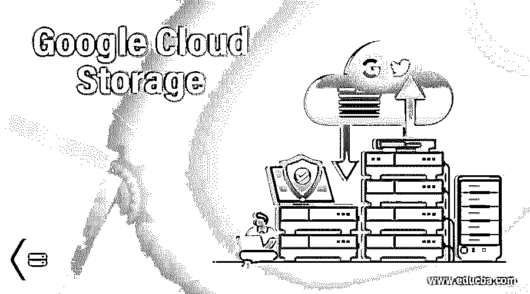

# 谷歌云存储

> 原文：<https://www.educba.com/google-cloud-storage/>

## 谷歌云存储简介

谷歌云存储被定义为用于在线存储数据的在线 web 服务，并且还提供使用谷歌提供的云平台从任何远程位置在线访问数据的设施，并且谷歌提供的服务是可靠的，使用高级安全功能来保护数据，易于扩展，并且当在谷歌云存储中访问数据时还提供良好的性能。google 云存储平台主要由大型组织使用，因为他们需要存储大量易于获取和访问的数据。

### 前三名谷歌云存储

下面提到了谷歌云存储的列表:

<small>Hadoop、数据科学、统计学&其他</small>

#### 1.块存储器

块存储也称为传统类型的存储，可用作数据的常规存储和存储在云平台上的数据。这种类型的谷歌云存储用于安装在云平台上的虚拟机。数据在这种类型的存储中是持久的，因为它可以与 USB 驱动器相比较，USB 驱动器可以轻松地连接到虚拟系统或从虚拟系统中分离，并有助于存储大量数据。

数据块存储类型很容易与本地系统中的虚拟磁盘进行比较。数据块存储类型的 I/O 性能非常高，有助于从系统中快速访问数据。数据存储位置也可以在块存储中决定，例如它是本地、分区还是区域类型。数据块存储提供的另一项功能是存储的自动可扩展性、数据的自动加密，还有助于创建数据备份。

**示例:** Quizlet 使用块存储类型

#### 2.网络文件存储

Filestore 是另一种类型的谷歌云存储，有助于在在线云平台上存储文件。它类似于块存储，因为此文件存储系统存在于本地系统中。网络文件存储是一种通过网络维护存储磁盘的存储类型。由于通过网络维护磁盘，它提供了以并行方式访问磁盘的能力，这意味着多个用户可以同时访问相同的数据。

网络文件存储具有某些缺点，因为系统中可能存在并发问题以及文件许可问题。在将系统用作存储选项之前，必须对系统进行适当的设计。

**示例:** SAP 使用网络文件存储

#### 3.对象存储

对象存储是另一种类型的谷歌云存储服务，不同于所有其他存储选项。该系统提供的特性在本质上是独一无二的，有助于以较少的开销开发系统。REST APIs 用于访问任何类型的文件，它不依赖于文件的大小。这些对象可以存储在一个称为存储桶的组中。存储桶具有存储多个对象的能力。

对象存储类型可以在云系统中使用，因为这种类型的系统的成本本质上是低的，并且系统也是简单的。云系统管理数据可用性、数据完整性、数据复制、容量规划和其他功能。对象存储系统的主要缺点是数据只能通过 REST APIs 访问，这是该系统的一个主要缺点。

**举例:** Twitter 使用对象存储系统

### 谷歌云存储的类型

目前主要有四种类型的云存储类别，包括:

1.  标准存储
2.  近线存储
3.  低温储存
4.  存档存储

所有上述存储选项都有一些共同之处，如:

*   没有大小限制适用于任何类型的类存储选项。该平台提供了无限的存储选项，用户可以根据需要存储数据。
*   在数据可访问性期间没有绑定，因为可以从全球任何远程位置访问数据。谷歌云存储平台提供的存储位置遍布全球。
*   延迟也非常低，因此数据检索可以得到提升，可以立即从系统中提取。
*   所有存储类型都有一个共同的特点，即高持久性，这有助于个人团体或组织存储大量数据。
*   所有存储类型都具有地理冗余能力，这意味着数据可以存储在全球的多个区域。
*   存储类提供了安全特性、API 和其他与数据操作相关的特性。

#### 1.标准存储

标准存储是 Google 云存储的一种类型，当需要频繁访问存储的数据并且数据存储特定的持续时间时使用。标准存储类型可用于该地区，因为存储在同一位置的数据使用较少的资源，有助于最大限度地提高数据效率，也有助于降低网络费用。

#### 2.近线存储

近线存储是另一种数据存储类别，它是一种低成本且高度耐用的服务，可轻松存储和访问系统中的数据。近线存储类型在成本、可访问性和数据存储等各个方面都优于标准存储。当需要存储连续数据时，可以使用近线存储类。

#### 3.低温储存

用于访问非频繁数据的 coldline 存储类的成本非常低，服务也非常耐用。当数据存储时间较长时，使用 coldline 存储类型，因为与近线和标准存储类型相比，数据存储的成本最低。

#### 4.存档存储

归档存储是最底层的数据存储服务，用于数据归档、灾难恢复和数据备份。在这种类型的存储类中，数据可以很容易地立即获得。与所有其他存储类别相比，此类存储类别的数据存储成本最低。

### 结论

谷歌云存储是由谷歌组织提供的存储服务，帮助在线存储数据，并提供即时访问数据的工具。有几种云存储选项可供选择，以满足具体需求。

### 推荐文章

这是谷歌云存储指南。在这里，我们讨论谷歌云存储的介绍，前 3 名谷歌存储，和 4 种类型的云存储。您也可以浏览我们的其他相关文章，了解更多信息——

1.  [云存储提供商](https://www.educba.com/cloud-storage-providers/)
2.  [巨型云存储](https://www.educba.com/mega-cloud-storage/)
3.  [什么是云存储？](https://www.educba.com/what-is-cloud-storage/)
4.  [云数据存储服务](https://www.educba.com/cloud-data-storage-service/?source=leftnav)

