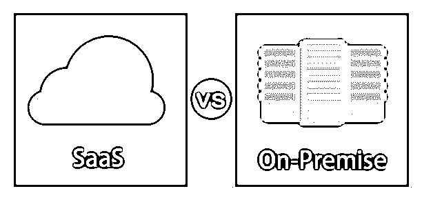
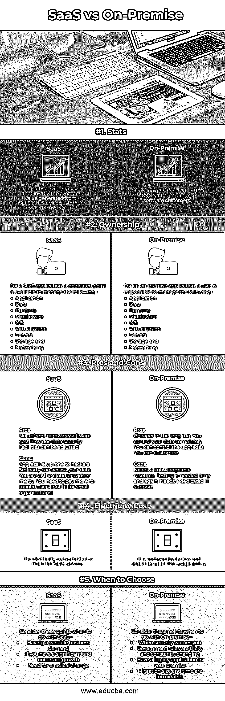

# SaaS vs 内部部署

> 原文：<https://www.educba.com/saas-vs-on-premise/>

## SaaS 和内部部署的区别

在本文中，我们将讨论 SaaS 与内部部署的区别。对大多数企业主来说，实施最适合您企业的解决方案是一项艰巨的任务。如今，提供计算技术的公司了解市场需求，并相应地采取行动，以最低的运营成本提供生产率驱动的解决方案。在本文中，我们将明确在实现 SaaS 和本地应用程序时要考虑的一些关键因素。

*   **SaaS** 是由第三方托管和维护的应用解决方案。
*   **内部部署**是一种可行的解决方案，在您的系统上本地托管，由第三方提供问题处理支持。

### SaaS 和本地的直接比较(信息图)

以下是 SaaS 与内部部署的五大区别:

<small>Hadoop、数据科学、统计学&其他</small>

### SaaS 和内部部署的主要区别

在当今的计算环境中，配置选项不受限制，这种环境有两种基本结构，即内部部署和 SaaS(云)。每一种都有其独特的优点和缺点，在某些情况下，一种优于另一种。让我们来看看这两者之间的一些重要差异——

*   最基本但最关键的区别是如何进行托管，这清楚地定义了一个界限。在 SaaS，应用程序托管在供应商的服务器上，并通过 web 浏览器访问，而在本地，应用程序安装在公司或用户的计算机和服务器上。
*   **考虑您的预算:**定价也是一个决定因素，两者之间有明显的区别，对于 SaaS，价格是在订阅的基础上产生的，可以按月、按季度、按半年或按年征收，而内部部署通常定价为一次性永久费用。该费用取决于组织的规模和安装的设备数量。因此，我们可以说，SaaS 是 OPEX，内部部署是资本支出(就财务而言)。
*   **操作自由度:**这意味着用户可以多么方便地调整他们正在使用的应用程序。在这种情况下，本地应用程序比 SaaS 更有优势。想象一下，一个成长中的企业没有一个计划好的工作结构，无法从内部部署中获得足够的好处，因为他们可以根据需要随时修改变更，但这对于 SaaS 来说是不可能的，因为它不是内部部署。
*   **支持和维护:**谈到这些标准，SaaS 将是任何用户的首选。如果您是本地用户，那么您应该有一个 IT 部门来修复与该软件应用程序相关的任何问题，而在 SaaS，处理应用程序正常行为的任何波动完全是服务提供商的责任。
*   **24*7 访问:**即时和随时访问也是一个决定性因素，使用 SaaS 应用程序，用户可以随时随地使用它，他所需要的只是有一个 Wi-Fi 和网络浏览器，而在内部应用程序的情况下，只能在公司场地访问，并消除了从家里访问的可能性。如果您计划使用任何一种实现，那么这一点值得考虑。
*   **软件测试需求:**内部部署的应用程序需要定期测试应用程序的正常运行，以避免任何类型的工作延迟和阻碍，这进而需要测试人员，而对于 SaaS 环境，这种需求已经消除，因为它已经完成，所以没有停机时间来满足测试要求。
*   谈到灾难和恢复，我们知道灾难随时都可能发生，拥有全面恢复战略的组织会认为会成功。对于内部部署的用户来说，备份是一项重大挑战，因为他们不得不考虑，否则公司可能会丢失数据，毫不奇怪，内部系统相对昂贵，需要额外的投资、安全性和许可，而 SaaS 在这一领域为其用户提供了全面的优势。SaaS 为数据备份提供的服务多种多样，从单纯的数据存储到功能完全转移的完全故障转移。

### SaaS 与内部部署对比表

让我们讨论一下 SaaS 与内部部署的主要比较:

| **参数** | **SaaS** | **内部部署** |
| **统计数据** | 统计报告显示，2012 年，SaaS 作为服务客户所创造的平均价值为 5.5 万美元/年 | 对于本地软件客户，这一价值降低到每年 4.8 万美元。 |
| **所有权** | 对于一个 SaaS 应用程序，有一个专用点可用于管理以下内容—

*   application program
*   data
*   runtime
*   middleware
*   操作系统
*   virtualization
*   server
*   And storage
*   network

 | 对于一个内部部署的应用，用户负责管理以下内容—

*   apply
*   data
*   runtime
*   middleware
*   operating system
*   virtualization
*   server
*   And storage
*   network

 |
| **利弊** | **优点** :
没有前期硬件/软件成本提供可调整的数据安全设施
**缺点:**
易受黑客攻击 3 rd 第三方可以访问您的数据您将受到云提供商的摆布。您需要为训练有素的用户支付更多费用(不适合小型组织) | **优点** :
从长远来看更便宜。你完全控制你的数据。你可以控制升级。可以定制
**缺点** :
需要有见识的资源。测试是需要一次又一次的。需要专门的 IT 支持 |
| **电费** | SaaS 服务器的耗电量更大。 | 它相对较少，取决于使用策略。 |
| **何时选择** | 考虑这几点，什么时候去 SaaS——

*   There are variable business needs.
*   If there is a significant and uncertain growth.
*   A radical change is needed.

 | 当您担心安全问题时，请考虑以下几点—

*   。
*   The rules of the government are complicated and constantly changing.
*   There is a legacy application on your premises.
*   The scale and time of migration are daunting.

 |

### 结论

我们已经看到了每种实现模式的影响因素，这取决于公司需求和业务规模，有助于选择一种模式。总的来说，两者都有各自的局限和优势。

### 推荐文章

这是 SaaS 与内部部署的主要区别指南。这里我们讨论信息图和比较表的主要区别。您也可以看看以下文章，了解更多信息–

1.  [差异【SAAS 与云的对比](https://www.educba.com/saas-vs-cloud/)
2.  [私有云与公共云的主要区别](https://www.educba.com/private-cloud-vs-public-cloud/)
3.  [PAAS 与 SAAS 的区别|信息图](https://www.educba.com/paas-vs-saas/)
4.  [rabbit MQ 与 MQTT 的区别](https://www.educba.com/rabbitmq-vs-mqtt/)
5.  [内部部署与私有云|主要差异](https://www.educba.com/on-premise-vs-private-cloud/)

