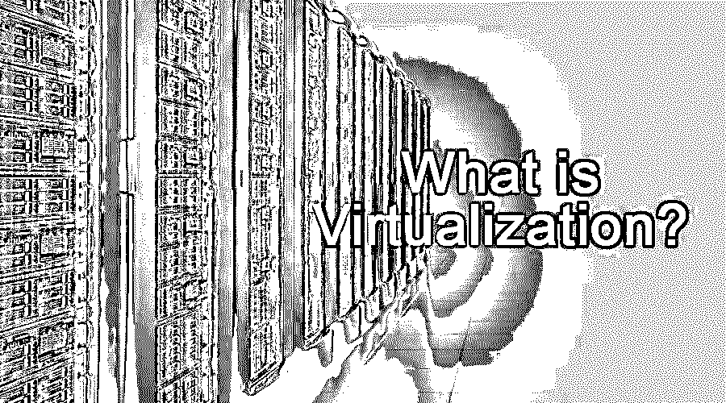
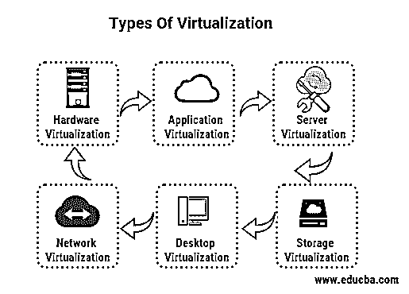

# 什么是虚拟化？

> 原文：<https://www.educba.com/what-is-virtualization/>

## 什么是虚拟化？

虚拟化是为同一物理资源的多种用途生成计算机资源的虚拟实例的技术。有几种虚拟化技术能够虚拟化服务器、存储、网络和操作系统。该技术以易于设置和环境设置成本优化以及更高的处理效率而闻名。

虚拟化环境将内存(RAM)、磁盘空间和网络等实际资源组件作为单独的资源组进行共享。因此，它有助于组织扩展计算资源。虚拟机(VM)是通过虚拟机管理程序管理的硬件虚拟化的常见用途。

<small>Hadoop、数据科学、统计学&其他</small>

### 它是如何工作的？

这是一台带有多个虚拟机的物理机。拥有数十台甚至数百台服务器的大公司[使用服务器虚拟化](https://www.educba.com/server-virtualization/)来提高运营效率并整合运行的机器数量。它可以帮助企业减少维护设备的数量，更好地使用这些设备，并确保更可靠的备份和恢复。一旦配置了虚拟服务器，您就可以使用相同的配置来配置新的虚拟服务器，这只需要几分钟。

### 利益

下面是提到的好处:

*   它节省了空间和运行成本。
*   轻松管理数据中心。
*   它可以提高 It 的生产力。
*   如果系统崩溃或任何突发故障，它有助于继续工作。
*   使用虚拟化可以更快地提供应用程序和资源。

### 虚拟化的类型

下面是提到的类型:

*   硬件虚拟化
*   应用虚拟化
*   服务器虚拟化
*   网络虚拟化
*   桌面虚拟化
*   [存储虚拟化](https://www.educba.com/storage-virtualization/)

#### 1.五金器具

称为管理程序的虚拟机管理器(VM)使硬件虚拟化成为可能。虚拟机管理程序创建计算机和操作系统的虚拟版本并将其整合到一个大型物理服务器中，从而可以更高效地利用所有硬件资源。用户可以在同一台机器上同时运行多个操作系统。

#### 2.应用

在应用虚拟化中，应用在服务器上被虚拟化。之后，应用程序从服务器发送到最终用户的设备。用户无需登录到他们的工作电脑，而是能够通过适当的互联网连接直接从他们的设备访问该应用程序。

#### 3.计算机网络服务器

服务器的虚拟化是对服务器用户屏蔽服务器资源，包括物理服务器、处理器和操作系统的数量和身份。

以下是一些流行的服务器虚拟化方法:

*   **虚拟机模式:**主机/客户模式基于虚拟机。这种方法使客户操作系统无需更改即可运行。
*   **半虚拟机模型:**主机/客户范例基于虚拟机，也用于虚拟机监视器。
*   **操作系统层:**操作系统层不是基于范例的；这种操作系统层模型运行在单个操作系统内核上。

#### 4.网络

这(NV)意味着模拟硬件平台。例如，软件服务器、存储设备或网络资源。它通过硬件将网络和服务汇总到一个逻辑虚拟网络中，该网络连接到虚拟机管理程序上的物理网络，并独立于网络运行。它可以在虚拟环境中提供一个真正独立于其他网络资源的虚拟网络。

有[种不同类型的网络](https://www.educba.com/types-of-network/)虚拟化，如外部和内部 NV。外部 NV 是位于不同位置的不同网络的组合。而在内部 NV 中，网络被划分为一个单独的系统。

#### 5.桌面

我们通常称桌面客户端虚拟化。这种桌面技术用于将物理计算机与计算机桌面环境分开。您可以像在虚拟桌面上使用物理桌面一样进行交互。它降低了软件许可和更新的成本。此外，系统上的补丁管理和维护非常简单，因为所有虚拟桌面都托管在同一个位置。桌面虚拟化的另一个优势是可以从任何位置远程登录来访问您的桌面。它已经在服务器计算模型中使用。

#### 6.储存；储备

当系统突然出现故障时，存储非常重要和有用。这是通过将所有物理硬盘组装成一个集群来实现的。在硬件或软件崩溃或不可用时，用户可以从中恢复数据。数据副本可以存储并移动到另一个位置。它可以通过软件应用程序或同时使用软件和硬件设备来实现。

### 虚拟化的优势和劣势

下面给出了提到的优点和缺点:

#### 优势:

*   安装不需要实际的硬件组件。
*   您可以从第三方访问虚拟化，也可以购买许可证。
*   最频繁的虚拟化提供商会自动更新他们有用的硬件和软件。它们由第三方提供商安装，而不是派个人到本地进行更新。
*   在虚拟化大规模出现之前，数字创业对于普通人来说几乎是不可能的。
*   能耗降低是因为物理服务器消耗的电力更少。
*   当几十台服务器可以安装在同一台计算机上时，服务器的供应几乎不需要额外的成本。

#### 缺点:

*   并非每个应用程序或服务器都能在虚拟化环境中工作。
*   您需要投资培训没有能力管理虚拟网络的现有网络管理员。
*   在虚拟化系统中，当出现问题时，需要进行复杂的故障排除。
*   困难在于，所需的额外资源几乎无法提前估计。

### 结论

在本文中，我们讨论了它的含义和工作原理。此外，还有关于类型及其优缺点的描述性指南。最初，任何类型的虚拟化都可能是复杂和令人困惑的，但随着时间的推移和实践，它会变得更容易、节省时间和成本，并且对任何企业都是有效的。

### 推荐文章

这是什么是虚拟化的指南？在这里，我们分别讨论虚拟化的基本概念、好处、优点、缺点和类型。您也可以浏览我们推荐的其他文章，了解更多信息——

1.  [虚拟数据机房](https://www.educba.com/virtual-data-rooms/)
2.  [虚拟专用网](https://www.educba.com/virtual-private-network/)
3.  [什么是网络安全？](https://www.educba.com/what-is-network-security/)
4.  [虚拟化技术](https://www.educba.com/virtualization-techniques/)

