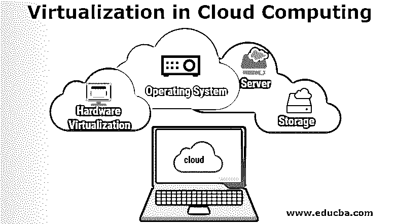

# 云计算中的虚拟化

> 原文：<https://www.educba.com/virtualization-in-cloud-computing/>

## 云计算中的虚拟化简介

云计算中的虚拟化是一种能够在多个用户或多个组织之间共享单个服务器或资源的物理实例的技术；换句话说，它基本上是制作一个虚拟平台的服务器 OS(操作系统)、存储设备、桌面或网络资源。当我们谈到云中的虚拟化时，虚拟化是在云中可用资源的帮助下发生的，然后这些资源在用户之间共享，使云虚拟化成为可能。

### 虚拟化在云计算中的应用

使用单个服务器运行多个应用程序和多个用户的方法很少，其中一种技术是通过实施一些软件来配置虚拟机，使其从一台主机移动到另一台主机，并且永远不允许它们在工作时关闭。这种方法也称为实时迁移。另一种方法涉及负载平衡技术，即在多台主机之间平衡负载，以更好地利用虚拟机资源。这个过程也称为动态资源处理。

<small>Hadoop、数据科学、统计学&其他</small>

当我们谈论云计算时，它不仅仅是关于用户共享他们的数据，而且他们还共享他们的基础设施，以便构建对几乎每个组织都有帮助的虚拟化技术。然后利用它向用户提供云计算应用的标准版本。一旦最新版本发布，就可以有效地提供给云和用户。

以下是允许我们在云中实现虚拟化的几种方法:

*   **操作系统级虚拟化:**在这种云计算虚拟化中，应用程序的多个实例可以在单个操作系统中运行。
*   **基于虚拟机管理程序的虚拟化:**在此过程中，操作系统共享主机的硬件，因此它允许多个操作系统(操作系统)在一台主机上运行。
*   **网格方式:**在这里，给定的工作负载被分配到许多物理服务器上，一旦计算出结果，就被传送回来。这种类型的服务主要用于科学目的。

### 云计算中虚拟化的类型

下面提到一些重要的类型:

*   硬件虚拟化
*   操作系统虚拟化
*   服务器虚拟化
*   存储虚拟化

#### 1.硬件虚拟化

在硬件虚拟化中，虚拟机管理器，即 VMM，被定位并安装在硬件系统上。VMM 作为软件安装在硬件系统中，并启用硬件虚拟化。虚拟机管理程序在这里的主要用途是监视和控制内存、处理器和其他硬件资源。一旦启用了硬件虚拟化，就可以在其上安装不同的 OS(操作系统)，并且许多应用程序可以在已安装的操作系统上运行。

#### 2.操作系统虚拟化

在操作系统虚拟化中，VMM(虚拟机管理器)或虚拟机软件安装在主机的操作系统(OS)中，而不是硬件中。操作系统虚拟化的主要用途是测试不同操作系统上的应用程序，即在不同的操作系统平台上。

#### 3.服务器虚拟化

在服务器虚拟化中，VMM (Virtual Machine Manager)或虚拟机软件直接安装在服务器系统上，在负载平衡的帮助下，可以根据资源使用情况将其划分为许多服务器。这样做是为了满足资源需求，服务器管理员扮演着将一台物理服务器划分为许多服务器的角色。

#### 4.存储虚拟化

在存储虚拟化中，对来自不同服务器(来自不同网络设备/位置)的物理存储进行分组。一旦完成，它看起来就像一个单独的存储设备。这些都由虚拟存储系统管理。它也可以使用软件应用程序来实现。在存储虚拟化和云计算中，服务器不知道数据存储的位置。存储虚拟化的主要用途是提供备份和恢复流程。

### 云计算中虚拟化的优势

下面是提到的优点:

*   **安全性:**虚拟化中的安全性是在防火墙和加密的帮助下提供的。这确保了虚拟化云中的所有内容都受到保护，并且可以防止任何未经授权的访问。数据也可以得到保护[免受网络攻击](https://www.educba.com/what-is-cyber-attack/)和与文件相关的威胁，如恶意软件、蠕虫和病毒。
*   **更经济:**正如我们所见，虚拟化为我们节省了物理机成本，例如服务器和硬件。它也是环境友好的，因为当服务器使用的数量减少时；我们省电。这使得任何组织运行多个 OS(操作系统)。
*   **实现敏捷:**通过云虚拟化，我们实现了更加灵活的运营，这是非常高效和敏捷的支持。科学或更复杂的技术问题可以用网格计算的方法来解决，网格计算是通过云虚拟化来实现的。它还避免了从损坏的设备中恢复数据的需要。
*   促进高可用性和灾难恢复。
*   **高效灵活的数据传输:**在云虚拟化中，用户不需要为了传输或检索数据而寻找硬盘或存储设备。使用云虚拟化几乎可以在任何时候完成。查找数据、传输或检索数据变得非常容易。
*   **无系统故障风险:**在云虚拟化中，系统故障风险被消除，因为存储在云中的数据可以随时从任何设备检索或传输。在传统场景中，在执行操作时，服务器可能会崩溃，最终可能会破坏组织的运营任务。在云虚拟化中，集群也总是启用的，因此即使一台服务器崩溃，另一台也总是准备好接管工作。

### 结论

在本文中，我们了解了云虚拟化的定义及其背后的工作原理。我们还看到了目前存在的云虚拟化类型，以及使用云计算虚拟化的相关优势。因此，任何组织都可以通过利用虚拟化来轻松实现健壮的云计算机制。

### 推荐文章

这是云计算虚拟化的指南。在这里，我们讨论云计算中虚拟化的工作原理、优势和不同类型。您也可以阅读以下文章，了解更多信息——

1.  [什么是云计算？](https://www.educba.com/what-is-cloud-computing/)
2.  [云计算职业](https://www.educba.com/career-in-cloud-computing/)
3.  [云计算应用](https://www.educba.com/cloud-computing-application/)
4.  [云计算的好处](https://www.educba.com/cloud-computing-benefits/)

