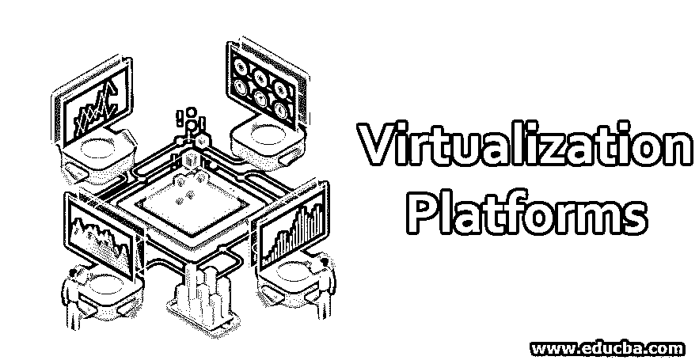
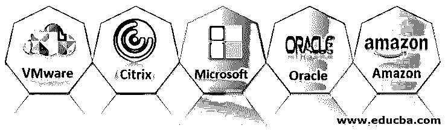

# 虚拟化平台

> 原文：<https://www.educba.com/virtualization-platforms/>

## 虚拟化平台简介

在本文中，我们将讨论虚拟化主题以及提供虚拟化的不同平台。虚拟化只不过是一种云服务，准确地说，它是由第三方机构向最终用户提供的基础设施即服务。在这种情况下，基础设施基本上是内存(主、辅)和处理能力、GPU 等资源。由于计算环境发展非常迅速，系统在处理速度、内存和许多其他方面日益强大，因此，大多数最终用户无法负担办公室或日常工作所需的高端系统，因此虚拟化的概念应运而生。

### 什么是虚拟化？

这个虚拟化概念并不是新概念，它是一个存在了很长时间的非常老的概念。但是很少被单个用户或中小型企业使用。虚拟化的定义可以是这样的，虚拟化就是创建和提供 IT 基础架构即服务。

<small>Hadoop、数据科学、统计学&其他</small>

市场上提供了不同类型的虚拟化，例如:

*   数据虚拟化
*   桌面虚拟化
*   服务器虚拟化
*   操作系统虚拟化

我们不讨论虚拟化的类型，因为这超出了本文的范围。我们更愿意讨论不同的平台，或者说有助于提供虚拟化的软件。因为虚拟化对于中小型企业来说是一个相当新的事物。

### 不同的虚拟化平台

以下是任何人都可以使用和实施的五大虚拟化平台，无论是小型企业还是大型公司。

#### 1.VMware

*   如果我们谈论虚拟化，首先想到的是 VMware。
*   VMware 是虚拟化的最佳选择，因为它易于使用并且具有强大的安全功能。
*   VMware 提供不同的解决方案来满足不同规模企业的各种需求。

#### 2.思杰

*   Citrix 是提供虚拟化的新兴平台之一
*   它有流行的远程访问工具，如 GoToMyPC 和 GoToMeeting 应用程序。
*   Citrix 还专门设计了 XenApp、XenDesktop 和 VDI-in-a-box 等虚拟化软件，可供中小型企业使用。
*   Citrix 还声称非 IT 人员可以提供支持并使用他们的应用程序。
*   他们也有一个免费版本来尝试和测试他们的平台。

#### 3.微软公司(全球知名的 PC 软件主要厂商)

*   微软提供了名为 Hype-V 的可视化软件。
*   因为它与微软云平台 Azure 有很好的集成，所以它正在蓬勃发展。
*   这样做的唯一缺点是，我们需要维护一个内部或外包的 IT 专业人员来使用这个平台。
*   该平台提供了企业所需的一切，从虚拟化服务到许多其他服务。

#### 4.神谕

*   Oracle 是一家提供从数据库管理系统到客户关系管理等多种服务的公司。
*   [Oracle 提供从桌面虚拟化到应用虚拟化的一切服务](https://www.educba.com/what-is-oracle/)。
*   使用他们的平台有多种好处，因为他们将所有服务整合为一个，并为您提供相同的支持。

#### 5.亚马孙

*   亚马逊有一项服务，服务器是提供给最终用户使用的。
*   亚马逊有一个 EC2 平台，为中小型企业提供基础设施。
*   该平台的可伸缩性是独一无二的，如果企业想要快速发展，它必须使用 amazon EC2 平台
*   Amazon 可以非常快速和精细地扩展任何可视化功能，没有任何问题。

[在数据科学中还有](https://www.educba.com/what-is-data-science/)虚拟化的主要部分。众所周知，使用机器学习和深度学习模型需要很高的处理能力，而每个人都负担不起那么高的计算能力。所以 google 是提供平台和资源来处理 ML/DL 模型的领先公司

**谷歌合作者**

*   这是一个虚拟环境，是由 python 提供的数据科学环境[anaconda 环境的复制品。](https://www.educba.com/what-is-python/)
*   这项服务是免费的，托管在云中，任何人都可以创建一个 ipython 笔记本，并开始编写他们的机器学习模型。
*   在这里我们可以自定义从 RAM 到 GPU 和 CPU 的处理能力。

### 推荐文章

这是虚拟化平台指南。在这里，我们将详细讨论什么是虚拟化以及前五大虚拟化平台。您也可以浏览我们的其他相关文章，了解更多信息——

1.  [云计算中的虚拟化工作](https://www.educba.com/virtualization-in-cloud-computing/)
2.  [存储虚拟化的类型](https://www.educba.com/storage-virtualization/)
3.  [云计算安全是如何工作的？](https://www.educba.com/cloud-computing-security/)
4.  [不同类型的公共云](https://www.educba.com/what-is-public-cloud/)

