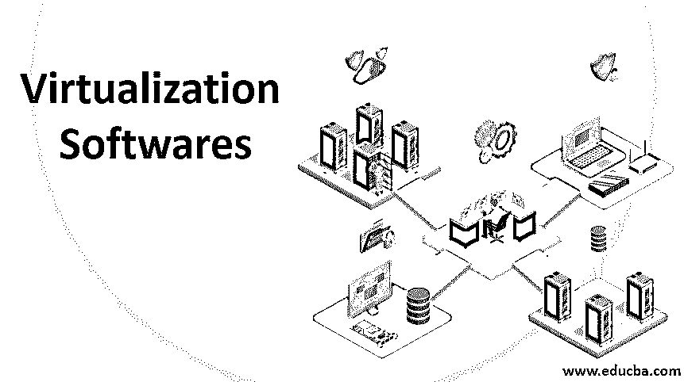

# 虚拟化软件

> 原文：<https://www.educba.com/virtualization-softwares/>

## 虚拟化软件简介

虚拟化软件可以被定义为一种有助于实现 IT 抽象的计算机程序，可以说它有助于对最终用户隐藏或屏蔽物理资源。

在本文中，我们将了解什么是虚拟化软件，以及如何使用它实现虚拟化。虚拟化通常可以解释为另一台计算机内部的计算机，它被企业用来共享计算机资源和降低基础设施的成本，市场上有不同的软件和平台可以实现虚拟化。我们还将讨论如何使用不同的软件来实现这一点。我们还将看到每种软件的优缺点，我们将在一些使用案例中讨论这种软件实现虚拟化的情况。

<small>Hadoop、数据科学、统计学&其他</small>

### 使用虚拟化软件的优势

*   人们可以在一台计算机上使用多个操作系统。
*   人们可以共享位于不同地理位置的多个计算机系统上集中托管的单个操作系统的组件。
*   通过使用虚拟化软件，人们可以利用计算机系统的全部容量，因为这有助于提高速度和功能方面的性能。
*   虚拟化软件还提供安全选项，有助于保护不同用户之间共享的数据和资源的安全。虚拟化中有一种称为快照的功能，用户可以对当前工作的系统进行备份，并在系统出现问题时进行恢复。

### 虚拟化软件

现在，我们来讨论一下市场上可用于虚拟化的不同虚拟化软件:

#### 1.网络安全管理软件产品虚拟化经理

*   这是一种适用于所有虚拟机的管理软件，该软件有助于跟踪性能并修复任何性能问题，如内存和存储
*   它为连接到系统的所有虚拟机提供了完整的可见性
*   该工具具有手动修复所有性能问题并在报告任何问题时触发任何事件的功能
*   这个工具在维护云平台和检查云平台的使用或性能方面也很有用。
*   工具中有触发器和自动指示，帮助用户正确监控一切。

#### 2.VMware Fusion

*   这个软件是为 mac 用户设计的，用户可以使用这个软件在 mac 上运行 Windows、Linux、Unix 和任何其他操作系统。
*   VMware Fusion 还支持基于云的虚拟化[平台](https://www.educba.com/virtualization-platforms/)
*   VMware fusion pro 版本提供了集成不同开发工具的便利
*   该软件使用非常简单，可以支持不同软件和应用程序的实时演示
*   它还有一个回滚点，可以保存操作系统最近的正常工作版本，并可以在需要时返回。
*   目前唯一的缺点是拖放功能不合适，需要改进。

#### 3.Parallels 桌面

*   这款软件也适用于 mac 用户使用 windows 和其他操作系统
*   这支持 windows 10 和 mac OS 高塞拉
*   它们提供了许多不同的工具，对日常工作非常有用
*   该软件的视图非常好，安装时不需要重启
*   虚拟操作系统中应用程序的性能也非常快，易于使用，没有任何延迟

#### 4.虚拟盒子

*   这个虚拟盒子来自 Oracle，其中最好的部分是它的
*   该软件在 windows 中用于运行不同的操作系统
*   它一次最多可以托管 4 个操作系统
*   它支持拖放功能，窗口可以最小化和调整大小

#### 5.VMware 工作站

*   这是最流行和最广泛使用的虚拟化软件
*   它支持多种操作系统，尤其是 windows 和 Linux
*   它是为通常在不同操作系统上工作的开发人员和 IT 专业人员设计的
*   这可以与多个应用程序集成
*   该软件还支持云应用程序

#### 6.QEMU

*   该软件用于硬件虚拟化
*   这也是一个开源的自由软件
*   对主机操作系统没有限制，这意味着该软件可以在 mac 和 windows 系统上运行
*   但是唯一的缺点是它一点也不方便用户使用

#### 7.Windows 虚拟 PC

*   这个软件是 windows 操作系统自带的
*   这只适用于 windows 用户，而且非常用户友好
*   用户可以在虚拟环境中使用打印选项，并且可以同时运行多个虚拟机
*   唯一的缺点是，除了 windows 之外，它不支持任何其他操作系统

#### 8.微软 Hyper V

*   该软件与 Microsoft windows server 2008 和更高版本捆绑在一起
*   它提供硬件虚拟化
*   该软件支持运行多个虚拟机
*   这也支持云，比如微软 Azure
*   这支持多个版本的 Linux 操作系统

#### 9.RedHat 虚拟化

*   这个虚拟化软件来自 Redhat 家族。
*   该软件是用 java 编写的，正如 Redhat 软件公司承诺的那样，它为运行在虚拟机内部的应用程序提供了非常好的性能
*   这是一个开源系统，因此任何用户都可以调整代码，使其为自己的使用和应用服务。
*   这是免费软件，安装非常容易。

### 结论

在本文中，我们讨论了如何实现虚拟化以及什么是虚拟化软件，我们还讨论了市场上可用于实现虚拟化的各种软件及其优缺点。

### 推荐文章

这是虚拟化软件指南。在这里，我们将讨论简介、虚拟化软件的定义及其优势，以及市场上排名前 9 位的虚拟化软件。您也可以浏览我们的其他相关文章，了解更多信息——

1.  [Scala 数据类型](https://www.educba.com/scala-data-types/)
2.  什么是虚拟化？
3.  [云计算中的虚拟化](https://www.educba.com/virtualization-in-cloud-computing/)
4.  [存储虚拟化](https://www.educba.com/storage-virtualization/)

