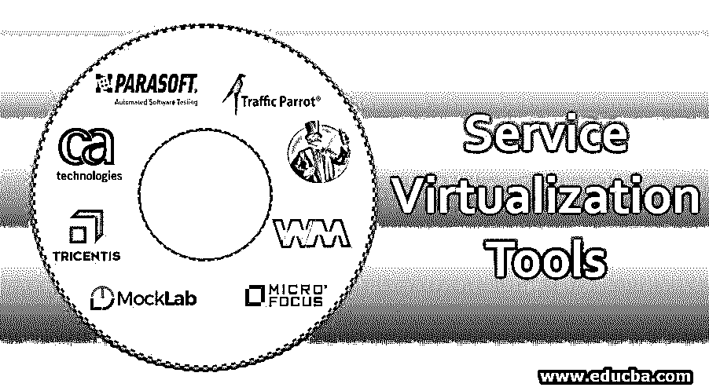
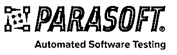
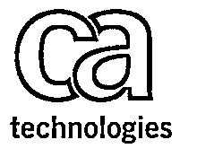
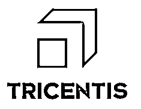

# 服务虚拟化工具

> 原文：<https://www.educba.com/service-virtualization-tools/>

## 服务虚拟化工具简介

服务虚拟化工具可以定义为一种帮助模拟虚拟服务的方法，这些虚拟服务模拟面向服务的体系结构中组件的性能。一般来说，[软件开发](https://www.educba.com/what-is-software-development/)团队在团队的各个垂直领域缺乏同步，比如软件设计、实现、测试等等。他们不一起工作，因此浪费了大量时间等待对方更新他们模块的最新进展。除了每个模块中的其他延迟之外，这是附加的延迟，并且它也严重影响产品的质量。

*   在服务[虚拟化](https://www.educba.com/what-is-virtualization/)的帮助下，现在团队可以轻松地模拟系统的感觉，即使模板还在构建中。
*   这有助于集成几个组件一起工作，从而减少时间和成本。
*   这也提高了产品质量。
*   服务虚拟化能够纠正错误。

### 服务虚拟化的顶级工具及其特性

我们现在列出了一些用于服务虚拟化的顶级工具及其特性。

<small>Hadoop、数据科学、统计学&其他</small>

#### 1.Parasoft 虚拟化

这是一个软件测试和测试人员。它创造了现实的可访问性，并通过提供软件将在其中执行并帮助其开发的环境来允许完整的测试。该工具还模拟各种测试依赖关系，并提供对测试环境的完全控制。以下是软件的符号:

**特性:**

*   在管理复杂环境方面提供了便利
*   独立测试过程的便利性得益于对外部系统的限时访问。
*   它有助于发现在测试过程中应用程序中丢失的性能问题。
*   它模拟大多数服务，并且还捕获实时系统的行为，以创建完整的测试环境。

#### 2.交通鹦鹉

该软件使开发者和用户能够轻松创建模拟环境和仿真。它更快地创建测试，更少的努力，给出模拟；后端改进了 API 和第三方的模拟服务。教程非常简单，也可以在网站上找到。这是软件架构师和管理者最喜欢的工具之一。这是因为它提供了时间和交付承诺，并通过交付其承诺来保持，提供了灵活的模型、协议支持以及兼容性，为其客户提供了持续集成工具。这里给出了徽标:

**特性:**

*   它支持各种操作，如 Http(s)、IBM 和文件传输。
*   它为开发人员和测试人员提供了自动化和手动的测试环境。
*   它兼容不同的平台。小型和微服务很容易处理。

#### 3.Wiremock

这个软件工具是一个基于 Http 的模拟器 API。即使没有 API，它也能为用户提供无缝的体验。模块、边缘的检查允许检查故障点。因此，这是一个很好的测试平台。这是标志:

**特性:**

*   它在性能上很强大，提升了 API，并根据请求赋予了匹配 URL 的本质。
*   它记录活动并在需要时重放。
*   它也托管模拟 API。

#### 4.骗子

软件工具 Mountebank 是众所周知的开源软件。该工具有助于执行多任务协议和开发工具下的其他协议。节点 JS 是代码库。它有灵活的支持。徽标如下所示:

**特性:**

*   它提供完整的平台服务，也可以用本地语言工作。
*   多任务处理是其中一个奇妙的功能。
*   在这个平台上可以测试各种互联网协议。

#### 5.气垫船云

Hoverfly 云是一个整合的解决方案，提供无缝的服务虚拟化能力。它从下到上为许多活动设计得很好，如集成、测试、自动化、效率、性能等。

**特性:**

*   它可以在任何平台上快速部署，并支持优化。
*   人们可以通过扩展来评估性能要求，还可以在虚拟基础架构扩展期间发现支持。

#### 6.数据模拟软件 MicroFocus

该软件为开发人员和测试人员提供了测量虚拟化的灵活性。该工具及时交付产品。同时授予访问权；这是给许多用户的多用户体验。徽标如下:

**特性:**

*   使用微焦点平台可以轻松模拟应用。
*   它提供诸如修改数据、访问网络、设计协作等服务。额外的优势是，即使测试条件没有变化，性能也是高效和可靠的。
*   甚至可以使用向导步骤在一个平台上开发、设计和测试该模型

#### 7.CA 服务虚拟化

如果系统在 SDLC 中的某个位置不可用，CA Service Virtualization tool 会进行模拟。开发人员和团队可以在一个平台上协作，一起工作。它提供快速、可靠和高效的交付。该工具的徽标如下:

**特性:**

*   它有助于简化管理过程，通过在一个屋檐下虚拟化可靠的系统来简化开发的复杂性。
*   该项目集合了并行开发，并简化了额外的资源需求，这些需求在很大程度上得到了显著降低。

#### 8.模拟实验室

该工具是一款用户友好的服务虚拟化工具。复制、粘贴、记录 Http 的存根响应、在团队中授权对有用的流线型数据记录的数据访问等操作。徽标如下:

**特性:**

*   即使没有可靠的 API，它也能帮助公司提高生产率。
*   更快地识别和解决问题。
*   测试边缘案例和故障模式是由这个工具产生的，而真正的 API 是不能产生的。

#### 9.Rational 测试虚拟化服务器

这是一个在开发生命周期中提供快速测试的工具。模拟可以是部分的，也可以是完全基于应用的。

**特性:**

*   软件和应用程序使用平台的虚拟化。
*   改进相关数据的重用和共享变得更加容易。
*   允许与其他工具合并和集成。

#### 10.特里森蒂斯托斯卡

这个服务虚拟化工具允许稳定地进入需要的系统，这样测试可以连续执行，没有任何干扰。它模拟需要的组件行为，以便测试可以在其上运行。徽标如下:

**特性:**

*   该工具为测试人员提供了高度开发和互联的并行平台。
*   模拟是测试的一个必要步骤，在产品质量保证和产品及时交付的情况下，自动化模拟得很好。

### 结论

在本文中，我们讨论了服务虚拟化工具。我们还列举了一些在虚拟化服务用户中流行的工具。这些工具具有巨大的优势，因为它们提供免费服务，对平台没有任何限制。这些工具是不可思议的、更新的、稳定的，并且对于处理前所未有的事件来说足够成熟。

### 推荐文章

这是服务虚拟化工具指南。在这里，我们将讨论简介、服务虚拟化的 10 大工具及其特性。您也可以浏览我们的其他相关文章，了解更多信息——

1.  [操作系统虚拟化](https://www.educba.com/os-virtualization/)
2.  [存储虚拟化](https://www.educba.com/storage-virtualization/)
3.  [单元测试工具](https://www.educba.com/unit-testing-tools/)
4.  [微服务工具|前 9 名](https://www.educba.com/microservices-tools/)

