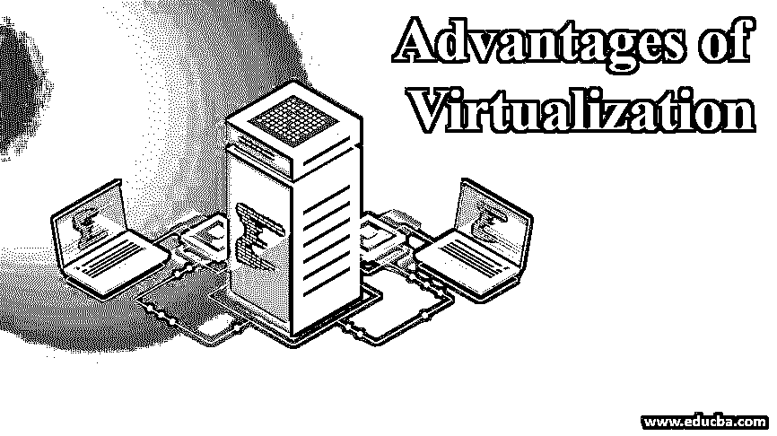

# 虚拟化的优势

> 原文：<https://www.educba.com/advantages-of-virtualization/>

## 虚拟化优势介绍

在本文中，我们将讨论虚拟化的优势。创建计算机或服务器或任何硬件组件的虚拟形式，这一过程称为虚拟化。硬件功能中使用的软件用于虚拟化。硬盘可以在安装操作系统的过程中进行分区，这就是虚拟化的一个例子。虚拟化的[类型](https://www.educba.com/types-of-virtualization/)是完全虚拟化、半虚拟化和操作系统级虚拟化。通过虚拟化，物理机可以得到充分利用。虚拟化过程始于 20 世纪 60 年代的大型计算机。现在的虚拟机就像一台真正的计算机，人们尽情享受它们的优势。

### 什么是虚拟化？

创建一个虚拟源(服务器、操作系统或网络)来完成物理服务器或网络的所有工作，这一过程称为虚拟化。与传统计算流程相比，虚拟化可以管理工作负载，因为它可以扩展存储并有效地增强流程。虚拟化可以应用于任何系统层，从服务器级到操作系统的网络层都可以使用。虚拟化包括系统级虚拟化、硬件虚拟化或服务器级虚拟化。常用的虚拟化类型是系统级的，在操作系统中也是如此。

<small>Hadoop、数据科学、统计学&其他</small>

根据创建虚拟化的资源，虚拟化分为网络、服务器、桌面、硬件、软件和存储虚拟化。[服务器虚拟化](https://www.educba.com/server-virtualization/)是将来自不同物理服务器的资源汇集起来，并使它们成为不同虚拟服务器的过程。在这个过程中，使用了一种叫做 hypervisor 的特殊工具。第 1 类虚拟机管理程序直接在硬件上运行，也称为裸机虚拟机管理程序。第 2 类虚拟机管理程序运行在来宾操作系统上，称为主机虚拟机管理程序。

第 1 类虚拟机管理程序由 VMware、Microsoft 和 Citrix 使用。基于 Oracle 的 Red hat 虚拟机中使用了类型 2 虚拟机管理程序。虚拟化是在虚拟机的帮助下完成的，虚拟机充当存储在计算机中的数据，可以移动到任何其他系统。数据的文件结构可以描述硬件或硬盘。虚拟化几乎应用于数字生活的所有方面，并且由于其成本较低，值得使用。

在[虚拟机](https://www.educba.com/what-is-virtual-machine/)中使用的虚拟机管理程序可用于根据使用硬件或硬盘的客户端的需求对硬件或硬盘进行更改。当必须进行更改时，可以通过在软件运行后写入的方式保存。这有助于用户在已知状态下引导系统。虚拟化的不同工作层需要不同的技术，因此需要不同的技能组合。在选择层和技术时应该小心，因为一个错误就会导致数据丢失。

### 虚拟化的优势

虚拟化的优势如下:

1.  因为虚拟化总是应用于系统的现有部分，所以虚拟机总是保证更好的效率和性能。这有助于系统存储和处理系统中的数据。
2.  虚拟机不是放在一起的。它们在逻辑上是分开的，因此一台虚拟机上的恶意软件攻击不会影响另一台虚拟机。
3.  由于实施了硬件虚拟化，我们需要购买更少的硬件供系统使用。这有助于解决硬件成本问题。只有存储需要扩展。如果存储由资源正确管理，所需的空间会更少。
4.  虚拟机比物理机有更好的备份。由此可见虚拟化的可靠性。此外，它恢复文件更快，它有很好的检索能力。
5.  虚拟机很容易由第三方提供商管理，因此成本可以预先知道。这有助于管理基础设施的成本并相应地制定计划。
6.  服务提供商通过在需要时自动更新软件来帮助软件。这不仅节省了时间，而且资源可以专注于其他工作，而不是检查虚拟机。
7.  性能和正常运行时间随着虚拟机的使用而增加。即使是最便宜的服务提供商也提供 99%的正常运行时间。
8.  资源的分配速度比物理机器更快。由于部署速度更快，因此节省了时间，并且虚拟机分布在整个组织中，因此可以轻松地对资源进行分类。
9.  在当今可用的数字服务器和存储设备的帮助下，用户可以很容易地成为数字企业家。在虚拟化的帮助下，可以在线管理、开发和划分工作。有许多从事虚拟化工作的站点，任何人都可以在这些站点中找到工作，并了解站点中使用的应用程序。
10.  它有助于节省能源，因为虚拟化可以减少使用的物理软件和硬件的数量。不分配本地硬件，因此对本地硬件的需求较少。这有助于为其他目的有效管理资金。消耗率降低，组织不需要使用数据中心。碳足迹减少，减少污染，让您高枕无忧。
11.  虚拟化使系统可以根据用户的需求进行扩展，并且存储容量超过任何物理系统。这种可伸缩性有助于使用许多应用程序并为其分配资源。此外，这有助于使用具有两个系统的存储容量的系统，因此可以减少一个系统的可用性。
12.  与物理服务器相比，服务器在系统中的运行速度非常快。我们不需要像在虚拟机中那样等待任何安装或更新完成，这些事情由服务提供商来完成。此外，还有虚拟备份工具。

当虚拟机的数量更多时，很难管理并造成混乱。此外，一旦网络中有足够的虚拟机，就很难向网络中添加新的虚拟机。如果网络中的虚拟机没有被使用，它会占用大量内存，因此是一种浪费。此外，应始终监控虚拟机。

### 推荐文章

这是虚拟化优势的指南。这里我们分别讨论虚拟化的基本概念和 12 大优势。您也可以阅读以下文章，了解更多信息——

1.  [云计算中的虚拟化工作](https://www.educba.com/virtualization-in-cloud-computing/)
2.  [云服务的类型](https://www.educba.com/types-of-cloud-services/)
3.  [CPU 虚拟化的类型](https://www.educba.com/cpu-virtualization/)
4.  [容器与虚拟机的排名比较](https://www.educba.com/containers-vs-virtual-machines/)
5.  [五大虚拟化平台指南](https://www.educba.com/virtualization-platforms/)

