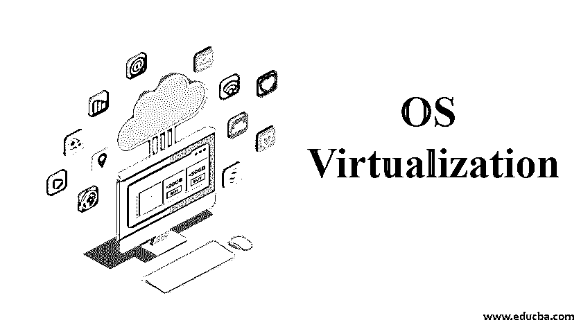
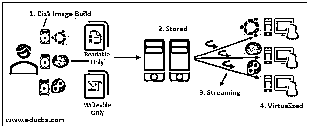

# 操作系统虚拟化

> 原文：<https://www.educba.com/os-virtualization/>

## 操作系统虚拟化简介

操作系统虚拟化(OS virtualization)是一种完全基于服务器和操作系统的云计算技术，其中多个用户同时使用单个系统运行不同的应用程序。虚拟化一词实际上代表着对用户隐藏基础设施细节，例如计算资源，并以虚拟形式向用户提供其他物理资源。20 世纪 90 年代后期，随着[服务器虚拟化](https://www.educba.com/server-virtualization/)的普及，虚拟化技术应运而生，随后虚拟化技术与操作系统服务器融合，对云计算技术产生了巨大影响。

### 操作系统虚拟化是如何工作的？

<small>Hadoop、数据科学、统计学&其他</small>

操作系统虚拟化在虚拟磁盘的帮助下工作，不需要任何物理磁盘或本地存储。它借助于媒介直接连接，即借助于虚拟磁盘传输数据的集中式服务器。在将其传输到作为最终用户的客户端之前，操作系统会加载到系统中并进行引导。最后，传输的数据被虚拟化，客户端通过所需的网络接收数据。

### 操作系统虚拟化的组件

**1。**首先需要运行的组件是 OS 虚拟化服务器。服务器充当中央媒介，管理从通过虚拟信道连接网络到与客户端通信的一切。首先设置机器，并与服务器建立连接。系统和服务器之间有多种连接方式。最常用的连接方法之一是 PXE 服务，由于其额外的功能，该服务后来被 bootstrap 采用。所有连接方法都使用网卡和协议与服务器保持稳定的连接。

**2。**在正确布置服务器之后，接下来是服务器和虚拟磁盘之间的连接。然后，客户端与服务器建立连接，并请求磁盘上的组件来运行操作系统。然后，服务器在数据库存储中搜索确切的组件，并检查分配给客户端的磁盘。根据磁盘的数量，特定的磁盘将被分配给特定的客户端。

**3。**将所需的虚拟磁盘分配给客户端后，磁盘将连接到操作系统虚拟化服务器，包含所有配置和网络设置的数据库将连接到服务器。然后，服务器通过来自后端的选项来维护客户机的唯一性。

**4。**磁盘与服务器连接完成后，数据流从服务器开始。负责启动操作系统平稳运行的软件先于其他部分进行流式传输。缓存的数据存储在其他地方，有各种产品可以收集这些信息。

**5。**在服务器完成适当的流传输并加载操作系统后，所有功能都可以顺利运行，附加磁盘将根据用户的要求进行流传输。

### 操作系统虚拟化的使用

随着操作系统虚拟化的出现，云计算行业出现了许多积极的影响，我现在就来讨论一下。

1.  操作系统虚拟化创建一个虚拟空间来存储数据，同时保持与服务器的连接。这种基础设施不仅节省了时间，而且为用户节省了成本，因为它消除了具有增加存储数据的成本和时间的物理结构的要求。
2.  由于所有数据都以安全虚拟形式存储，因此存储数据不需要太多维护，因为完全不需要硬件。所有数据都存储在虚拟磁盘中，然后通过服务器传输到客户端。这一优势节省了大量时间和空间，此外还节省了基础设施的总体成本。
3.  由于操作系统虚拟化系统完全基于虚拟机，因此消除物理硬件功耗的要求已大幅降低。此外，能量节省最大化，系统需要更少的冷却，最终节省成本和能量。
4.  操作系统虚拟化的出现为云计算行业带来了创新，正因为如此，许多大大小小的组织都做出了重大改进。操作系统虚拟化利用服务器硬件，并允许服务器以最高效率使用硬件。这导致了运营商品投资的高回报率。
5.  操作系统虚拟化还提供快速部署功能，数据以更快的速度传输到客户端。它比旧的传统数据传输方式更快，支持旧的传统部署功能，即每台机器都必须手动加载数据进行传输。
6.  操作系统虚拟化对客户端隐藏了不必要的额外物理基础设施，隐藏了额外的资源，并且仅呈现对维护基础设施和整体资源的客户端有益的有用特征。主要资源和硬件资源存储在基于不同操作系统的容器中以供使用。
7.  操作系统虚拟化中容器的存在也为数据提供了安全性。由于虚拟资源和其他计算程序存储在不同的容器中，并且每个容器都包含一组不同的应用程序，因此安全性是一个主要问题。然而，操作系统虚拟化通过将应用程序分离到容器中克服了这种安全顾虑。
8.  操作系统虚拟化还可以保护数据免受未授权用户的访问，因为它使用虚拟主机环境来有效分配硬件资源，并维护数据的安全性，防止不可访问用户访问数据，这是旧的传统云计算模式在安全性方面的一个主要问题。

### 结论

因此，总而言之，操作系统虚拟化隐藏了物理结构，并使用虚拟软件来帮助并行运行多个操作系统。因此，大多数小型和大型公司开始使用操作系统虚拟化，因为它的可靠性和安全性以及对用户的成本效益。

### 推荐文章

这是操作系统虚拟化指南。在这里，我们将简要介绍操作系统虚拟化及其整体功能和用途。您也可以浏览我们推荐的其他文章，了解更多信息——

1.  什么是虚拟化？
2.  [存储虚拟化](https://www.educba.com/storage-virtualization/)
3.  [云计算中的虚拟化](https://www.educba.com/virtualization-in-cloud-computing/)
4.  [什么是云计算中的虚拟化？](https://www.educba.com/what-is-virtualization-in-cloud-computing/)

