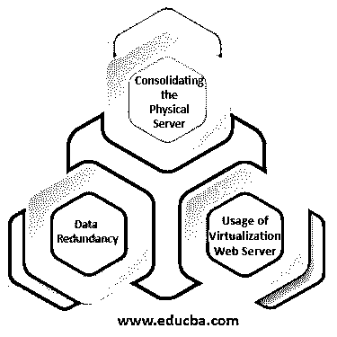

# 服务器虚拟化

> 原文：<https://www.educba.com/server-virtualization/>

## 什么是服务器虚拟化？

服务器虚拟化可以描述为将一个物理服务器的多个副本创建并实现为多个虚拟服务器的过程，用于在所有虚拟服务器中模拟实际服务器，并且虚拟服务器的性能与原始服务器相同。让虚拟服务器与物理服务器保持同步非常重要。这种方法用于一些特殊目的，如整合物理服务器、在数据库丢失数据时恢复数据，以及虚拟化 web 服务器。

### 服务器虚拟化是如何工作的？

这是通过将软件与硬件分离来实现的，这是通过使用一个称为虚拟机管理程序的软件组件来实现的。市场上有不同种类的虚拟机管理程序

<small>Hadoop、数据科学、统计学&其他</small>

*   **Type 1 Hypervisor:** 这是最常用的 Hypervisor，它直接放在服务器上，从那里执行分区工作。这就是称之为裸元虚拟机管理程序的原因
*   **第 2 类虚拟机管理程序:**这种类型的虚拟机管理程序最常与操作系统的软件一起使用。
    这个管理程序通常用于测试服务器或实验室服务器

虚拟化工作通过以下步骤完成:

*   首先，希望对其服务器进行虚拟化的组织必须确定哪台服务器没有充分利用其容量，服务器没有充分利用其容量是服务器虚拟化的最佳候选。因此，虚拟化有助于利用这些未使用的服务器资源，并重新用于其他工作
*   确定服务器后，组织应监控服务器的资源使用情况。资源包括内存、磁盘使用和不同类型的负载，在实施虚拟化之前需要对其进行全面监控。
*   一旦该部分完成，用户就可以部署虚拟化软件来创建服务器的分区。任何软件，如微软 Hyper V 或 VMware 等。软件的选择取决于服务器，并且是物理(硬件)配置
*   一旦分区或虚拟化完成，在迁移之后，需要再次监控服务器的资源使用和性能。

### 服务器虚拟化的使用

服务器虚拟化的各种用途如下:

#### 1.整合物理服务器

*   服务器虚拟化有助于整合服务器，这意味着由于分区，一台物理服务器可以充当多台服务器，每个分区可以承载多个具有不同需求的客户端。
*   因此，与多台服务器相比，维护 1 台物理服务器的硬件不需要太多成本。
*   因此，基本上，它有助于削减成本和正确管理 it 基础架构

#### 2.数据冗余

*   如果一个组织使用虚拟化并复制多个分区中的数据，这将有助于他们保护数据的安全。如果一个分区丢失或者一个分区中的数据被删除，他们仍然可以使用另一个分区来恢复它。

#### 3.将虚拟化用作 Web 服务器

*   让 web 服务器托管网站是一项昂贵的任务，虚拟化可以在这方面提供帮助。如果服务器被虚拟化，那么服务器的专用部分可以作为网站的 web 托管平台。
*   如果进行了多重分区，那么它可以托管多个具有不同要求的网站，如不同的资源配置，操作系统，我们可以根据网站的要求定制分区。

### 优势

下面是提到的优点:

*   由于虚拟化有助于共享和分配有限的资源，因此减少了物理资源和昂贵资源的使用。
*   如果我们进行虚拟化，我们基本上是在软件的帮助下执行数据的实时迁移
*   虚拟化还有助于减少物理设备的使用。
*   服务器的虚拟化分区可以独立于其他分区和实际的物理服务器运行自己的软件和操作系统。
*   这有助于降低服务器的成本。
*   如果完成了虚拟化，那么备份服务器的当前状态是非常容易的，如果服务器遇到一些问题，恢复也是非常容易的。
*   虚拟化还有助于降低能源和功耗。
*   如果使用虚拟化将服务器划分为多个部分，那么它有助于整合服务器。
*   通过虚拟化，可以非常轻松地安装软件和安全更新及补丁。
*   服务器虚拟化是托管网站最简单、最经济的方式。

### 推荐文章

这是服务器虚拟化指南。在这里，我们将讨论服务器虚拟化的工作原理以及使用方法和各种优势。您也可以看看以下文章，了解更多信息–

1.  [虚拟化的优势](https://www.educba.com/advantages-of-virtualization/)
2.  [存储虚拟化](https://www.educba.com/storage-virtualization/)
3.  [虚拟化面试问题](https://www.educba.com/virtualization-interview-questions/)
4.  [什么是云计算中的虚拟化？](https://www.educba.com/what-is-virtualization-in-cloud-computing/)

